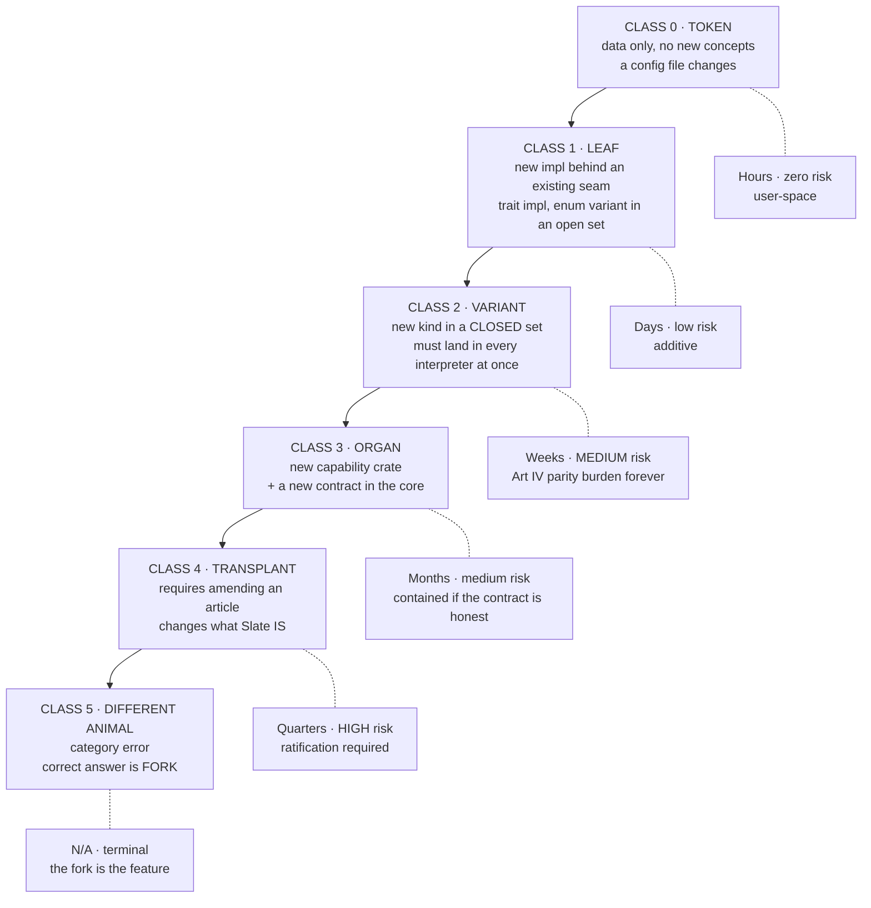
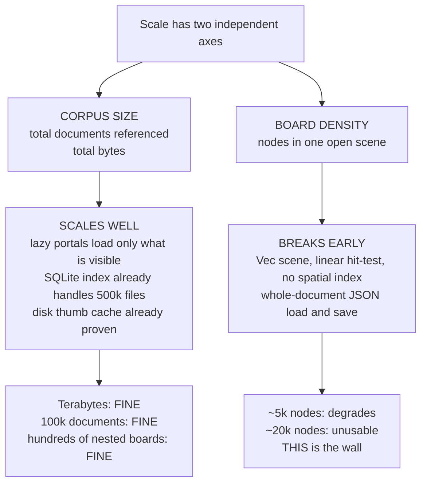
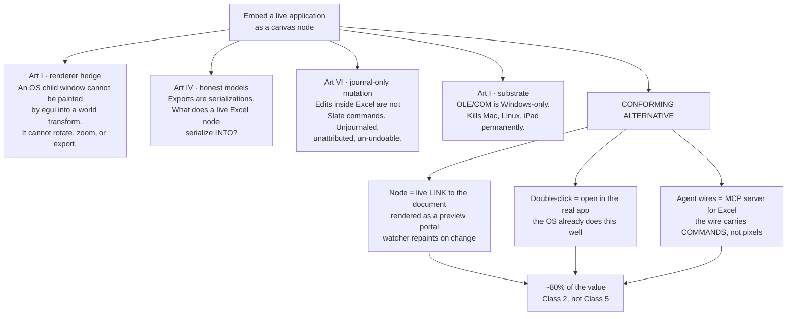
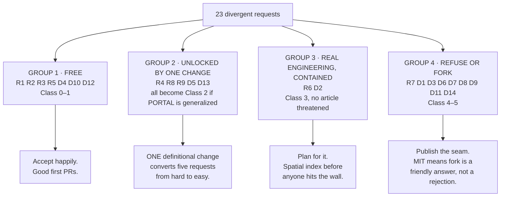

# Architecture Audit №2 — Flexibility Stress Test

**Date:** 2026-07-25
**Repo state audited:** `main` @ `c808966`
**Exercise:** simulate divergent feature requests from outside the architectural domain; classify each by what it costs and what it threatens.
**Companion to:** `CONSTITUTION.md`, `ROADMAP.md`, `docs/audit-2026-07-25-...md`

---

## 0. Repo state note

`main` currently contains audit №1 as a document; the code changes it recommended (WI-2 convergent journal, WI-3 source identity, WI-4 edge extraction) are not in the pushed tree. `SceneCmd` is still positional and whole-node; `CONSTITUTION.md` still has one amendment-log entry (Founding). Analysis below is written against pushed state, with **"post-WI"** notes wherever a landed refactor changes the answer materially. Where your local work has already moved ahead, the post-WI column is the live one.

---

## 1. The framing: your constitution is already a flexibility specification

The instinct behind this exercise is that flexibility is a property you add — an extension point here, a plugin API there. It isn't. **Flexibility is a property of where your seams already are**, and you have more of it than you think, in specific places, and almost none in others.

The useful observation: a constitution that says "no" in specific, principled places is *better* for third-party developers than one that says "yes" everywhere. A vibe coder forking Slate needs to know within ten minutes which of their ideas is a weekend and which is a rewrite. Articles I–XI already answer that — they just don't answer it in a form anyone can read quickly. This report is an attempt to produce that form.

The second observation, which matters more for an open project: **the cheapest requests to accommodate are the ones that never touch you at all.** MIT licensing means a Class 5 request ("make Slate a window manager") has a correct and friendly answer — *fork it, here is the seam you'd cut at* — and the health of that answer depends entirely on whether the seam is real. Most of the recommendations at the end are about making forks cheap rather than making the core accommodating.

---

## 2. The instrument: six flexibility classes

Every request below is scored into one of six classes. The classes are defined by **what has to change**, not by effort, because effort follows from structure.



**The critical boundary is between Class 1 and Class 2**, and it's worth being precise about why. A Class 1 change adds an implementation behind a seam that already exists — nobody else has to know. A Class 2 change adds a variant to a closed set, and Article IV binds you: *"a new style property lands in both interpreters, or not at all."* Every Class 2 addition is a permanent tax paid by the egui painter, the artifact writer, the migration chain, and — post-WI — the MCP schema. Three Class 2 features is fine. Thirty is how monoliths die, which is the exact failure mode Article III exists to prevent.

**The second critical boundary is Class 3 to Class 4.** Class 3 is expensive but *contained*: a new crate with a declared contract can be big and still not endanger anything. Class 4 changes an invariant, and invariants are what other people's forks depend on.

---

## 3. The nine requests

### R1 · "Elven calligraphic text throughout the program"

**What it actually is:** two unrelated requests wearing one coat — a *chrome* font change and a *document* font change. They have different costs and only one of them is hard.

Chrome typography is a token. `ui-tokens.toml` already carries `tab_text_size` and friends with a `schema_version`, and the tuner feature edits it live. Adding font family to that file is Class 0.

Document typography is where it stops:

```rust
pub enum FontChoice { #[default] Sans, Serif, Mono }
```

Three variants, closed, serialized into every `.slate`. An elven calligraphic face is a fourth thing that doesn't exist, and adding it as a variant is wrong — the next person wants Blackletter, then a client's brand face. **This is the archetypal case for opening a closed enum**, and the test in §8.1 says it should be opened: font choice is *taste*, not semantics, and no agent needs to enumerate the set of fonts that exist in the world.

The genuine cost hides in Article IV. The artifact writer must produce SVG that renders identically elsewhere, which means a custom font has to travel *with* the export — `@font-face` with a base64 WOFF2 payload, or the artifact looks correct on your machine and wrong on the client's. That is real work (font loading in egui, subsetting, embedding, and a licensing question you inherit from whoever made the font). But it is work done **once**, after which every font anyone ever wants is Class 0.

**Verdict: Class 1** (after a one-time Class 2 refactor of `FontChoice` to `{ Sans, Serif, Mono, Custom(FontId) }` plus a font registry). **Paradigm risk: none.** This request is a gift — it forces the right refactor for a trivial reason before someone forces it for an urgent one.

---

### R2 · "Not light mode, not dark mode — Barbie"

**What it actually is:** the single best test of whether your theme system is data or code. Right now it is 90% data and 10% code, and the 10% is the whole problem.

The good news is genuinely good. `atlas-shell/src/theme.rs` defines `Palette` as **fourteen semantic slots** — `bg`, `grid_dot`, `card`, `card_hover`, `border`, `border_strong`, `ink`, `sub`, `line`, `accent`, `portal`, `thumb_bg`, `select`, `staged`. Those are *roles*, not colours. That is exactly the design that makes arbitrary theming possible, and it is the part most projects get wrong.

The bad news: `Palette::light()` and `Palette::dark()` are **hardcoded Rust constructors**, and `ui-tokens.toml` — which already has a schema version and a live tuner — contains **no colour entries at all**. So your metrics are data and your colours are code, in the same subsystem, for no principled reason.

There is also a quiet Article X hazard: `dark_visuals()` / `light_visuals()` set egui's own `Visuals` separately from `Palette`. Two colour systems, hand-synchronised. A third theme makes that divergence visible immediately, because whoever writes the Barbie theme will set `Palette.bg` to pink and get a dark-grey panel behind it.

**The fix is small and high-leverage:** move the fourteen slots into `ui-tokens.toml` as a `[palette.<name>]` table, derive the egui `Visuals` from the palette rather than beside it, and load themes from a user-space directory. Barbie then ships as a 14-line TOML file that someone posts in a GitHub issue.

**Verdict: Class 0** — *after* a half-day Class 1 refactor. **Paradigm risk: none.** Recommend doing the refactor regardless of whether anyone ever asks, because it also converts "theme divergence between the two apps" from a discipline problem into a structural impossibility, which is what Article X is trying to achieve.

---

### R3 · "Squared-off circuit-board traces instead of bezier wires"

**What it actually is:** a request for something you have already built and haven't unified.

`apps/slate/src/app/lens.rs` contains `lens_orthogonal_route()`, a `LensWireStyle::Orthogonal` variant, and a UI toggle for it. The Lens view has had orthogonal wire routing since the commit that introduced port semantics. The board has beziers via `connector_bezier()` in `slate-doc`. **Two routers, two crates, one concept, no shared seam.**

So the request is not "add a feature," it is "finish a consolidation you already owe yourself." The shape:

```rust
pub enum EdgeRouting { Bezier, Orthogonal, Straight, Arc }
```

...as a field on the edge, with routing functions living in `slate-doc` (or `vector-ink`) next to `connector_bezier`, and Lens switching to the shared implementation. tldraw arrived at the same answer with `'arc' | 'elbow' | straight`, which is mild external validation that four is roughly the right number.

Two constitutional notes. Routing must stay **derived, never stored** — the existing rule that geometry is recomputed from current endpoint rects is what makes wires follow their nodes by construction, and an orthogonal router must obey it too. And routing is a Class 2 addition in the strict sense (both interpreters), but orthogonal polylines are trivially SVG-expressible, so the Article IV burden is near zero.

**Verdict: Class 1** (Class 2 formally, but the parity cost is a rounding error). **Paradigm risk: none.** Of the nine requests, this is the one I'd act on soonest, because the duplication is already costing you and a stranger noticing it is embarrassing.

---

### R4 · "Drag workbooks into each other — infinite nesting"

**What it actually is:** the first request that is genuinely architectural, and the first where the naive implementation and the conforming implementation differ enormously.

**The naive version — embed the child document's contents into the parent — breaks three articles at once.** Article IX (a workbook containing workbooks is a store of record). Article VI (one document, one journal — whose journal receives an edit made inside a nested child?). Article V's determinism (a nested board is authored content, not regenerated content, so it must be journaled, so both documents claim ownership of the same mutation).

**The conforming version is nearly free, because you already designed it.** A nested workbook is *a portal whose source is another `.slate`*. Article V: "a portal is a scene node whose frame is ordinary journaled data, but whose contents are regenerated deterministically from `(source, query)` and are therefore not journaled." A child board rendered inside a parent frame is precisely that. The parent journals the frame; the child's contents are regenerated by loading the child; editing the child happens *in the child's own tab, with the child's own journal*, and the parent's portal repaints.

That single reframing turns a Class 4 into a Class 2 and resolves the undo question completely: there is no shared undo stack because there is no shared mutation.

Three edge cases that must be closed on day one:

| Hazard | Consequence | Mitigation |
|---|---|---|
| **Cycles** — A contains B contains A | Infinite recursion on load or paint | Cycle detection on portal insert; depth cap on paint (render depth 3, then a card) |
| **Depth explosion** — 8 levels of nesting each with 40 children | Load storm; the "infinite" in "infinite nesting" is not free | Lazy resolution: a portal loads its child only when it enters the viewport above a zoom threshold |
| **Relinking asymmetry** | Child moved or renamed; parent shows a hole | Same `SourceUri` + `root_relative` fix as WI-3. Nesting is a *source* problem wearing a scene costume |

**Verdict: Class 2** as a portal; **Class 4** if implemented as embedding. **Paradigm risk: Low as portal, High as embed.** This is the clearest case in the whole exercise where the request is fine and the obvious implementation is fatal, which is a good argument for writing down the portal framing *before* someone contributes the embedding version as a PR.

---

### R5 · "Group the top-bar tabs into categories"

**What it actually is:** pure chrome, and the least dangerous request on the list — with one trap.

`TOPBAR.md` owns the tab strip; Article X requires the painting to live in `atlas-shell` so both apps get it. Tab groups are a well-understood UI pattern with well-understood mechanics (collapse, colour, reorder, drag between groups). Nothing about it touches the document model.

**The trap is state placement.** A tab group is *session* state — it describes an arrangement of open windows, not a property of any workbook. If it leaks into the `.slate` file, you get two immediate pathologies: a workbook that "remembers" it was in the green group on someone else's machine, and a format version bump for a UI preference. Tab groups belong in `{app}-chrome.json` alongside `ChromePrefs`, where dock-edge preference already lives.

**Verdict: Class 1.** **Paradigm risk: none**, provided the state lands in prefs and the painting lands in `atlas-shell`. Worth accepting from a contributor as a first PR; it exercises the shared-chrome rule without touching anything durable.

---

### R6 · "One board as the hub for my entire life — hundreds of nested boards, 100k+ documents, terabytes"

**What it actually is:** the scale question, and the answer is more encouraging than you'd expect *in one dimension* and more alarming *in another*. The two get conflated constantly, so separate them:



**Why the corpus axis is fine:** File Atlas already scans ~500k files/sec into a SQLite index and paints from it in milliseconds; the thumbnail cache is disk-backed and project-shared. If nested boards are portals (R4) and portals resolve lazily, then a 100k-document tree only ever materialises the fraction in view. The architecture you have is genuinely a good fit for the "hub for my whole life" use case — that is what Atlas *is*.

**Why the density axis breaks:** three concrete limits, all in the pushed tree.

1. **`Scene { nodes: Vec<Node> }` with no spatial index.** I grepped for r-tree, quadtree, BVH — nothing. Every hit test, every marquee, every paint cull is a linear scan. At 60fps with a few thousand nodes that's survivable; at 20k it is not. This is the hard wall and it arrives before any of the others.
2. **Whole-document load and save.** `SlateDoc::load_from` parses the entire JSON; every save rewrites it. A 100k-item workbook is a multi-hundred-megabyte JSON document being serialised on Ctrl+S.
3. **Post-WI, z-order sort on read.** Fractional-index ordering (WI-2) means sorting on read — fine at 10³, a per-frame cost at 10⁵ unless the sorted order is cached and invalidated.

**The recommendation is a rule, not a feature:** *scale the tree, cap the board.* A board is a composed view with a soft node budget in the low thousands; a corpus is a lazily-resolved tree of boards and sources. Enforce it with a visible readout ("2,140 nodes") and a warning band rather than a hard limit, and put a spatial index in before the first person hits it. An R-tree over node AABBs is a well-understood few-hundred-line addition to a pure crate, and it is *far* cheaper to add before the painter and the hit-tester have grown twenty call sites that assume linear iteration.

**Verdict: Class 3** (spatial index + streamed document storage). **Paradigm risk: Medium** — not because it changes what Slate is, but because the failure mode is a slow, embarrassing degradation rather than a clean error, and it is the most likely way an enthusiastic new user's first impression gets ruined.

---

### R7 · "Load whole applications as nodes — a live Excel instance inside Slate"

**What it actually is:** the paradigm-breaker of the set. The naive version violates **four articles simultaneously**, which I don't think any other request on this list manages.



The deepest problem is the one people notice last: **a live embedded application has no serialization.** Every other node kind can be written into the artifact — that is Article IV.1's whole claim. An Excel instance cannot. So either exported boards silently lose content (dishonest) or embedding is forbidden in exportable regions (a two-tier scene model, which is a far bigger change than the embedding itself).

The conforming alternative is genuinely good, and it's worth noticing that it delivers the *stated* goal — automated tool-to-tool flows — better than embedding would. The user wants agent wires connected to a spreadsheet so work flows between tools. That is exactly what MCP is for. An Excel MCP server plus an agent node plus a `Context` edge gives you a spreadsheet an agent can read and write, with every mutation journaled and attributed, on any platform, exportable, undoable. Embedding gives you a spreadsheet in a rectangle that the agent cannot see.

**Verdict: Class 5 as embedding** (correct answer: fork, and expect the fork to be Windows-only forever). **Class 2 as live-linked document portal + MCP.** **Paradigm risk: Terminal for the naive version.** This request deserves a written answer in the repo before it arrives, because it will arrive, it will sound reasonable, and someone will offer a working Windows prototype.

---

### R8 · "A musician wants to edit audio"

**What it actually is:** a facet request, and your taxonomy already anticipated it — `docs/facet-taxonomy.md` lists MP3/WAV under `Timeline`, and `Timeline` already unlocks "scrub, trim, poster frame."

Split the ask into three tiers, because they have wildly different costs:

| Tier | What it means | Cost | Verdict |
|---|---|---|---|
| **Arrange** | Waveform display, trim in/out, sequence clips, annotate over time | **Class 2** | Do it. `VideoOpts` already has `start` / `end` trim; waveforms are `Path` nodes and `vector-ink` draws them; SVG-expressible |
| **Mix** | Multiple tracks, gain, fades, live playback | **Class 3** | A capability crate. Real but contained work: audio thread, decode, resample |
| **Process** | EQ, compression, spectral editing, destructive DSP | **Class 4/5** | Don't. Violates Article IX's non-destructive linking and fails Article III badly |

The interface question you asked is answerable from the existing model rather than invented: a **timeline portal** — a node whose contents are regenerated from `(audio source, time window)`, exactly as a Lens portal regenerates from `(repo, query)`. Waveform as a generated `Path`. Trim handles as the same grip affordances the Line tool already uses. Playhead as ephemeral overlay (not journaled — same category as intent ink and presence). Clip arrangement as ordinary nodes with `Membership` edges into a track frame.

The honest limit worth stating out loud: **Slate can be an excellent non-destructive audio *arranger* and can never be a DSP editor**, because Article IX forbids touching sources and Article IV requires the export to be an honest serialization of the model. Neither of those bends. And by the 10% rule, arranging is probably most of what a designer cutting a presentation reel actually needs.

**Verdict: Class 2 (arrange) / Class 3 (mix).** **Paradigm risk: Low** — provided the three tiers are named publicly so nobody arrives expecting Audition.

---

### R9 · "Circles with gravity, pushed by hand, drawing orbital traces"

**What it actually is:** the sleeper of the set. It sounds like the most off-the-wall request and it is one of the most compatible — but only because of a generalization you haven't made yet.

The naive read says this breaks Article VI immediately: a simulation mutates state every frame, Article VI says every mutation is a journaled command, therefore 60 journal commits per second per body. Unusable.

But Article V already carved out exactly this: **portal contents are "regenerated deterministically from `(source, query)` and are therefore not journaled."** A simulation is deterministic given initial conditions and elapsed time. So:

- **Journaled (authored):** the bodies' initial positions, masses, velocities; the sim's parameters; the frame it lives in.
- **Not journaled (regenerated):** every position at every instant, and the orbital traces.
- **A human push** is one journaled command — "set velocity of body 3 at epoch *t*" — after which the sim replays deterministically from the new epoch.

That is clean, constitutional, and it gives you scrubbable, reproducible, exportable simulations for free. Traces are generated `Path` nodes, which are already SVG-expressible; an exported artifact shows the orbit at the exported instant, honestly.

**The generalization this reveals is the most valuable idea in this report.** A portal is currently defined as *a view of a source*. This request only works if a portal is *a deterministic function of declared inputs*. Widen the definition and one node kind absorbs: nested boards (R4), simulations (R9), live data feeds, dataflow graphs, generated diagrams, timeline views (R8), and Lens itself. That is an enormous flexibility return on a definitional change.

The one real constraint is Article II: a simulation is per-frame work by nature. It must be budgeted (fixed timestep, bounded body count, pause when off-screen) and it must never be the reason the canvas misses 60fps. A soft cap in the low hundreds of bodies with a visible readout is the honest version.

**Verdict: Class 2** given the portal generalization; **Class 4** without it. **Paradigm risk: Low.** Worth building a toy version *specifically as a test* — if a gravity sim works as a portal, then dataflow, live data, and nested boards all work, and you'll have proven the most load-bearing abstraction in the system.

---

## 4. Matrix 1 — the nine requests

**Paradigm risk** = probability that implementing the request *as asked* damages Slate's coherence as a tool. It is not difficulty; R6 is hard and low-risk, R7 is easy and terminal.

| # | Request | Architecturally, it is… | Class | Effort | Articles in tension | Paradigm risk | Conforming path |
|---|---|---|:--:|---|---|---|---|
| **R1** | Elven calligraphic text | Font registry + custom font embedding | 1 (after 2) | Days + one-time refactor | IV (export parity) | **None** · ~5% | Open `FontChoice`; embed `@font-face` in artifact |
| **R2** | Barbie theme | Palette from data, not code | 0 (after 1) | Half a day | X (chrome divergence) | **None** · ~2% | Move 14 slots to `ui-tokens.toml`; derive egui `Visuals` from `Palette` |
| **R3** | Circuit-board wire routing | Consolidating two existing routers | 1 | Days | IV (trivial parity) | **None** · ~3% | `EdgeRouting` enum in `slate-doc`; Lens adopts it |
| **R4** | Nested workbooks | Portal whose source is a `.slate` | **2** | 1–2 weeks | IX, VI, V | **Low as portal** · ~15%<br/>**High as embed** · ~70% | Portal + cycle detection + lazy resolve; edit only in the child's own tab |
| **R5** | Tab groups | Chrome + session prefs | 1 | Days | X | **None** · ~3% | Paint in `atlas-shell`; state in `{app}-chrome.json`, never in `.slate` |
| **R6** | 100k docs, terabytes, deep nesting | Spatial index + streamed storage | **3** | 1–2 months | II (60fps) | **Medium** · ~35% | *Scale the tree, cap the board.* R-tree over AABBs; lazy portals; node-count readout |
| **R7** | Live Excel inside a node | OS window embedding | **5** as asked<br/>**2** reframed | N/A vs weeks | **I, IV, VI, I again** | **Terminal** · ~95%<br/>(**Low** reframed · ~10%) | Live-linked document portal + "open in app" + MCP server for the agent wire |
| **R8** | Audio editing | Timeline facet + timeline portal | 2 (arrange)<br/>3 (mix) | Weeks / months | IX (non-destructive), III | **Low** · ~20% | Ship *arrange* tier only; name the three tiers publicly |
| **R9** | Orbital gravity sim | Portal as deterministic function | **2** | 1–2 weeks | VI (journaling), II (per-frame) | **Low** · ~15% | Journal initial conditions + epochs; regenerate positions; budget the timestep |

**Reading the matrix:** six of nine are Class 0–2 and essentially harmless. The two that matter are R7 (where the obvious implementation is fatal and the reframe is cheap) and R6 (where nothing is fatal but the degradation is ugly and arrives without warning). R4 and R9 are the two that both become easy *if* you make one definitional change, which §6.1 argues you should make anyway.

---

## 5. My own list — maximally divergent

Grouped by the architectural axis each one stresses, because the axis is more informative than the idea.

### Axis: space and dimension

**D1 · VR / 6DOF spatial canvas.** "The board should be a room I walk through." `WorldRect` is 2D, the camera is 2D, hit-testing is 2D, and the SVG ceiling has no third dimension. Every one of those is load-bearing. Note the asymmetry with the existing `.3dm` viewports: those are 3D *content in a 2D frame*, which is fine; this is a 3D *canvas*, which is a different program. **Class 5.**

**D2 · Fractal zoom — a full board living inside a shape, recursively, forever.** Closely related to R4 but with no discrete "open" step: you just keep zooming. Requires level-of-detail across document boundaries and a camera with unbounded precision (f32 world coordinates run out of significant digits after roughly 7 orders of zoom — this is a real and unglamorous limit that Figma and Google Maps both hit and solved with hierarchical coordinate frames). **Class 3**, and genuinely interesting: your LOD ladder in Atlas is already the right instinct.

### Axis: time

**D3 · A real video NLE inside Slate.** The board has no time axis. `FrameNode.order` is a discrete slide sequence, which is a proto-timeline, but a real NLE needs continuous time as a first-class dimension of the document, not of a portal. **Class 4** — and the honest answer is the same as R8: be an arranger, not an editor.

**D4 · Journal time-travel scrubbing.** A slider that scrubs the document backward through its own history, with authorship colouring. This is nearly free — the journal is already an ordered ledger of invertible commands, and post-WI it is property-scoped, which makes partial replay meaningful. **Class 1**, and it would be one of the most distinctive features in the tool. Worth noting that it becomes *much* better after WI-2 and much worse before it.

**D5 · Live performance / VJ mode.** MIDI or OSC input driving board parameters in real time, output to a projector. Article VIII.2 says every input modality compiles to the command surface, so MIDI is an adapter. Real-time parameter drive is exactly the *evaluated edge* mechanism from audit №1 §6.7. **Class 2**, surprisingly.

### Axis: trust and secrecy — the false-affordance cluster

**D6 · Encrypted or permission-gated regions of a board.** "This frame is only visible to partners." **This is the most dangerous request in either list**, because a plausible implementation exists that is a *lie*. Hiding a node at paint time gives a convincing UI while the data sits in plaintext in the `.slate` JSON and, worse, in any exported SVG. Users will trust it. Real per-region encryption means a key model, a threat model, and an artifact writer that can withhold content from someone holding the file — which is DRM, and doesn't work. **Class 4, and should be refused rather than implemented.**

**D7 · Legal redaction workflow.** Same failure, more consequential. A black rectangle over text in an SVG export leaves the text selectable underneath — this exact mistake has produced real court filings with recoverable redactions. Doing it correctly means rasterising or destructively removing content, which collides with Article IX's non-destructive guarantee. **Class 4, refuse** — or implement only as "export with content removed at the model level," which is a different, honest, much smaller feature.

### Axis: extension mechanism

**D8 · Third-party binary plugin marketplace.** Direct collision with Article VII.3 (agents and users extend with *data, not code*). Loading foreign binaries into the process breaks the "cannot corrupt the core" guarantee that clause exists to provide. **Class 5.** But note the near-neighbour: a **skills and themes marketplace** — declarative command recipes, palettes, brushes, dashboards, `ui-tokens.toml` themes — is **Class 1** and delivers most of the community energy people actually want from a plugin ecosystem. The contrast between D8 and its neighbour is the single best illustration of why VII.3 is well-drafted.

**D9 · "Compile the board to a program."** Wiring evaluated edges into something Turing-complete and running it. This is Article VII.4's named script amendment arriving through the back door, as graph topology rather than text. Worth anticipating explicitly: the acyclicity constraint on evaluated edges is what stops a dataflow graph from becoming a language, and someone will eventually ask for a loop node. **Class 4.**

### Axis: input and embodiment

**D10 · Voice-only operation.** Sounds enormous, is nearly trivial *by construction*: Article VIII.2 already requires every modality to compile to the command surface, and post-WI the registry is enumerable with names and aliases. Speech-to-command over a registry that already has fuzzy palette matching is a small adapter. **Class 1.** This is the strongest existing evidence that the constitution is doing real work — an accessibility request that would be a rewrite in most applications is a leaf node here.

**D11 · Phone as the primary device.** Not a viewer — authoring. Breaks the interaction model (no hover, no right-click, no keyboard chords, a dock designed for a 27-inch screen), which means a parallel input vocabulary, which Article VIII.2 forbids as "parallel mutation paths." **Class 4** for authoring; **Class 1** for a *presentation remote*, which is just a command client over the network and is a genuinely lovely small feature.

### Axis: sources beyond files

**D12 · Email, Slack, and calendar as sources.** A message thread as a node; a calendar week as a portal. Post-WI-3 this is a `Source` implementation with a non-file locator, and the facet taxonomy handles it (`Text`, `Structured`, arguably `Timeline`). Article IX explicitly permits pointing at other databases. **Class 1–2**, and probably the highest-value item on my list for non-architects.

### Axis: truth

**D13 · Generative image nodes.** "Make me a node that generates a texture from a prompt." Worth teasing apart carefully, because Article IV.2 says *"graphs are extracted, never hallucinated"* — but read in context that governs **analysis views**, not authored content. A generated image placed by a human is authored content, no different from a photo. What *would* violate IV.2 is a Lens portal whose nodes were invented by a model. **Class 2, permitted** — but the distinction should be written down before someone cites IV.2 to block it or, worse, cites it to justify a hallucinating analysis view.

### Axis: social scale

**D14 · 200-person lecture whiteboard.** The host-election LAN model from audit №1 assumes 2–8 participants on one network. 200 people across the internet needs a server, a relay, and a permission model — the exact centralisation that "Slate remains a local desktop application" was chosen to avoid. **Class 4**, and the correct answer is almost certainly "that is a different product; here is the fork seam."

---

## 6. Matrix 2 — my divergent list

| # | Idea | Axis stressed | Class | Articles in tension | Paradigm risk | Note |
|---|---|---|:--:|---|---|---|
| **D1** | VR / 6DOF canvas | Dimension | **5** | I, IV | **Terminal** · ~95% | 2D is in `WorldRect`, the camera, hit-test, and the SVG ceiling |
| **D2** | Infinite fractal zoom | Dimension | 3 | II, V | **Medium** · ~30% | f32 world coords die around 10⁷ zoom; needs hierarchical frames |
| **D3** | Real video NLE | Time | 4 | III, IV | **High** · ~65% | Board has no time axis; be an arranger |
| **D4** | Journal time-travel scrub | Time | **1** | none | **None** · ~5% | Nearly free post-WI-2; highly distinctive |
| **D5** | MIDI/OSC live performance | Time | 2 | VIII (adapter, fine) | **Low** · ~15% | Evaluated edges + a modality adapter |
| **D6** | Encrypted board regions | Trust | 4 | IV **(honesty)** | **High** · ~75% | **False affordance** — plausible implementation is a lie |
| **D7** | Legal redaction | Trust | 4 | IV, IX | **High** · ~80% | **False affordance** — real-world harm precedent |
| **D8** | Binary plugin marketplace | Extension | **5** | VII.3 | **Terminal** · ~90% | Neighbour: skills/theme marketplace = **Class 1** |
| **D9** | Board compiles to a program | Extension | 4 | VII.4 | **High** · ~70% | The script amendment arriving as topology |
| **D10** | Voice-only operation | Input | **1** | none — VIII.2 *requires* it | **None** · ~2% | Best evidence the constitution earns its keep |
| **D11** | Phone as primary authoring | Input | 4 (1 as remote) | VIII.2 | **Medium** · ~45% | Remote = lovely. Authoring = parallel vocabulary |
| **D12** | Email / Slack / calendar sources | Sources | 1–2 | IX **permits it** | **Low** · ~10% | Highest value here for non-architect users |
| **D13** | Generative image nodes | Truth | 2 | IV.2 (only apparently) | **Low** · ~15% | Authored ≠ analysed; write the distinction down |
| **D14** | 200-person lecture board | Social scale | 4 | I (local-first) | **High** · ~70% | Needs a server; that's a different product |

---

## 7. What the two matrices agree on

Read together, twenty-three divergent requests cluster into four groups, and the grouping is more useful than any individual verdict.



**Group 2 is the finding.** Five separate requests — nested boards, audio timelines, orbital simulation, live-performance parameter drive, and generated content — all reduce to Class 2 the moment a portal is defined as *a deterministic function of declared inputs* rather than *a view of a source*. No other single change in this report comes close to that leverage.

**Group 4 is not a failure list.** Nine of twenty-three requests should be refused or forked, and that is a healthy ratio for a tool with a thesis. A project that says yes to all twenty-three is Photoshop, which is the thing Article III exists to prevent you from becoming.

---

## 8. Seven levers to pull now

Ordered by leverage per unit effort.

### 8.1 Generalize the portal — *the* lever

Amend Article V's definition from "a scene node whose contents are regenerated from `(source, query)`" to "**a scene node whose contents are regenerated deterministically from declared inputs**," where inputs may be a source and query (Lens, Grid, Venn), another document (nested boards), initial conditions plus elapsed time (simulation), a parameter set plus upstream values (dataflow), or a generator plus a seed (generated content).

Everything else stays: contents are not journaled, the frame is. One paragraph, five requests unlocked, and it makes Phase 3 strictly more valuable than currently planned.

### 8.2 Adopt an explicit open/closed enum rule

The single most portable piece of guidance in this report, and it resolves R1, R3, D13 and a dozen unasked questions:

> **Close an enum where an agent must enumerate it. Open an enum where a human must express themselves through it.**

| Closed (semantics — agents enumerate) | Open (taste — humans express) |
|---|---|
| `NodeKind` | `FontChoice` → add `Custom(FontId)` |
| `EdgeRole` | `Dash` → add `Custom(Vec<f32>)` |
| `Facet` | `EdgeRouting` (new) |
| `CommandId` | Theme names |
| `SourceKind` | Corner / cap / join profiles |

The reasoning is Article VII: the human and agent surfaces are one surface, and an agent must be able to enumerate *what kinds of thing exist* to act reliably. It does not need to enumerate every font in the world. Anything on the closed list is a Class 2 addition forever; anything on the open list becomes Class 0 once opened.

### 8.3 Move `Palette` into `ui-tokens.toml`

Fourteen semantic slots already exist and are already correct. They are simply in the wrong place. Adding a `[palette.<name>]` table, deriving egui `Visuals` from the palette rather than beside it, and loading user themes from a directory converts every future theme request to Class 0 and turns the two apps' visual agreement into a structural property rather than a discipline. Half a day, and it is the request most likely to arrive from a stranger in the first month of visibility.

### 8.4 Spatial index before density arrives

An R-tree or grid over node AABBs in `slate-doc`, consulted by hit-testing, marquee selection, and paint culling. A few hundred lines in a pure crate. Doing it now costs a day; doing it after the painter and hit-tester have accumulated twenty call sites that assume linear iteration costs a week and a regression hunt. This is the only item on the list with a genuine deadline, and the deadline is set by someone else's enthusiasm.

### 8.5 Publish `EXTENDING.md` — the class taxonomy itself

The six classes from §2, with a worked example each and an honest statement of what each costs. This is the document that lets a stranger self-triage in ten minutes instead of opening an issue you have to answer. It is also, bluntly, the highest-leverage recruitment artifact you can write: contributors go where the map is clear.

Pair it with a **capability crate contract** — a short template stating what a Class 3 capability may touch (its own crate, the command registry, facets, portals) and may not (the core scene model, chrome painting, other capabilities), so a third party can build one without asking permission.

### 8.6 Write the false-affordance register

A short document listing features Slate must refuse **because the architecture would make them lies**, with the reason attached. This is a genuinely unusual artifact and it will save you an argument every time one arrives:

| Never | Because |
|---|---|
| Encrypted or permission-hidden regions | Content sits in the `.slate` and in every export; hiding at paint time is security theatre |
| Legal redaction | A black rectangle in SVG leaves recoverable text; real redaction is destructive, which Art IX forbids |
| DRM or view-limited artifacts | The artifact is a file the recipient holds; nothing can be withheld from them |
| Destructive source editing | Art IX. The non-destructive guarantee is the reason people trust it with client work |
| "Live" embedded applications | No serialization, no journal, no cross-platform story (R7) |
| Hallucinated analysis graphs | Art IV.2 — the Lens's value is that it never invents |

Each of these is a feature someone will request in good faith, that has an implementation that *looks* like it works, and that would damage a user who believed it.

### 8.7 Publish fork seams

For every Group 4 item, name the cut. "A VR canvas forks at `WorldRect` and the camera — `slate-doc` and `vector-ink` are reusable, the board painter is not." "An OLE-embedding build forks at `NodeKind` and will be Windows-only." This turns your most common rejection into a contribution, costs a paragraph each, and is the specific behaviour that makes an MIT project feel generous rather than closed.

---

## 9. The governance dimension

One observation that isn't architectural but determines whether any of this matters.

You are about to expose a tool with a strong thesis to an internet of people who will want it to be a different tool. The most valuable thing you have for that is not the code — it is `CONSTITUTION.md`, because it makes "no" **impersonal**. "I don't want that" invites argument. "That conflicts with Article III, here's the article, here's the conforming alternative" ends the discussion respectfully and leaves the requester with a path forward. Very few young projects have that, and the ones that don't usually acquire a maintainer who burns out saying no in their own voice.

Two specific recommendations:

**Make Article XI.1's pushback mandate apply to humans too.** It currently binds agents. The same discipline — name the article, explain the damage, propose an alternative or an amendment — is exactly the right issue-triage protocol for contributors, and framing it as a shared standard rather than a maintainer's veto changes how it reads.

**Expect the amendment process to be tested early and treat that as success.** Someone will make a well-argued case for a Class 4 change. Article XI.2 already handles this: they draft, you ratify. A project where outsiders can propose constitutional amendments but only the founder ratifies them is a well-designed governance structure, and it happens to be exactly the "seed that others build on" model you described.

---

## 10. Summary

- **Six of nine of your requests are harmless**; the two that matter are R7 (obvious implementation is fatal, reframe is cheap) and R6 (nothing is fatal, but the wall is real and undated).
- **Five requests collapse from hard to easy** with one definitional change to Article V. Make that change.
- **Nine of twenty-three should be refused or forked**, which is a healthy ratio and evidence the thesis is load-bearing rather than decorative.
- **The two most dangerous ideas in either list are the trust-cluster ones** (D6, D7), because they have convincing implementations that lie to users.
- **The strongest existing evidence your architecture is flexible** is D10: voice-only operation, which would be a rewrite almost anywhere else, is a leaf node here because Article VIII.2 already demanded it.
- **The one dated item** is the spatial index (§8.4). Everything else can wait for a real request; that one is set by someone else's enthusiasm and arrives without warning.

*Prepared as audit №2. No amendments proposed; §8.1 recommends one clarification to Article V that materially increases the system's reach.*
