# Architecture Audit & Roadmap №1 — Protocols, Collaboration, Agents, and the Graph API

**Date:** 2026-07-25
**Repo state audited:** `main` @ `bb1acfc` (73 commits, ~65 kLOC Rust, 11 crates + 2 apps)
**Companion to:** `CONSTITUTION.md` (ratified 2026-07-19), `ROADMAP.md`, `docs/facet-taxonomy.md`
**Status:** Draft for review. Contains four proposed amendments (A–D) requiring your ratification per Article XI.2.

---

## 0. Method and how to read this

This is the first of what you intend to be a recurring audit. The method used here, which you should expect repeated:

1. **Read the repository as-built** — not the README's description of it, the actual types. Every claim in this document about current behaviour is traceable to a file and a line.
2. **Read the constitution as law** — Article XI.3 says the constitution wins over code, so where the two disagree the finding is "the code is wrong," not "the constitution is unrealistic."
3. **Research prior art** — for each proposal, find who has already built this and what it cost them. Novel architecture is a liability; boring architecture that three other teams have already debugged is an asset.
4. **Exercise the pushback mandate** (Art. XI.1) — name conflicts explicitly rather than quietly building around them.

The document is long because you asked it to be divergent enough to catch edge cases. If you read only three things, read **§1 (summary)**, **§4.3 (the one blocking finding)**, and **§9 (decision matrix)**.

A note on terminology used throughout: I use **"the graph"** to mean the board's scene contents (`slate-doc::scene`), **"the ecosystem"** to mean both apps plus shared crates, and **"a source"** to mean any addressable origin of file-like material — local disk today, a cloud project tomorrow.

---

## 1. Executive summary

### 1.1 The nine findings

| # | Finding | Severity | Section |
|---|---------|----------|---------|
| **F1** | Multi-backend sources are **not** one problem. Generic protocols are nearly free; platform APIs (ACC, Google Docs) are a permanent maintenance tax; iCloud has no viable API at all. | Informational | §3.2 |
| **F2** | The real cost of cloud sources is **identity, not I/O**. `SlateItem` is keyed on `PathBuf` + a path/size/mtime cache key. Cloud objects have IDs and versions and no stable path. This one refactor gates everything else — and it gets ~linearly more expensive with every workbook you author. | **High — do first** | §3.3 |
| **F3** | A large fraction of your cloud goal is achievable **today, with zero adapter code**, because Google Drive, Box, Dropbox and ACC all ship desktop sync clients that mount as ordinary folders. The API adapters buy specific things (server-side thumbnails, permissions, version pinning) — not basic access. | Informational | §3.4 |
| **F4** | **The journal, as currently shaped, cannot support multiplayer.** `SceneCmd::Add{index}` and `Remove{index}` are positional and `Patch` replaces whole nodes. Article VI and Roadmap Phase 6 both promise that the journal is the foundation for collaboration. It isn't yet. The fix is small now and structural later. | **Critical — blocking** | §4.3 |
| **F5** | You are describing **three different products** under one word ("collaboration"): a portable bundle, a shared-file handoff, and live co-presence. They differ by roughly 10× in cost each. Sequencing them correctly is most of the win. | High | §4.1 |
| **F6** | The **link-resolution asymmetry** (my `P:\` is not your `P:\`) is the single hardest edge case in both the cloud story and the collaboration story — and it has **one shared fix**: source-relative URIs. Your `.atlas-cache` project-relative cache keys are already a working precedent for exactly this idea. | High | §4.6 |
| **F7** | Long-lived agent memory is plausible, but only if the memory **lives in the document as journaled data**, not "in the agent." This is Article VII.3 (data, not code) applied to memory, and it happens to match where the industry landed in 2026. | Informational | §5.2 |
| **F8** | Splitting `slate.nodes` / `slate.edges` is **correct**, and there is direct empirical support: tldraw shipped arrows-with-embedded-bindings, then migrated the bindings out into standalone records. You are currently at their pre-migration design (`NodeKind::Connector`). Migrating at 73 commits is trivial; at 500 it is a data migration with users. | High | §6.3 |
| **F9** | Toolbars-as-nodes is not a UI feature — it is a **third interpreter of one model**, which is a pattern your constitution has already ratified twice (Art. IV: painter + artifact writer; Art. V: portals). It is therefore consistent rather than novel, but it introduces **non-local style** and needs an explicit flattening rule and cycle discipline or it will break Article IV. | Medium | §7.4 |

### 1.2 The one-paragraph answer to each question you asked

**"Can I point Slate at arbitrary databases, or does each need custom tooling?"** Both, in a specific ratio. One trait and one crate (`opendal`) gets you ~50 storage backends including Google Drive, OneDrive, Dropbox, S3, WebDAV and SFTP at near-zero marginal cost per backend. Autodesk Construction Cloud is not a storage backend — it is a versioned, permissioned project graph — and needs a bespoke adapter with an OAuth flow, a maintenance treadmill, and a real per-quarter cost. iCloud Drive has no public cross-platform API and should be treated as a synced local folder forever. **Ratio: about 80% generic, 15% bespoke-but-bounded, 5% impossible.**

**"What's the optimal collaboration paradigm for a local desktop app?"** Host-election over the local network, with the workbook file as the rendezvous — the opener of a shared `.slate` becomes the authoritative host, peers connect to it, and edits are last-writer-wins per property. This is Figma's model minus the cloud, and it is dramatically simpler than true peer-to-peer CRDTs. But it requires the journal fix (F4) first, because LWW-per-property is not expressible in the current command set.

**"Is long-running agent memory plausible?"** Yes, and it is mostly a document-design problem rather than an AI problem. Persist memory as journaled, authored, user-prunable records attached to the agent node; rehydrate a stateless model from them on each invocation. Do not rely on any provider's built-in memory — it will not survive a model swap, and Article I's substrate hedge should apply to model providers exactly as it applies to renderers.

**"What should the node/edge API look like?"** Two top-level record types (`Node`, `Edge`) in a `slate::graph` module, with kind-tagged unions rather than an inheritance tree, capability traits standing in for inheritance, a declared legality schema for which edge roles may connect which node kinds, and a hard partition between *evaluated* edges (must be acyclic) and *declarative* edges (may cycle). Full proposal with diagrams in §6.5.

**"How do chrome and canvas fit one architecture?"** They don't need to be unified — *panels* need to be unified. Extract a `ControlSurface` model (a set of typed parameters) and give it three interpreters: chrome rendering in `atlas-shell`, canvas rendering in the board painter, and serialization in `slate-artifact`. Toolbars, flyouts, tabs and canvas nodes then become the same content in different **slots**, exactly as `CommandSpec` already makes bindings, palette entries, and documentation the same data in different surfaces.

---

## 2. The repository as audited

Facts established by reading the tree, recorded here so future audits can diff against them.

### 2.1 Shape of the workspace

| Crate | LOC | Renderer-free? | Role |
|---|---:|---|---|
| `apps/slate` | 25,508 | no (egui) | Board, canvas, Lens, tagging, session host |
| `apps/file-atlas` | 8,808 | no (egui) | Tree canvas, scanning, export workflow |
| `crates/atlas-shell` | 7,967 | no (egui) | Shared chrome: top bar, dock, palette, tokens |
| `crates/atlas-core` | 4,995 | yes | Scanner, SQLite index, thumbs, journal, watcher |
| `crates/code-lens` | 3,947 | yes | Code graph extraction + layout + agent beacon |
| `crates/slate-doc` | 3,067 | yes | `.slate` model: tags, items, **scene graph** |
| `crates/slate-artifact` | 2,574 | yes | HTML/SVG serializer |
| `crates/vector-ink` | 2,077 | yes | Path geometry, stroking, hit-testing |
| `crates/rhino-mesh` | 1,551 | yes | `.3dm` render-mesh reader |
| `crates/circle-pack` | 1,185 | yes | Venn / packing geometry |
| `crates/atlas-commands` | 925 | yes | Command specs, registry, history, cancel stack |
| `crates/atlas-ai` | 586 | no (has `ui.rs`) | Cursor integration, context beacon |
| `crates/atlas-session` | 120 | yes | Slate ⇄ Atlas in-process bridge |

**Observation:** Article I is holding. ~28 kLOC of the ~65 kLOC total is in renderer-free crates, and the pure crates carry the durable models. That is a genuinely good ratio for a two-app workspace this young, and it is the reason most of what follows is *cheap*.

**One deviation worth noting:** `atlas-ai` contains `ui.rs` and therefore depends on the renderer. That is defensible (it ships a shared panel body under Art. X) but it means the crate that will grow into the agent surface is currently renderer-bound. §5.7 recommends splitting it before Phase 4.

### 2.2 The scene model as it stands

From `crates/slate-doc/src/scene.rs` (2,050 lines):

```rust
pub struct Scene { nodes: Vec<Node>, next_node_id: u64, next_group_key: u64 }

pub struct Node {
    id: NodeId, rect: WorldRect, rotation_deg: f32, opacity: f32,
    locked: bool, hidden: bool, group: Option<GroupKey>, kind: NodeKind,
}

pub enum NodeKind { Frame, Image, Shape, Text, Connector }

pub enum SceneCmd {
    Add    { index: usize, node: Node },
    Remove { index: usize, node: Node },
    Patch  { before: Box<Node>, after: Box<Node> },
}
```

Five structural facts that drive most of this report:

1. **Z-order is `Vec` position.** "later = on top," with frames painted behind regardless.
2. **Connectors are nodes.** `NodeKind::Connector(ConnectorNode)` — an edge stored inside the node list, with its endpoints (`ConnectorEnd::Anchored { node, side, t }`) embedded in the connector itself.
3. **Connector geometry is derived, never stored** — `connector_bezier()` recomputes from current rects at paint and export time. This is excellent, and it is also the tell that a connector is not really a node: it has no independent extent.
4. **Groups are flat and non-nesting** (`GroupKey`, no group node). Also excellent — nested groups are one of the classic sources of tree-merge pain.
5. **Commands are positional and whole-node.** `Add`/`Remove` carry a `usize` index; `Patch` swaps an entire `Node`. Both properties are load-bearing for §4.3.

### 2.3 The link model as it stands

```rust
pub struct SlateItem {
    id: ItemId, path: PathBuf, file_name: String,
    size: u64, mtime: i64, cache_key: String,
    pdf_page: u16, assignments: BTreeMap<GroupId, TagId>,
}

pub fn link_status(item: &SlateItem) -> LinkStatus {
    if item.path.exists() { Ok } else { Missing }   // ← the whole abstraction
}
```

`link.rs` is 15 lines and consists of a single `Path::exists()` call. This is the entire surface that Article IX's "`Source` abstraction" must eventually replace. That is very good news: the seam is small, unbranched, and has exactly one caller pattern. **The cost of the Source refactor is dominated by the data model, not by the call sites.**

### 2.4 Precedents already in the codebase worth reusing

Three patterns already ratified and working, which the proposals below deliberately extend rather than replace:

- **Specs are data** (`atlas-commands`): one static table feeds the key dispatcher, the palette, and the documentation, structurally preventing drift. §7.5 extends this to chrome panels.
- **Two interpreters of one model** (Art. IV): the egui painter and the artifact writer both read `scene`, and a style property must land in both or neither. §7.2 adds a third interpreter.
- **Project-relative cache keys** (`.atlas-cache`): thumbnail cache keys are computed relative to a detected project root, so any machine opening any part of a project hits the same entries. **This is already a working solution to the machine-independent-identity problem**, applied to caches. §3.3 and §4.6 apply the same idea to links.

That third one is the most under-appreciated asset in the repo. You solved the hard half of the portability problem eighteen months before you needed it, for a different reason.

---

## 3. Part I — Sources: pointing Slate at arbitrary backends

### 3.1 The question, restated precisely

You asked whether cloud/OS-arbitrary sources are "a simple section of code with minimal maintenance" or "deep knowledge of each database in turn, continuously upkept."

The question contains a hidden assumption worth surfacing: that Google Drive, iCloud, Autodesk Construction Cloud, and a Linux filesystem are the same *kind* of thing. They are not, and the differences are not cosmetic:

| Backend | What it actually is | Stable path? | Stable ID? | Versioned? | Permissions model |
|---|---|---|---|---|---|
| Local FS / SMB | Byte store, hierarchical | yes | no (inode, not portable) | no | OS ACL |
| S3 / Azure / GCS | Flat key-value blob store | yes (key) | yes (key + etag) | optional | IAM |
| WebDAV / SFTP | Byte store over a wire | yes | no | no | server auth |
| Google **Drive** | Object store with a graph overlay | **no** (files can have many parents, duplicate names) | yes (fileId) | yes (revisions) | per-object sharing |
| Google **Docs** | Not files at all — server-side documents | no | yes | yes | per-object sharing |
| Box / Dropbox | Object store, path-ish | mostly | yes | yes | per-object sharing |
| **Autodesk ACC** | Project graph: hubs → projects → folders → items → versions | **no** | yes (URN) | **mandatory** | project roles + permissions |
| iCloud Drive | Consumer sync, **no public cross-platform API** | n/a | n/a | n/a | n/a |
| Linux / iOS FS | Byte store, hierarchical | yes | no | no | OS ACL |

Two rows deserve emphasis because they break the naive mental model:

**Google Docs is not a file.** A Google Doc has no bytes to download in its native form; you can only export a *rendition* (PDF, DOCX, HTML). A workbook that "links to a Google Doc" is linking to something that has no stable serialization — the doc changes underneath the link, and the thumbnail you cached is of a document that no longer exists in that form. This is a genuinely different linking semantic and deserves its own facet.

**ACC items are versions, not files.** In the APS Data Management model, a *folder* contains *items*, and an item is a container of *versions*. There is no such thing as "the file" — there is `urn:...:fs.file:vf.xyz?version=3`. A link must therefore choose: pin to a version (stable, goes stale) or track the tip (live, changes under you). This is a modelling decision, not an implementation detail, and it has no analogue in your current `PathBuf`.

### 3.2 The three-tier answer (F1)

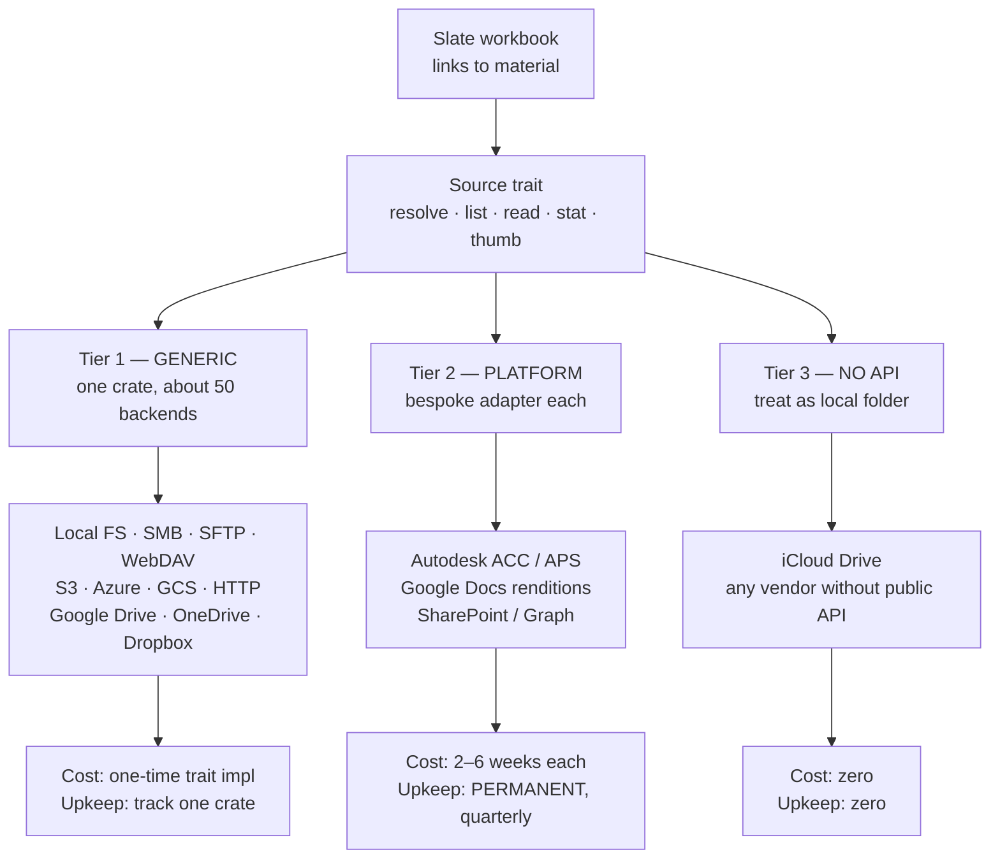

**Tier 1 — genuinely close to point-and-shoot.** Apache OpenDAL is a Rust-native data access layer that <cite index="16-1">talks to 50+ backends through one API, with each service behind a feature flag, and the same verbs — `read`, `write`, `stat`, `delete` — working on every service</cite>. Its coverage includes <cite index="18-1">standard protocols (FTP, HTTP, SFTP, WebDAV), object storage (S3, Azure Blob, GCS, OSS), file storage (local fs, HDFS), and consumer cloud storage including Google Drive, OneDrive and Dropbox</cite>. Critically for Article II, <cite index="16-1">retry, logging, timeout, and concurrency limits are composable layers wrapped around an operator rather than code you write per backend</cite>. It is Apache-governed, Rust-core, and the same pattern <cite index="17-1">Apache Iceberg's Rust implementation uses for its universal storage layer — a backend-agnostic `FileIO` interface, a dispatcher enum for per-backend config, and OpenDAL underneath handling per-service API differences, authentication and retries</cite>.

For Tier 1, your instinct is right: it is one section of code. You implement `Source` once over an `opendal::Operator`, and each new backend is a feature flag plus a credentials form. Maintenance is tracking one dependency.

**Tier 2 — bespoke, bounded, and permanently taxed.** Autodesk is the instructive case because it is the one you actually need professionally. It requires: a <cite index="23-1">three-legged OAuth authorization-code flow, where your app redirects the user to an Autodesk login, receives an authorization code on a callback, and exchanges it for a token</cite> — which for a *desktop* app means spinning up a loopback HTTP listener, handling PKCE, and storing refresh tokens in the OS credential vault. Then per-call you must handle <cite index="22-1">403s for insufficient scopes, 404s that require verifying resources through listing endpoints, 429 rate-limit responses needing exponential backoff, and 500s needing retry with increasing intervals</cite>, and <cite index="26-1">pagination where endpoints default to small page sizes and a `Retry-After` header tells you how long to wait when limited</cite>.

None of that is hard. The problem is that it never stops. In the current Autodesk changelog alone: <cite index="24-1">the APAC region code is being replaced with AUS for Australia endpoints with integrations required to update before March 31 2026, and Revit Cloud Model ZIP downloads changed after February 15 2026 requiring workflow updates for linked files</cite>. That is the actual texture of Tier 2: two breaking changes in one quarter, each individually trivial, each capable of silently breaking every workbook linked to that platform until someone notices.

**Tier 3 — accept the limitation.** iCloud Drive has no public cross-platform API for third-party desktop applications. Do not plan for it. Treat it as a local folder that happens to be synced, which is what it is on any machine where the user has installed iCloud.

### 3.3 What this actually costs: identity, not I/O (F2)

Here is the finding that matters more than the tier analysis.

Fetching bytes is the easy part and always was. The expensive part is that **`SlateItem` currently encodes a specific theory of identity** that cloud sources violate:

```rust
path: PathBuf,        // ← assumes: one canonical path, stable, machine-local
size: u64,            // ← assumes: byte length is meaningful and cheap to get
mtime: i64,           // ← assumes: a filesystem timestamp exists
cache_key: String,    // ← derived from path + size + mtime
```

Every one of those assumptions fails somewhere in the table in §3.1. A Google Drive file can have two parents and no canonical path. An ACC item has no size until you pick a version. A Google Doc has no meaningful mtime for the *rendition* you cached.

The replacement is a URI plus a content identity plus an optional version pin:

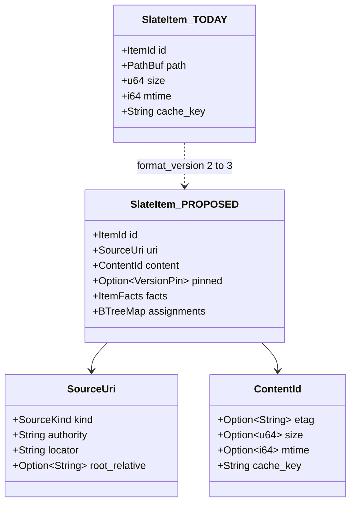

The `root_relative` field on `SourceUri` is the important one, and it is stolen directly from your own `.atlas-cache` design: store the locator *relative to a detected root* (project folder, ACC project, Drive shared-drive) alongside the absolute locator. Resolution then tries root-relative first, absolute second. That single field is what makes a workbook portable between machines (§4.6), between users, and between a local mirror and its cloud original — because the same document, reached three different ways, produces the same relative locator.

**Why this is urgent rather than merely important:** it is a `format_version` bump on `SlateDoc` (currently 2, with an in-place upgrade path already implemented at `doc.rs:330`). Migrating N workbooks is a loop. The cost of that loop is proportional to how many workbooks exist and how much you care about not breaking them. Today that number is small and they are all yours. This is the cheapest it will ever be.

### 3.4 The shortcut you should take first (F3)

Before writing a single adapter: **Google Drive, Box, Dropbox, OneDrive and Autodesk ACC all ship desktop sync clients that present as ordinary folders.** Drive for Desktop, Box Drive, and the ACC Desktop Connector all mount a drive letter or a folder tree on Windows.

Which means: with the `root_relative` change from §3.3 and *no adapter code at all*, Slate can link to material in all five platforms today. The sync client handles auth, download, caching, conflict, and offline. Your existing shell thumbnail pipeline works unmodified, because to Windows these are files.

What the native adapters buy you *beyond* that:

| Capability | Sync client | Native adapter |
|---|---|---|
| Basic linking and thumbnails | ✅ | ✅ |
| Works with zero code | ✅ | ❌ |
| No local disk consumption | ❌ | ✅ |
| Link survives another user's different sync setup | ❌ | ✅ |
| Version pinning (ACC) | ❌ | ✅ |
| Permission awareness before opening | ❌ | ✅ |
| Server-side thumbnails (no download to preview) | ❌ | ✅ |
| Works on a machine without the vendor client installed | ❌ | ✅ |

That table is the honest business case for Tier 2 work. It is not "access to the cloud" — you already have that. It is *portability of links between differently-configured machines*, which is precisely the collaboration problem in §4.6. **The cloud story and the collaboration story converge on the same fix.**

### 3.5 The performance cliff nobody warns you about

Article II binds the canvas to 60fps and names glanceability a performance property. Your local scanner streams ~500k files/sec. **A cloud API will do roughly 200 items per HTTP round trip, rate-limited per minute.**

That is a difference of three to four orders of magnitude, and it is not fixable by engineering. It changes the interaction model:

- **Never full-walk a cloud root.** Local Atlas walks everything and paints a heat map. A cloud root must be lazily expanded — one folder level per user action, with everything below it a portal card that says "not yet enumerated" rather than a count.
- **The index becomes authoritative, not advisory.** Locally, SQLite is a cache in front of a fast truth. For cloud sources it is the *only* fast truth; a background re-verify may take minutes.
- **Generation-tagging becomes load-bearing.** Article II.3 already requires it. With network sources, stale-result discard moves from good hygiene to correctness.
- **`link_status()` cannot be synchronous.** `Path::exists()` is microseconds; a HEAD against ACC is 100–400ms and may 429. Link health must become a background sweep with a tri-state (`Ok` / `Missing` / `Unknown`), and `Unknown` must be a first-class UI state rather than an error.

That last one is a small type change with wide reach, and it is worth doing at the same time as the identity refactor since it touches the same struct.

### 3.6 Constitutional reading

**Article IX ("Slate is a linker, never a database")** *anticipates* this work explicitly — "local paths today; git repositories, cloud drives, and URLs later." No conflict; this is the article being implemented as written.

**Article II (performance)** is where the friction is. Nothing in Article II contemplates a source with 400ms latency and a rate limit. It does not need amending — asynchrony and generation-tagging are already mandated — but the *interpretation* needs recording, which is what §3.5 does.

**Article III (the 10% rule)** should be applied ruthlessly here. "Support cloud storage" fails the rule; it names no real use. "Open a workbook whose images live in the firm's ACC project from my laptop at home without the Desktop Connector installed" passes it, and is a much smaller feature.

### 3.7 Recommendation

**Do, in this order:**

1. **The identity refactor** (`PathBuf` → `SourceUri` + `ContentId` + `root_relative`), with `format_version` 2→3 and an in-place migration. No new backends. Behaviour identical. ~1–2 focused sessions.
2. **Tri-state link health** and async `link_status` in the same change.
3. **`Source` trait with exactly two implementations**: `LocalFs` (today's behaviour) and one Tier-1 backend via `opendal` chosen for being the least interesting — SFTP or WebDAV. Proving the seam with a *boring* backend is the point; if the trait survives WebDAV it will survive S3.
4. **Stop.** Ship it, use it for a month, and see whether the sync-client shortcut (§3.4) has already met the real need.
5. **Only then**, and only if a named weekly use survives step 4, build **one** Tier-2 adapter. ACC, since it is the one with professional value. Budget it honestly: 2–6 weeks of first build, then a permanent ~quarterly maintenance obligation.

**Do not:** build a plugin system for sources, add more than one Tier-2 adapter before the first one has been in daily use for a quarter, or attempt Google Docs (as opposed to Drive) until the rendition-vs-document distinction has a facet in `docs/facet-taxonomy.md`.

### 3.8 Proposed Amendment A — Article IX clarification

> **Article IX (amended).** Workbooks link to material; they do not become a store of record. All links resolve through a `Source` abstraction — local paths, network shares, object stores, cloud drives, and platform document services — each resolving to content, facets, and thumbnails.
>
> **IX.2 — Locators are relative first.** Every link stores a locator relative to a detected source root wherever one exists, alongside its absolute form. Resolution prefers the relative form. A workbook must be openable on a machine that mounts the same material at a different absolute location.
>
> **IX.3 — Links declare their version discipline.** A link to a versioned source either pins a version or tracks the tip, and says which. Silent tip-tracking is prohibited: a workbook that shows different content on two days must be able to say so.
>
> **IX.4 — Latency is a source property, not an error.** Link health is tri-state (`Ok` / `Missing` / `Unknown`). No user-facing operation blocks on a source round trip.

---

## 4. Part II — Collaboration

### 4.1 You are describing three products (F5)

Untangling this first saves the most money. What you described contains three separable capabilities:

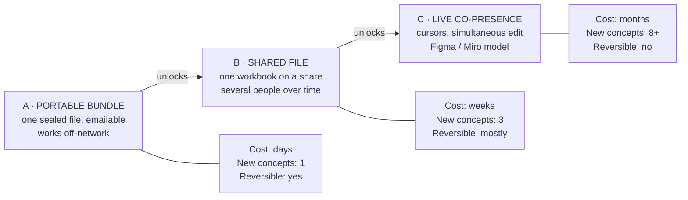

**A — the portable bundle.** A `.slate` whose linked material has been internalised, so it can be emailed, archived, or opened on a machine with no access to the originals. This is your "ZIP-like" idea. It is the cheapest of the three by an order of magnitude, it is the one your users will ask for first, and it is a prerequisite for the other two because it forces you to answer "what does this workbook mean away from its origin machine."

**B — the shared file.** The PowerPoint-on-OneDrive model you described: one workbook lives somewhere central, several people open it, and it does not corrupt. Note that this does *not* require simultaneity. Most of the value of "shared" in an architecture office is *sequential*: I mark up the board, you open it tomorrow and see my markup, with authorship visible. Your journal already records authorship per commit (Art. VI) — B is largely a matter of making concurrent *opening* safe rather than making concurrent *editing* work.

**C — live co-presence.** Cursors, selections, simultaneous manipulation. This is the Figma/Miro experience, and it is a different engineering discipline: it requires a transport, a conflict model, a presence protocol, a session lifecycle, and — most importantly — a durable commitment, because once people rely on it you cannot take it back.

**The single most valuable thing in this section:** these are not one roadmap item. Ship A, live with it, then B, live with it. C should only follow a specific unmet need that A and B failed to serve.

### 4.2 What the prior art actually does

Your instinct to look at PowerPoint and Figma is right, but they solve different problems and the difference is instructive.

**Figma** is the reference architecture for canvas multiplayer, and its key decision is *not* the one people assume. Figma <cite index="43-1">rejected both Operational Transformation, for its combinatorial complexity, and pure CRDTs, for their decentralisation overhead, in favour of a server-authoritative system inspired by CRDT last-writer-wins registers, where the server defines operation ordering, eliminating vector clocks and tombstone garbage collection</cite>. In their own words, <cite index="38-1">Figma is not using true CRDTs; CRDTs are designed for decentralised systems with no central authority, and since Figma is centralised the server is the authority, which removes that overhead for a faster, leaner implementation</cite>.

The resulting conflict model is worth internalising because it is remarkably simple: <cite index="38-1">the server keeps the latest value any client sent for a given property on a given object, so two clients changing unrelated properties on the same object do not conflict, nor do two clients changing the same property on unrelated objects; a conflict only occurs when two clients change the same property on the same object, and the document ends with the last value sent</cite>. Two further details matter for you: <cite index="43-1">child ordering uses fractional indexing with arbitrary-precision fractions rather than sequence operations, so inserting between two siblings averages their indices</cite>, and <cite index="39-1">deleted objects' properties are not stored on the server at all — that data lives in the undo buffer of the client that performed the delete, which is then responsible for restoring it on undo</cite>.

**PowerPoint** (the model you actually described) is a different beast: a *file* on a sync service, with co-authoring layered on top and a merge/conflict path when it fails. Its real lesson is negative — the desktop-app-plus-synced-file model works well right up until two people edit offline, at which point the user is shown a merge dialog. That failure mode is acceptable for Office because Office has thirty years of institutional trust. It would be corrosive in a young tool.

**The choice this implies for a local-first desktop app:** you have no server. That leaves two coherent options and one incoherent one.

| Option | Conflict model | Requires | Verdict |
|---|---|---|---|
| **Host election** — first opener becomes authoritative, peers connect to it | Server-authoritative LWW per property (Figma's model, minus the cloud) | LAN discovery, a session protocol, a host-migration story | **Recommended** |
| **True CRDT** — every peer holds a convergent replica | Automatic merge, offline-divergent editing works | A CRDT library and a data model shaped for it | Fallback if offline divergence becomes a real need |
| **Shared file, no protocol** — everyone opens the same `.slate` on a share | Last-save-wins over the whole document | nothing | **Actively harmful** — silently destroys work |

The third option is what happens by default if you do nothing and someone puts a `.slate` on a network share. It deserves an explicit guard (§4.6) regardless of which of the first two you build.

If you do end up needing a real CRDT, the Rust-native answer is currently Loro, and notably it already models the exact structure you need: it <cite index="82-1">implements a movable tree CRDT based on Kleppmann's highly-available move operation for replicated trees, and additionally employs fractional indexing to sort child nodes so siblings maintain an order — introduced specifically for scenarios such as graphic design and file systems where sibling order matters</cite>. Its own documentation credits the Figma blog for the fractional-index technique, which tells you these two designs have converged.

### 4.3 The blocking finding: the journal cannot converge (F4)

**This is the most important paragraph in the report.**

Article VI states that journal authorship is "the foundation for multiplayer synchronization later." Roadmap Phase 6 states that collaboration is "built on the authored, attributed journal streams that Article VI has been accumulating since Phase 1." That is a promise about a future capability being accrued *now*, in every commit.

The current command shape cannot keep it:

```rust
pub enum SceneCmd {
    Add    { index: usize, node: Node },   // ← positional
    Remove { index: usize, node: Node },   // ← positional
    Patch  { before: Box<Node>, after: Box<Node> },  // ← whole-node
}
```

Three specific failures, each fatal on its own:

1. **Positional inserts do not commute.** If I insert at index 4 and you concurrently insert at index 4, the two journals cannot be merged — replaying either order gives a different document, and neither peer's index refers to the same slot after the other's operation lands. Every collaborative canvas that has hit this problem has solved it the same way: **stable identity plus fractional ordering**, which is exactly what Figma and Loro both do.

2. **Whole-node patches destroy concurrent edits.** `Patch { before, after }` replaces the entire `Node`. If I change a frame's fill while you rotate it, whichever patch lands second reverts the other's change — not because of a conflict, but because each patch carries a full snapshot of every property. Figma's core insight is that <cite index="38-1">changes are atomic at the property value boundary</cite>, and that is *why* unrelated property edits do not conflict. Your patch granularity is the whole object, so *all* edits conflict.

3. **Stale-index rejection is silent.** `Scene::apply` returns `false` "when the command no longer matches the scene (stale index/id)." In single-player that is a safety net that essentially never fires. In multiplayer it is the *normal* case, and silently dropping a command means the two peers now hold different documents while both believe they are synchronised. Divergence without detection is the worst possible failure mode for a document tool.

**The good news is how cheap the fix is right now.** You already have the hard part — `NodeId` is a stable, scene-allocated identifier, and `GroupKey` groups are flat. Three changes make the journal convergence-capable:

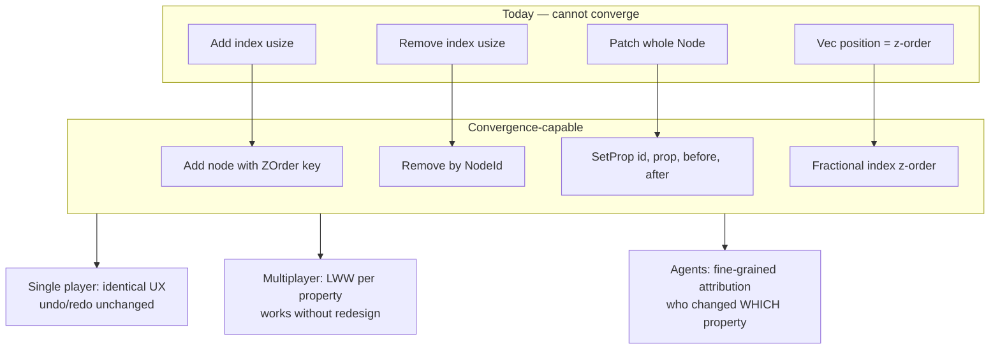

1. **Address by `NodeId`, never by index.** `Remove { id }`, and `Add { node, z: ZOrder }`.
2. **Replace `Vec` position with a fractional-index `ZOrder`** stored on the node. Sort on read. This is the change Figma makes with base-95 encoded fractions and Loro makes with a forked fractional-index implementation; it is well-trodden and there are Rust crates for it.
3. **Make `Patch` property-scoped.** `SetProp { id, prop: PropKey, before: PropValue, after: PropValue }`. Keep a coarse `ReplaceNode` for genuinely whole-object operations, but make the common path (move, resize, restyle) property-granular.

**Every one of these is an improvement in single-player too**, which is the test Article I implies for hedges: a hedge that costs you nothing today is free insurance. Property-scoped patches make the journal readable ("set fill" rather than "replace node"), make agent attribution precise ("the agent changed the *title*, you changed the *position*"), and shrink journal entries by roughly the size of an embedded image reference.

**Recommendation: do this before Phase 3 (portals), not at Phase 6.** Portals will add node kinds; every node kind added before the fix is another kind whose properties need enumerating afterwards. The cost curve here is not flat.

### 4.4 The portable bundle (product A) and its constitutional problem

You proposed a workbook that internalises all its links into a single package. This is straightforwardly the right first move — and it collides head-on with Article IX: *"Slate may point at other databases; it must not quietly become one."*

A bundle containing the bytes of 400 images **is** a store. The constitution says no.

But read the article closely: the operative word is **"quietly."** The prohibition is against Slate *becoming* a store of record by accident — links decaying into copies, the workbook becoming the place material lives, the tool drifting into being a DAM. That is a real failure mode worth prohibiting.

A bundle that is explicitly, visibly, and reversibly a *snapshot* is a different thing. The distinction that keeps the spirit intact:

| | Store of record (prohibited) | Sealed snapshot (permitted) |
|---|---|---|
| Is it the origin of the material? | yes | no — it records where it came from |
| Can you get back to the source? | no | yes — every entry keeps its `SourceUri` |
| Does it claim to be current? | yes | no — it carries a seal timestamp |
| Can you edit material inside it? | yes | no — re-link to edit |
| Does the UI hide its nature? | yes | no — bundles are visibly marked |

Concretely: a `.slatepack` is a zip containing the `.slate`, an `assets/` tree, and a **manifest** mapping every asset to the `SourceUri` and `ContentId` it was sealed from. Opening one shows a clear "sealed 2026-07-25, sources not verified" state. "Re-link to sources" is a first-class command that turns a bundle back into a live workbook.

You already have the pattern: your export engine writes "a JSON manifest documenting every source→dest mapping," and `slate-artifact` already does asset copying and base64 inlining under `ExportOptions`. **A bundle is `slate-artifact`'s asset pipeline pointed at a `.slate` instead of an `index.html`.** That is a smaller job than it sounds.

One honest warning on scale: an architectural competition board with 40 high-res images and two Rhino models is a 2–8 GB bundle. Email is not a viable transport for the real cases; the realistic transports are a file share, WeTransfer, or a USB drive. Budget a "bundle without originals — thumbnails and previews only" mode, which produces a 20–50 MB file that presents perfectly and cannot be zoomed to pixel level. That mode is likely to be the one people actually use, and it is *more* honest about being a snapshot, not less.

### 4.5 "Files on the same drive means everyone has access" — where this breaks

Your observation is correct and important: if the workbook lives on Box and everything it links to lives on Box, then anyone who can open the workbook can probably resolve its links. That is genuinely elegant, and it is the reason the cloud-source work and the collaboration work reinforce each other.

Five ways it breaks, all of which you will hit:

1. **Permissions are per-object, not per-drive.** Box, Drive and ACC all grant access at folder or file granularity. I can share a workbook from a folder you can read while it links to material in a folder you cannot. Result: a board with holes in it, and — worse — holes that look identical to missing files. This needs a distinct `Forbidden` link state, separate from `Missing`, or people will "fix" permission problems by re-linking to copies, which is exactly the drift into a store that Article IX prohibits.

2. **Mount points differ.** The same Box folder is `C:\Users\jm\Box\...` for you and `D:\Box\...` for me. Absolute paths break; this is F6, and `root_relative` is the fix.

3. **Sync lag is not atomic.** You save the workbook and its new images; the workbook syncs in 2 seconds, the 400 MB of images in 4 minutes. For that window, everyone else sees a broken board. Bundles do not have this problem; live links do.

4. **Selective sync and online-only files.** Both Box Drive and Drive for Desktop default to placeholder files that download on access. `Path::exists()` returns true; reading blocks for seconds. Your thumbnail pool will happily saturate on placeholder hydration and stall the canvas. This is an Article II problem hiding in an Article IX feature.

5. **Version skew.** On ACC especially, "the file" is a moving target. Two people open the same workbook a week apart and see different drawings, with nothing in the UI indicating why. This is what Amendment A.3 (declared version discipline) exists to prevent.

### 4.6 Edge-case register

Recorded here so future audits can check them off. Several of these have no analogue in Figma or Miro because they arise specifically from Slate being a *linker* with *geometric* semantics.

| # | Edge case | Why it bites | Mitigation |
|---|---|---|---|
| E1 | Link resolution differs per machine | Board renders differently for each viewer | `root_relative` locators (Amendment A.2) |
| E2 | Two people open a `.slate` on a share with no protocol | Last save silently destroys the other's work | Lock file / lease + visible read-only mode. **Do this even before any collaboration feature.** |
| E3 | Undo in a shared session | "Undo" must mean *my* last action, not the global last | Author-filtered undo stack; Figma's model — the deleter holds the deleted object's properties |
| E4 | Presence data hitting the journal | Cursors at 60Hz would flood an invertible ledger | Presence is ephemeral, never journaled. **Precedent already exists**: Art. VIII.4 intent ink — "it feeds context, it is not content" |
| E5 | Portals regenerate differently per peer | Art. V says contents are deterministic from `(source, query)` — but only *given the same source*. Two peers with different mounts get different contents from identical queries | Portal contents are per-peer; the *frame* syncs, the contents do not. Must be stated explicitly or it reads as a sync bug |
| E6 | Frame membership is geometric | Moving a node changes which slide it belongs to. Two people dragging concurrently can reorder someone else's deck without touching it | Either accept and surface it ("slide membership changed"), or move to explicit `Membership` edges (§6.5) |
| E7 | Thumbnail cache divergence | Peer A has warmed thumbs, peer B sees grey cards for minutes | Already solved — project-relative `.atlas-cache` keys. Generalise to cloud sources |
| E8 | Agent edits during a live session | An agent commits at machine speed while two humans edit | Agents propose into a staging layer by default (§5.5) |
| E9 | Host disappears mid-session | Laptop closes; who owns the document? | Host election needs a migration path, or accept "session ends, everyone keeps their local copy, last writer saves" |
| E10 | Clock skew between peers | LWW with wall-clock timestamps mis-orders edits | Use a session-monotonic counter from the host, never wall clock — Figma's server-defined ordering removes the need for timestamps entirely |
| E11 | A bundle opened, edited, and re-shared | Two divergent lineages of the same board with no relationship | Bundles carry an origin ID and a seal time; re-linking is explicit |
| E12 | Large paste / import during a session | One commit carrying 200 nodes stalls every peer | Chunk large mutations; already implied by Art. II.3 |

**E2 is the one to act on immediately.** It requires no collaboration feature at all, it is a half-day of work, and without it the *first* time two people in your office both open a workbook on the firm share, someone loses an afternoon.

### 4.7 Scalability — and permission to not over-engineer

Article III applies to collaboration as much as to features. The realistic concurrent-user count for an architectural workbook is **two to six**, occasionally eight in a review. It is not two hundred.

That single fact removes most of the hard engineering:

- Presence fan-out at N=6 is trivial; you do not need Figma's server-side fanout optimisation.
- LAN bandwidth for property-level updates at N=6 is negligible; the only heavy payloads are image bytes, which peers should resolve from the *source*, not from each other.
- You do not need a relay, a CDN, or an operational transform engine.

What you *do* need to size for is **node count per board**, not user count. A competition board or a Lens view over a large repo can hold thousands of nodes. Property-level LWW is O(1) per edit regardless of scene size — another argument for §4.3 — but a naive "broadcast the whole scene on change" implementation is O(scene) per keystroke and will fall over at exactly the board sizes you care about. Design the wire format as deltas from the start.

### 4.8 Recommendation

1. **E2 guard now** — lock file plus read-only mode for a `.slate` already open elsewhere. Half a day. Prevents real data loss today.
2. **The journal fix (§4.3)** — before Phase 3. This is the load-bearing change.
3. **Product A, the bundle** — `.slatepack` with manifest, plus the lightweight thumbnails-only variant. Ships user-visible value immediately and forces the portability questions.
4. **Product B, shared-file safety** — leases, authorship display, "reload with changes" rather than simultaneous editing. Most of the office value of "collaboration," at a fraction of C's cost.
5. **Product C only after a named use survives A and B.** If it comes: host election, LWW per property, presence off-journal, session-monotonic ordering, deltas on the wire.

### 4.9 Proposed Amendment B — bundles, sessions, and presence

> **Article IX.5 — Sealed snapshots.** A workbook may be sealed into a self-contained bundle containing copies of its linked material. A bundle is a *serialization*, not a store: every entry retains the `SourceUri` and `ContentId` it was sealed from, the bundle records when it was sealed, its snapshot nature is visible in the interface, and re-linking to live sources is always available. A bundle that cannot name where its contents came from is prohibited.
>
> **Article VI.2 — Convergent commands.** Journal commands address nodes by stable identity, never by position; ordering is carried by an order key, not by list index; and mutations are scoped to the smallest property that changed. A command that cannot be applied is surfaced, never silently dropped.
>
> **Article VIII.5 — Presence is not content.** Cursors, viewports, selections, and session membership are ephemeral: they are broadcast, never journaled, never exported, and never restored. This extends the intent-ink principle of VIII.4 to multi-participant sessions, human or agent.


---

## 5. Part III — Agents in the Slate ecosystem

### 5.1 Three modes are three context bindings, not three UIs

You described three interaction modes. The useful reframing is that they differ in **what determines the agent's context**, and that difference — not the visual treatment — is what drives the engineering.

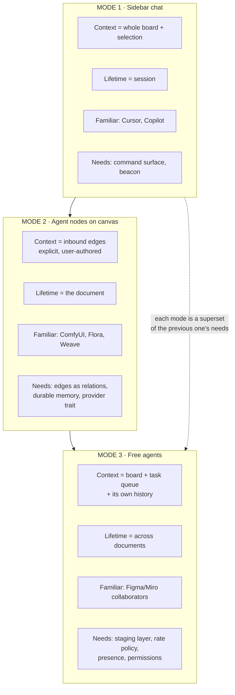

**Mode 1 — sidebar chat.** Context is implicit: whatever the beacon says is on screen. Your `atlas-ai` context beacon is already the seed of this, writing `.atlas-ai/<app>-context.json` describing what is being previewed. Cheapest to build, most familiar to users, and it is the right first target.

**Mode 2 — agent nodes.** Context is *explicit and spatial*: what flows in through inbound edges. This is the mode that most needs the graph work in §6, because "connect this frame to that agent" is meaningless unless edges are first-class typed relations. Your own connector spec already anticipates this — it cites "Art. VIII (connectors are machine-readable relations for the context beacon)" as a design input. You have already decided, in a spec, that wires carry semantics.

**Mode 3 — free agents.** Context is the whole board plus the agent's own accumulated task history. This is the mode with genuinely new requirements: a permission model, a rate policy, presence, and a staging layer.

The prior art for Mode 2 is well developed and worth studying rather than reinventing. Node-graph editors are established in AI creative workflows — <cite index="73-1">ComfyUI lets users compose generation pipelines through modular graph representations, and node-level branching, comparison and reordering is the distinguishing affordance versus linear interfaces</cite>. The design-tool lineage is converging on the same shape: <cite index="81-1">Weavy combined generative models and professional editing in a single node canvas for branching and remixing, and Figma acquired it, positioning Weave as part of an AI-native future for image, video and motion workflows</cite>. FLORA <cite index="74-1">describes its own approach as built for professionals who think in systems, not just outputs</cite>, and the research literature has converged on the same claim — that <cite index="78-1">organising the entire interaction history as a branching conversation tree on a 2D canvas captures the evolution of user intent over time, keeping alternatives visible</cite>.

**What this means for you strategically:** Mode 2 is not a differentiator on its own — Figma is building it. Your differentiator is that Slate's nodes are *linked professional material* (Rhino models, drawing sets, PDFs, IFC later) rather than generated media, and that agents act through a **command surface that also drives the human UI** (Art. VII). Nobody in that competitive set has command parity as constitutional law. Lean on that, not on the node-canvas aesthetic.

### 5.2 Long-lived memory: what is actually plausible (F7)

Your question — can an agent node hold memory that is still coherent weeks or months later — has a firm answer: **yes, but not by storing it in the agent.**

The 2026 consensus is that <cite index="71-1">memory is treated as a dedicated architectural component separate from the model's context window, not just a longer prompt</cite>, and the reason is a hard technical limit: <cite index="67-1">even million-token contexts hit context rot, where output quality degrades as context fills</cite>. Simply accumulating a conversation forever does not work and will not start working.

The architecture that does work maps almost perfectly onto Article VII.3 (agents extend the workspace with *data, not code*):

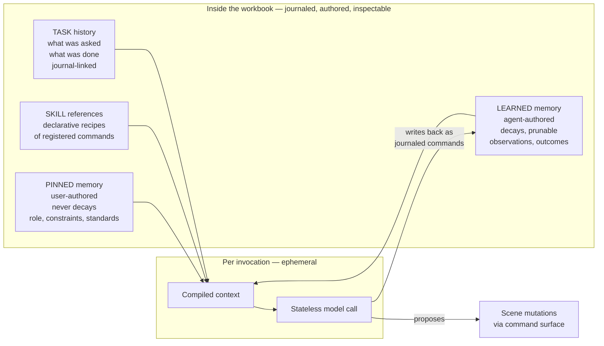

Four design rules that make this hold up over months:

1. **Memory lives in the document, not the provider.** An agent node's memory is a set of records inside the `.slate` (or beside it, in the AI workspace, using the beacon pattern you already have). Swap Claude for a local Ollama model and the memory survives — this is Article I's substrate hedge applied to model providers, and it is exactly as important as the renderer hedge.

2. **Separate pinned from learned.** User-authored memory ("this agent handles competition boards; house style is 8pt Univers; never touch the source files") is durable and never decays. Agent-authored memory ("last time, the client preferred the darker palette") should decay — the industry pattern is confidence scoring where low-confidence memories are archived after a period, and something as crude as "learned entries older than 90 days require re-confirmation" is sufficient at your scale.

3. **Memory is a privileged execution path — treat it as one.** This is the security finding, and it is not hypothetical. Research on agent skills documents **memory file poisoning**, where <cite index="65-1">a skill instructs the agent to write adversarial content into persistent memory files that the agent reads at startup, modifying long-term state so behaviour persists across arbitrarily many future sessions even after the offending skill is removed</cite>, and the broader recommendation is blunt: <cite index="68-1">if retrieved memory can influence what tools the agent uses, that is a privileged execution path and needs to be designed like one — with role-based segregation between system-rule memory and user-preference memory, permissions on who can write what, and audit logging</cite>. Article VI gives you the audit surface for free, since every commit carries its author. What you must add is the *segregation*: an agent may never write to pinned memory, and pinned memory must be visibly distinguished in the UI.

4. **Memory must be prunable and legible.** If a user cannot open a panel, read every memory entry in plain language, and delete any of them, then the agent is not a tool — it is an accumulating liability. This also happens to be the most reliable debugging affordance you will have.

**The honest limitation:** consistency over months is a *retrieval* problem, and retrieval quality on temporal and multi-hop queries is still the weak spot of every memory system published. Expect the agent to reliably recall pinned constraints and recent work, and to be unreliable about "what did we decide in March." Design the UI so the agent shows *which* memories it used, so the user can correct a bad retrieval instead of arguing with a confident wrong answer.

### 5.3 Skills, and the bright line Article VII.4 needs

You described agent nodes with "access to a series of skills." Article VII.4 explicitly forbids sandboxed scripts until an amendment is ratified, and instructs agents proposing script execution to be refused under Article XI. So the question is whether a "skill" is data or code.

The test you need is a bright line, and here is one that holds:

> **A skill is data if it can only be interpreted by the core's own command registry. A skill is code if it requires an interpreter you would have to sandbox.**

Applied:

| Artifact | Verdict | Why |
|---|---|---|
| "Apply house style: these 6 registered commands, these parameters" | **Data** — permitted | A recipe of registered commands. Every step is journaled and reversible. The core is the interpreter. |
| A saved dashboard (a scene of portals) | **Data** — permitted | Already named in Roadmap Phase 4 |
| A brush, palette, tag template | **Data** — permitted | Art. VII.3 as written |
| "For each selected node, if width > 200, run X" | **Grey — needs a decision** | Contains control flow. Either constrain to a declarative filter+action form (data) or admit it is a language (code) |
| A Rhai/Lua/WASM script attached to a workbook | **Code** — prohibited until amendment | Requires a sandbox by definition |

My recommendation: **define skills as declarative filter+action recipes over the command registry, with no user-authored control flow**, and treat the grey row as data *only* in that constrained form. That keeps Article VII.4 intact for real, rather than by relabelling. If a real weekly need later demands loops and conditionals, that is the moment to draft the script amendment — with evidence, as the constitution intends.

An underrated benefit: because a skill is a list of registered commands, a skill is *also* a valid MCP tool description, a valid palette entry, and a valid documentation page. The "specs are data" pattern from `atlas-commands` pays out a fourth time.

### 5.4 Branching spawn: keep one history

Your branching idea — ask for two replies, get two nodes, discard one, continue from the other — is the most interesting agent proposal in your list, and it has one specific trap.

**The trap:** it looks like version control, so the instinct is to build a second history system — a conversation DAG with its own branch/discard/merge semantics, parallel to the journal. Do not. Two histories in one document is a permanent source of "undo did something surprising" bugs, and it violates the spirit of Article VI (the journal is *the* mutation record).

**The resolution:** branching is already expressible in the graph you are proposing. A spawned reply is an ordinary node. The relationship to its parent is an ordinary edge with a `Provenance` role. Discarding a branch is ordinary node deletion, which is ordinary journal undo. Continuing from a node is spawning a new child with a new provenance edge.

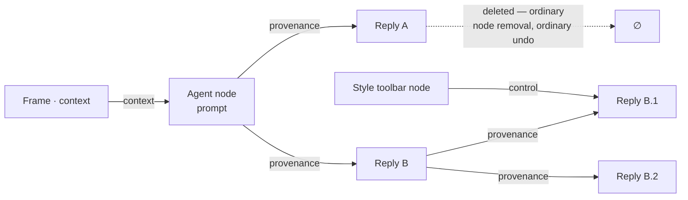

This buys you three things for free: the branch structure is visible and manipulable with the normal selection and layout tools; it exports to the artifact writer like any other subgraph; and an agent can read its own conversation history by walking provenance edges, which is a *much* better retrieval story than a flat transcript.

One rule to add: **provenance edges are immutable and non-reparentable.** They record what happened. A user may delete a spawned node, but may not rewire its parentage — that would make the history lie, which Article IV (honest models) prohibits.

### 5.5 Free agents and the velocity mismatch

Mode 3's genuinely new problem is not autonomy, it is **speed asymmetry**. A human commits a handful of mutations a minute. An agent can commit hundreds a second. The 2026 literature on multiplayer specifically flags this: <cite index="40-1">the new wildcard is AI agent velocity — agents generate operations 25 to 100 times faster than humans, stressing conflict-resolution algorithms in ways neither OT nor CRDTs were designed for</cite>.

At your scale this is not a distributed-systems problem, it is a *consent* problem: a free agent that rearranges a board while you are working on it is unusable regardless of how correctly the edits merge.

**Recommendation: agent mutations land in a staging layer by default.** An agent's proposed changes are visible on the canvas as a distinguished overlay (tinted, attributed, non-authoritative) with accept/reject at the granularity of a task. Only an explicitly "autonomous" agent node writes directly to the journal. This gives you:

- Article VIII.3 satisfied structurally — the human is never blocked, and never surprised.
- A natural throttle in multiplayer, since staged changes are per-user until accepted.
- A far better failure mode when the agent is wrong: reject, rather than undo 200 commands.

The precedent exists in your own codebase: the Lens agent overlay is exactly this pattern already — <cite index="57-1">a deterministic layer that never hallucinates plus a semantic overlay written by an agent, watched and applied separately</cite>. Your `lens-agent-contract.md` describes Slate supplying deterministic ground truth and agents supplying semantic labels via a separate file. **Generalise `overlay.json` from a Lens feature into the ecosystem's staging model.**

### 5.6 Protocol and provider churn

Two moving targets, both of which should be held at arm's length by adapters.

**MCP is versioned and moving quickly.** The specification revision <cite index="50-1">2026-07-28 was locked as a release candidate on May 21, 2026 with the final specification publishing on July 28, 2026, and the stated expectation is that implementers targeting it will be able to adopt future revisions without rewriting their transport or lifecycle code, using deprecation windows and extensions as the standard tools</cite>. The official Rust SDK, `rmcp`, tracks it. Relevant new mechanics include <cite index="50-1">server-initiated requests being permitted only while the server is actively processing a client request, so a user is never prompted out of nowhere and every elicitation traces back to something they started</cite> — which happens to align neatly with your staging-layer recommendation.

**Model providers churn faster than protocols.** Today `atlas-ai` launches Cursor and assumes it is installed. You named Ollama as a future local option. Neither should be a dependency of the core.

The constitutional reading is clean: **Article I's renderer-agnostic rule generalises.** Just as no document model may depend on egui, no command, memory record, or agent node may depend on a specific provider or protocol version. Concretely:

- `atlas-commands` stays pure and knows nothing about MCP.
- A new `atlas-mcp` crate adapts the registry to the protocol. Spec churn touches only this crate.
- A `Provider` trait (`complete`, `stream`, `cancel`, `capabilities`) with implementations for Cursor-as-partner, a local Ollama endpoint, and a hosted API. Agent nodes reference a provider *by name*, resolved through user settings, so a workbook does not hard-code a vendor.
- Split `atlas-ai`'s `ui.rs` out (into `atlas-shell` where chrome belongs under Art. X) so the AI crate becomes renderer-free like the other durable crates.

### 5.7 Recommendation

1. **Mode 1 first**, on the existing beacon. It exercises the command surface, which is the thing everything else needs.
2. **Split `atlas-ai`**: pure core + `Provider` trait; UI to `atlas-shell`; new `atlas-mcp` adapter crate.
3. **Generalise the Lens overlay into a staging layer** before any agent can write to a board.
4. **Then Mode 2**, after the graph work in §6 — agent nodes are the first real consumer of typed edges, and building them before the edge model exists will bake the wrong model in.
5. **Mode 3 last**, gated on a named weekly use, with staging on by default and autonomy opt-in per node.
6. **Memory as journaled document data** from the very first agent node, with pinned/learned segregation. Retrofitting memory provenance later is painful; adding it at the start costs a field.

### 5.8 Proposed Amendment C — the agent surface

> **Article VII.5 — Agent nodes.** An agent may be represented as a node on the board. Its context is defined by its inbound edges; its memory is journaled document data subject to VII.3; its outputs are ordinary nodes and edges. An agent node is not a special universe: it is subject to selection, layout, export, undo, and every other command like any other node.
>
> **Article VII.6 — Memory segregation.** Agent memory distinguishes *pinned* records, authored by the human and never written by an agent, from *learned* records, authored by an agent and always prunable by the human. All memory is human-readable and deletable. Memory that cannot be read or deleted is prohibited.
>
> **Article VII.7 — Proposal by default.** Agent mutations enter a staging layer and require human acceptance unless the agent has been explicitly granted autonomy for that workspace. Staged changes are visible, attributed, and rejectable as a unit.
>
> **Article VII.8 — Skills are recipes.** A skill is a declarative sequence of registered commands with parameters. Skills contain no user-authored control flow. This is the boundary that keeps VII.4 meaningful; anything requiring an interpreter remains prohibited pending the named script amendment.
>
> **Article I.2 — The provider hedge.** The renderer-agnostic rule extends to model providers and agent protocols. No document model, command, or memory record may depend on a specific model provider, vendor application, or protocol revision. Protocol adapters are leaf crates.


---

## 6. Part IV — The graph API: nodes, edges, and inheritance

This is the section you asked for most specifically, so it carries the most diagrams.

### 6.1 Where you are today

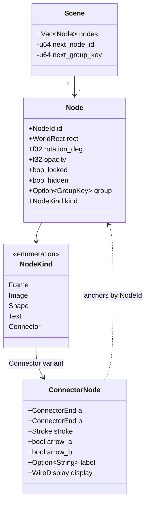

The design is coherent and the geometry handling is genuinely good. But `Connector` sitting inside `NodeKind` produces three concrete symptoms already visible in the code:

1. **`Node.rect` is meaningless for connectors.** Every connector carries a `WorldRect` that is either ignored or maintained as a derived AABB. A field that lies for one variant is a design smell that grows with every new variant.
2. **The z-order list contains things with no z.** Frames already have a special painting rule ("frames paint behind all content regardless of position in the vec"). Connectors want one too. Each exception is a branch in the painter and the writer.
3. **Relations cannot be queried.** "What connects to this frame?" requires a linear scan of all nodes, matching on a variant, then matching on endpoints. Fine at 200 nodes; wrong shape for agent context resolution at 5,000 (§5.1, Mode 2).

### 6.2 Graph theory, only the parts that pay rent

You said you had not researched edge types. Here is the minimum that will change your design decisions, with the practical consequence attached to each.

| Concept | Meaning | Why you care |
|---|---|---|
| **Directed vs undirected** | Does the edge have a from/to? | A connector between two moodboard images is undirected. A context edge (frame → agent) is directed and the direction *is* the meaning. You need both, so direction must be a property, not an assumption. |
| **Multigraph** | More than one edge allowed between the same pair | You need this. Two agents can both read one frame; one frame can be both context and styling target. Do not enforce uniqueness on (source, target). |
| **Self-loop** | An edge from a node to itself | Almost always a bug in your domain. Legality schema should reject it except for explicitly allowed roles. |
| **Hyperedge** | One edge, N endpoints | Tempting for "this toolbar governs these five frames." **Recommendation: don't.** Model it as five edges. Hyperedges break every renderer, every hit-test, and every UI affordance you already have, in exchange for saving four records. |
| **Property graph (LPG)** | Nodes and edges both carry a type label and arbitrary attributes | This is the model you are describing, and it is the right one. It is Neo4j's model, tldraw's model, and the model your `SceneCmd` already suits. |
| **Typed / schema-constrained graph** | Declared rules for which edge types may connect which node types | **The highest-value idea in this section.** See §6.6. |
| **DAG constraint** | No cycles permitted | Required for any edge whose semantics involve *evaluation*. See §6.7. |
| **Derived vs stored geometry** | Is the edge's shape data or a function? | You already made the right call — `connector_bezier()` derives. Keep it, and note that this property is what distinguishes an edge from a node. |

**The single most useful distinction:** an edge is *a relation whose geometry is derived from its endpoints*; a node is *an entity with independent extent*. Applied to your current model, that test says `Connector` is not a node — which is exactly what your own code already knows, since it stores no geometry for it.

### 6.3 The precedent: tldraw already made this migration (F8)

You do not have to reason about this from first principles. tldraw — the most-studied open-source infinite canvas SDK — shipped arrows with bindings embedded in the arrow shape, then moved them out.

In their current architecture, <cite index="56-1">shape records store immutable data in the store while ShapeUtil classes define rendering, interaction and geometry, a separation that keeps the data layer simple and portable</cite>, and <cite index="57-1">bindings connect shapes together, such as arrows connecting to boxes, managed by a separate BindingUtil</cite>. Arrows <cite index="55-1">connect to other shapes via bindings, with terminal handles connecting through `TLArrowBinding` records</cite>.

The migration itself is documented in their RFC on migrations: they <cite index="62-1">required a store-level migration to pluck the binding information out of existing arrows and create new standalone binding records</cite> — and that migration had to be sequenced against pre-existing per-field migrations on the old embedded binding data. Their file format now carries separate schema version sequences for `com.tldraw.shape.arrow` and `com.tldraw.binding.arrow`.

**Read that as a cost forecast.** They paid: a store-level migration, migration-ordering complexity against third-party extensions, and a permanent schema-versioning obligation for two record types where there had been one. You are currently at their pre-migration design, at 73 commits, with one user, and with a `format_version` upgrade path already implemented. **The same change costs you a schema bump and an afternoon.**

### 6.4 Correcting the Rhino analogy

You reached for `Rhino.Geometry` as the model: a base class that everything geometric inherits from, with `Curve` → `NurbsCurve` beneath it. It is a reasonable instinct and the wrong pattern here, for two reasons.

**Reason 1 — Rust doesn't do inheritance, and the workaround is worse.** RhinoCommon is C#; `GeometryBase` is an abstract class with virtual dispatch. Rust's equivalents are trait objects (dynamic dispatch, no shared data) or enums (shared data, closed set). Simulating a class hierarchy in Rust produces either a `Box<dyn Node>` soup that cannot be serialised cleanly or a nest of structs-containing-structs that is painful to pattern-match.

**Reason 2 — the closed enum is the *better* design for an agent-native tool.** This is the more important point. A closed, tagged union serialises to a JSON schema that an agent can enumerate exhaustively: *these are all the node kinds that exist, these are their properties*. An open inheritance hierarchy cannot be enumerated — an agent can never know what subclasses exist. Article VII wants the human and agent surfaces to be the same surface; that argues strongly for a finite, declarable type set.

**What you actually want from inheritance is capability grouping** — "everything that can be styled," "everything that can anchor a wire." Rust expresses that with traits, and you already have a ratified precedent for exactly this style of thinking: **`docs/facet-taxonomy.md`**. Files are not sorted into a type tree; a file is described by the *set of capabilities it exhibits*, and tools bind to facets rather than formats.

**Apply the same idea to nodes.** Facets for files, capabilities for nodes. One concept, used twice, which is precisely the kind of self-consistency the constitution exists to protect.

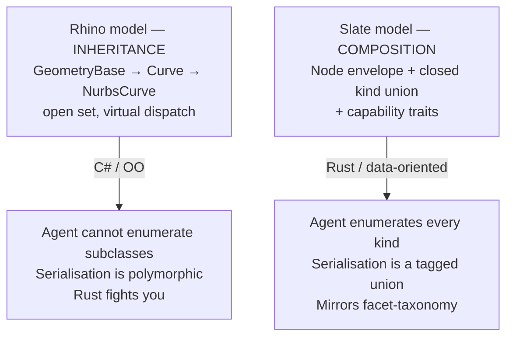

### 6.5 The proposal

Two top-level record types in a new `slate::graph` module, replacing the current single-list scene.

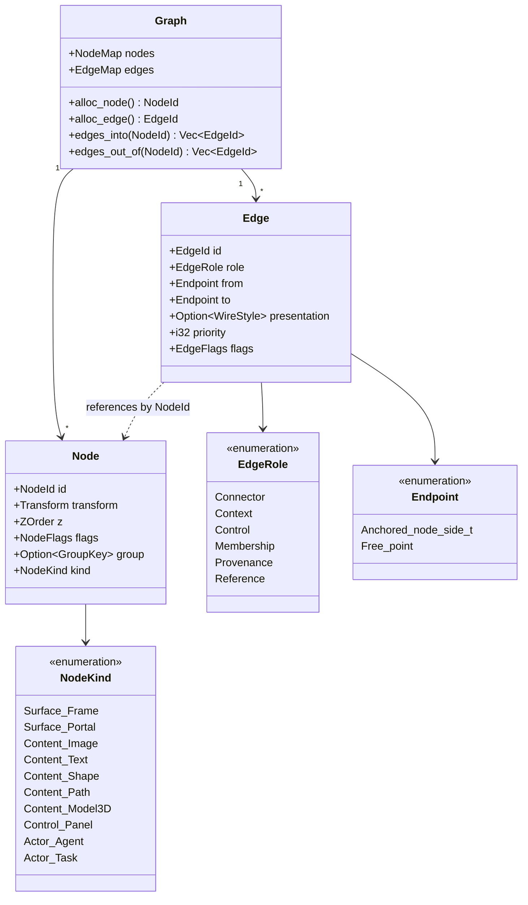

**Node kinds, grouped by family.** The families are documentation and menu structure, not types — the enum stays flat so it serialises cleanly.

| Family | Kinds | Defining property |
|---|---|---|
| **Surface** | `Frame`, `Portal` | Contains or generates other content; has membership semantics |
| **Content** | `Image`, `Text`, `Shape`, `Path`, `Model3D` | Authored material with visual extent |
| **Control** | `Panel` (the toolbar-as-node from §7) | Holds parameters that govern other nodes |
| **Actor** | `Agent`, `Task` | Has behaviour, memory, and a lifecycle |

Note `Portal` appears here as a node kind. Roadmap Phase 3 requires it and it does not exist yet — adding it to the taxonomy now costs nothing and prevents a second migration later.

**Edge roles, with their semantics spelled out:**

| Role | Directed? | Visible? | Evaluated? | Meaning |
|---|---|---|---|---|
| `Connector` | optional (arrowheads) | yes | no | Annotative wire. Today's `ConnectorNode`. |
| `Context` | yes | yes, faint | no | Source node supplies context to an actor node |
| `Control` | yes | yes, faint | **yes** | Control panel governs a property of the target |
| `Membership` | yes | no | no | Explicit container membership (optional alternative to geometric frame membership — see E6) |
| `Provenance` | yes, immutable | optional | no | This node was spawned from that one (§5.4) |
| `Reference` | yes | no | no | Non-visual semantic link, e.g. "this detail refers to that sheet" |

**Capability traits, replacing inheritance:**

```rust
pub trait Spatial    { fn bounds(&self) -> WorldRect; fn transform(&self) -> &Transform; }
pub trait Paintable  { fn paint_order(&self) -> ZOrder; fn opacity(&self) -> f32; }
pub trait Styleable  { fn style_props(&self) -> &[PropKey]; }   // what a Control edge may drive
pub trait Anchorable { fn anchor(&self, side: Side, t: f32) -> [f32; 2]; }
pub trait Container  { fn admits(&self, kind: &NodeKind) -> bool; }
pub trait Evaluable  { fn recompute(&mut self, inputs: &EvalInputs) -> Recomputed; }
pub trait Attributed { fn attrs(&self) -> &AttrMap; }   // agent-visible metadata
```

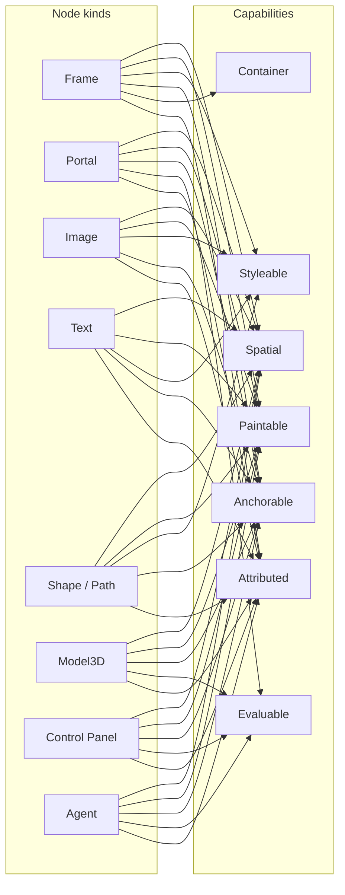

Read that diagram as the answer to "what inherits from what": nothing inherits, but `Frame` and `Image` both satisfy `Styleable`, so any tool or agent operation written against `Styleable` works on both — and on every future kind that opts in. That is inheritance's actual benefit, without its costs.

### 6.6 The legality schema — the highest-value idea here

Declare, as data, which edge roles may connect which node kinds. This is a small table that buys a disproportionate amount:

```rust
pub struct EdgeRule { role: EdgeRole, from: KindMask, to: KindMask, cardinality: Card }

const EDGE_RULES: &[EdgeRule] = &[
    EdgeRule { role: Connector,  from: ANY_SPATIAL, to: ANY_SPATIAL, cardinality: Many },
    EdgeRule { role: Context,    from: ANY,         to: ACTOR,       cardinality: Many },
    EdgeRule { role: Control,    from: CONTROL,     to: STYLEABLE,   cardinality: Many },
    EdgeRule { role: Membership, from: CONTAINER,   to: CONTENT,     cardinality: OneParent },
    EdgeRule { role: Provenance, from: ANY,         to: ANY,         cardinality: OneParent },
];
```

What it gives you:

- **The UI knows what a drag can do.** Dragging from a control panel highlights only styleable targets. No invalid states to render.
- **Agents get a legal-move list.** An MCP tool description that says "you may create a `Context` edge from any node to an `Agent`" is dramatically more reliable than one that says "create edges."
- **Files validate on load.** A corrupted or hand-edited `.slate` fails with a specific message instead of painting wrong.
- **It is documentation that cannot drift** — the same pattern as `atlas-commands`' spec table, which already prevents the "ENTRIES vs hotkeys" bug class you named in `DESIGN.md`.

### 6.7 Evaluated vs declarative edges — the rule that prevents a class of bugs

Partition the roles into two disjoint sets and enforce different invariants on each:

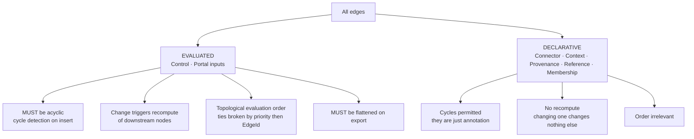

Every node-graph application that has skipped this distinction has shipped infinite-loop bugs. Blender, Houdini, Grasshopper and ComfyUI all enforce acyclicity on their evaluated graphs; Miro and FigJam permit arbitrary cycles because their arrows are annotation. **You are building both kinds in one canvas**, which is unusual and is precisely why the partition must be explicit rather than emergent.

Two hard rules follow, both constitutional:

- **Determinism (Art. IV).** Evaluation order must be topological, with ties broken by explicit `priority` then `EdgeId` — never by hash-map iteration order or insertion order. Non-deterministic style resolution would make the egui painter and the artifact writer disagree, which Article IV forbids directly.
- **Flattening on export (Art. IV.1).** "Exports are serializations, not conversions." An SVG has no concept of a control edge, so the writer must resolve every evaluated edge to concrete property values at write time. If the exported artifact and the board ever disagree because of an unflattened control edge, that is an Article IV violation, not a rendering bug.

### 6.8 Naming and module layout

```
crates/slate-doc/src/
  graph/
    mod.rs          — Graph, ids, allocation, adjacency indices
    node.rs         — Node, NodeKind, kind payload structs
    edge.rs         — Edge, EdgeRole, Endpoint, derived geometry
    caps.rs         — capability traits
    schema.rs       — EDGE_RULES, validation
    order.rs        — ZOrder fractional index
    cmd.rs          — GraphCmd (the convergent successor to SceneCmd)
```

On the public API naming you proposed (`slate.nodes`, `slate.edges`): keep it, but as *module paths*, `slate_doc::graph::{node, edge}`. When an MCP surface or a future scripting surface exposes this, `slate.nodes.*` and `slate.edges.*` is the right external shape and maps one-to-one onto the modules.

One correction worth making early: **`Scene` should be renamed `Graph`.** "Scene" implies a render tree; you are building a property graph that happens to be rendered. Names shape what people build, and the rename is free today.

### 6.9 Migration path

All of this is one `format_version` bump (3 → 4, assuming the source refactor takes 3), sequenced as follows so that no step leaves the tool broken:

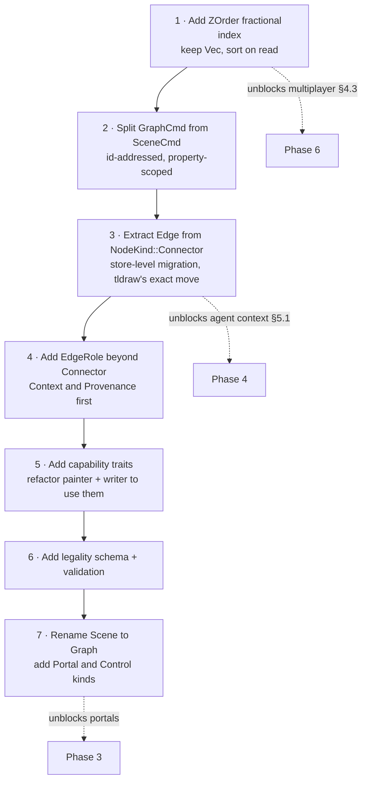

Steps 1 and 2 are the ones with deadline pressure (they gate Phase 3 onward). Steps 3–7 can land incrementally.


---

## 7. Part V — Chrome, canvas, and control surfaces

### 7.1 The real question

You framed this as "toolbars versus flyouts versus tabs — how do these fit one architecture," plus the specific ambition of a toolbar that can also live on the canvas as a node, wired to frames to govern their style.

The framing to reject: *chrome and canvas are two worlds that need unifying*. They aren't and don't. Chrome is the shell; the canvas is the document. Article X exists precisely to keep chrome painting in `atlas-shell`, and dissolving that boundary would violate it.

The framing that works: **a panel is a view over a set of typed parameters. The parameter set is the durable thing; where it is displayed is a presentation choice.** Once you separate those, "toolbar," "flyout," "tab," and "canvas node" stop being four architectures and become four *slots* for one kind of content.

### 7.2 One model, three interpreters — a pattern you have already ratified twice

Article IV: "the egui painter and the artifact writer remain two interpreters of one model." Article V: portals are generated views of a source, sharing one scene graph. Both are the same move — *one durable model, several renderings*.

Control surfaces are that move a third time:

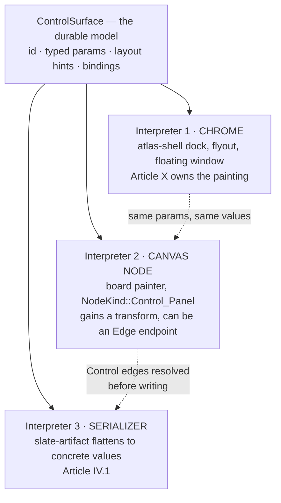

Because it is the third instance of an established pattern rather than a new one, the constitutional cost is near zero. It needs a clarification, not an amendment — see §7.6.

### 7.3 The `ControlSurface` model

```rust
pub struct ControlSurface {
    pub id: SurfaceId,
    pub title: String,
    pub params: Vec<Param>,
    pub layout: LayoutHint,          // Row | Column | Grid — a hint, not a pixel spec
}

pub struct Param {
    pub key: ParamKey,               // stable identity, survives reordering
    pub label: String,
    pub kind: ParamKind,             // Slider{min,max,step} | Color | Toggle | Enum | Number | Text
    pub value: ParamValue,
    pub binds: Option<PropKey>,      // which node property this drives when connected
}
```

Three properties make this work:

- **`ParamKey` is stable**, so a saved surface survives you reordering its controls.
- **`binds` is optional**, so a surface can hold values that drive nothing (a saved palette) or values that drive properties (a style controller).
- **`ParamValue` lives inside the union of things `PropKey` can address** — which means the SVG ceiling (Art. IV.3) governs it automatically. A control that can express something SVG cannot is prohibited by an article you already ratified.

Your `ui-tokens.toml` and the existing dock panel bodies are the raw material; this is a formalisation of what those already are.

### 7.4 Style resolution, and the two traps (F9)

Connecting a control panel to a frame with a `Control` edge means a frame's appearance now depends on distant graph state. That is a real gain in expressiveness and it introduces two failure modes that must be closed by design.

**Trap 1 — ambiguous resolution.** Three panels connect to one frame, two of them driving `fill`. Which wins? "Whatever order the edge map iterates" is exactly the class of non-determinism Article IV forbids. **Rule: resolution is by explicit `priority: i32` on the edge, descending; ties broken by `EdgeId` ascending.** Both are stable and serialisable. Show the winning source in the inspector so a user can see *why* a frame is that colour.

**Trap 2 — the export divergence.** SVG has no control edges. If the writer does not flatten, the artifact and the board disagree, which is a direct Article IV.1 violation. **Rule: `slate-artifact` resolves all evaluated edges to concrete values before writing, and a golden test asserts board-vs-artifact parity for a scene containing control edges.** Add that test in the same commit as the feature, not after.

A third, softer risk: **non-local style is harder to reason about than local style.** A frame that looks wrong now has a cause somewhere else on an infinite canvas. Mitigations that cost little: paint control edges faintly but always visible when either end is selected; add a "reveal controllers" command that frames the camera on everything driving the selection; and make detaching a control edge *bake* the current values into the node rather than reverting it, so disconnecting never causes a surprise visual jump.

### 7.5 Toolbars, flyouts, tabs — one architecture

They are not three things. They are **Slot × Trigger × Content**, and you have already half-built this in `DOCK.md`'s Tool / Dashboard / Action kinds.

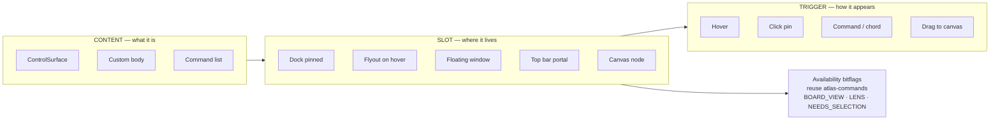

The concrete recommendation is to extend the pattern that is already working:

```rust
pub struct PanelSpec {
    pub id: PanelId,
    pub content: PanelContent,          // Surface(SurfaceId) | Body(fn) | Commands(&[CommandId])
    pub allowed_slots: SlotMask,        // DOCK | FLYOUT | WINDOW | TOPBAR | CANVAS
    pub default_slot: Slot,
    pub availability: Availability,     // the existing atlas-commands bitflags, reused verbatim
    pub icon: IconId,
    pub description: &'static str,
}
```

This is `CommandSpec` for panels, and it inherits every benefit `DESIGN.md` already claims for commands: one table feeds the dock, the flyouts, the Advanced reference, and the palette, so they cannot drift. `allowed_slots` is what lets a style panel be draggable to the canvas while the Workbook panel is not — expressed as data, checkable in a test, and legible to an agent.

**One boundary to hold firmly (Art. X):** the *rendering* of a control surface as chrome stays in `atlas-shell`. The `ControlSurface` model itself is renderer-free and belongs in a pure crate — `slate-doc` if it is part of the document, a new `atlas-controls` crate if shared with Atlas. When a surface is instantiated as a canvas node it is painted by the board painter, not by `atlas-shell`, and keeping those two painters in visual agreement is a token-sharing problem, which `ui-tokens.toml` already solves.

### 7.6 Recommendation and Amendment D

Sequence this *after* the graph work in §6, because a canvas control panel is a node with `Control` edges — the model must exist first. But specify it now, because knowing that panels will one day be nodes changes how you would build the panel registry today.

> **Proposed Amendment D — Article V.2 (dual presentation).** A *control surface* — a named set of typed parameters — is document-adjacent data with more than one presentation: as chrome (painted by `atlas-shell`, Art. X), as a node on the board, and as flattened values in an exported artifact (Art. IV.1). The parameter set is the durable model; its location is a presentation choice.
>
> **V.3 — Deterministic resolution.** Where several control surfaces drive one property, resolution is by declared priority, ties broken by stable edge identity. Resolution order is never implicit in storage or iteration order.
>
> **V.4 — Flatten on export.** Evaluated edges are resolved to concrete values by every serializer. Board and artifact must not disagree; a golden test enforces this.

---

## 8. Constitutional audit

| Article | Status | Risk | Action |
|---|---|---|---|
| **I** — minimal core, renderer hedge | **Holding well.** ~28 kLOC in pure crates carrying the durable models | `atlas-ai` has a UI module and will grow into the agent surface while renderer-bound | Split `atlas-ai`; ratify **Amendment C / I.2** extending the hedge to model providers and protocols |
| **II** — performance | Holding locally | Network sources have no 60fps story; cloud enumeration is 3–4 orders of magnitude slower than local scan | Record the interpretation in §3.5; tri-state async link health |
| **III** — the 10% rule | Holding | Every item in this report is a candidate for violating it | Each recommendation is gated on a *named weekly use* before build |
| **IV** — honest models | Holding | Control edges (§7.4) can silently break board-vs-artifact parity | Flattening rule + golden test, ratified as **Amendment D / V.4** |
| **V** — one universe, portals | Holding, unimplemented | `Portal` is not yet a `NodeKind`; multiplayer makes portal contents per-peer (E5) | Add `Portal` in the §6.9 migration; state the per-peer rule explicitly |
| **VI** — journal-only mutation | **VIOLATED IN SPIRIT** | The journal cannot converge; Art. VI and Roadmap Phase 6 both promise it can | **Amendment B / VI.2**, and do the work before Phase 3 |
| **VII** — command parity | Holding | "Skills" drift toward the prohibited script territory of VII.4 | **Amendment C**: skills as declarative recipes; the data/code bright line |
| **VIII** — bandwidth | Holding | Presence data would flood the journal if treated as content | **Amendment B / VIII.5**, extending the intent-ink principle |
| **IX** — linker, not database | Holding | Bundles are a store unless explicitly sealed and reversible | **Amendment A + B / IX.5** |
| **X** — no chrome divergence | Holding | Canvas-node control panels are painted by the board, not `atlas-shell` | Share tokens; keep the model renderer-free; explicitly scope Art. X to *chrome* painting |
| **XI** — agent conduct | Working as designed | — | This document is an exercise of XI.1 |

**Summary:** one real violation (Article VI), four amendments proposed, no article requiring repeal. For a constitution ratified six days ago and stress-tested against five substantial future capabilities, that is a good result — it suggests the articles are load-bearing rather than decorative.

---

## 9. Decision matrix

Scored 1–5. **Payoff** = daily-driver value now. **Cost** = build effort (5 = cheapest). **Reversibility** = how easily undone (5 = trivially). **Debt** = cost of *not* doing it now, compounding (5 = most urgent). **Fit** = constitutional alignment (5 = required by an article).

| # | Decision | Payoff | Cost | Rev. | Debt | Fit | Σ | Verdict |
|---|---|:--:|:--:|:--:|:--:|:--:|:--:|---|
| 1 | Open-file lock / read-only guard (E2) | 3 | 5 | 5 | 4 | 4 | **21** | **Do now** — half a day, prevents real data loss |
| 2 | Journal convergence fix (§4.3) | 3 | 3 | 3 | **5** | **5** | **19** | **Do now** — blocks Phases 3, 4, 6 |
| 3 | Identity refactor: `SourceUri` + `root_relative` (§3.3) | 3 | 3 | 3 | **5** | 5 | **19** | **Do now** — cheapest it will ever be |
| 4 | Extract `Edge` from `NodeKind::Connector` (§6.3) | 2 | 4 | 3 | **5** | 4 | **18** | **Do next** — tldraw's exact migration, at 1/50th the cost |
| 5 | `.slatepack` sealed bundle (§4.4) | **5** | 4 | 5 | 2 | 4 | **20** | **Do next** — highest visible payoff of anything here |
| 6 | Split `atlas-ai`, add `Provider` trait (§5.6) | 2 | 4 | 4 | 4 | 5 | **19** | **Do next** — before any agent work |
| 7 | Edge roles + legality schema (§6.6) | 2 | 3 | 4 | 4 | 4 | **17** | Then |
| 8 | Agent Mode 1 (sidebar) on existing beacon | 4 | 3 | 4 | 2 | 5 | **18** | Then |
| 9 | MCP adapter crate (`atlas-mcp`) | 3 | 3 | 4 | 3 | **5** | **18** | Then — spec finalises 2026-07-28 |
| 10 | Staging layer generalised from Lens overlay (§5.5) | 3 | 3 | 4 | 4 | 4 | **18** | Then — before agents can write |
| 11 | `Source` trait + one boring Tier-1 backend | 2 | 4 | 4 | 3 | 4 | **17** | Then — prove the seam, then stop |
| 12 | `ControlSurface` model + `PanelSpec` registry (§7) | 3 | 3 | 3 | 3 | 3 | **15** | Later — after the graph work |
| 13 | Agent Mode 2 (agent nodes) | 4 | 2 | 3 | 2 | 4 | **15** | Later — gated on 4, 6, 7, 10 |
| 14 | Toolbars as canvas nodes (§7.4) | 3 | 2 | 3 | 2 | 3 | **13** | Later — gated on 12 |
| 15 | One Tier-2 adapter (Autodesk ACC) | 3 | **1** | 3 | 2 | 3 | **12** | Later — only after a named weekly use survives the sync-client shortcut |
| 16 | Live co-presence (product C) | 3 | **1** | **1** | 1 | 3 | **9** | **Defer** — gated on 2, and on a real unmet need after A and B |
| 17 | Agent Mode 3 (free agents) | 3 | **1** | 2 | 1 | 3 | **10** | **Defer** — gated on 10, 13 |
| 18 | Google Docs as a source | 1 | 2 | 3 | 1 | 2 | **9** | **Defer** — needs a rendition facet first |
| 19 | iCloud native support | 1 | **1** | 3 | 1 | 2 | **8** | **Never** — no public API. Synced folder only |
| 20 | Hyperedges | 1 | 2 | 2 | 1 | 2 | **8** | **Never** — model as N edges |

---

## 10. The executable plan

Six work items. Each is scoped to be finishable, each leaves the tool better as a daily driver (per the roadmap's own rule that no phase is pure infrastructure), and each has an acceptance test.

### WI-1 · Open-file guard
**Why:** the first real data-loss risk in your office, and it exists today.
**Do:** lock file beside the `.slate` on open; second opener gets a clear read-only banner with the holder's name; stale locks expire.
**Accept:** two instances open the same workbook; the second cannot save; closing the first releases within 30s.
**Size:** half a day. **Blocks:** nothing. **Unblocks:** shared-file use immediately.

### WI-2 · Convergent journal
**Why:** Article VI's promise; gates Phases 3, 4 and 6.
**Do:** `ZOrder` fractional index on `Node` (keep `Vec`, sort on read); `GraphCmd::{Add{node,z}, Remove{id}, SetProp{id,prop,before,after}}` with `ReplaceNode` retained for coarse ops; `apply` returns a typed rejection instead of `false`.
**Accept:** existing undo/redo tests pass unchanged; a new test replays two independently-authored command streams in both orders and asserts identical final graphs.
**Size:** 1–2 sessions. **Blocks:** WI-4, all of Phase 6.

### WI-3 · Source identity
**Why:** every cloud and collaboration story routes through it, and it only gets more expensive.
**Do:** `SlateItem.path` → `SourceUri { kind, authority, locator, root_relative }` + `ContentId`; tri-state `LinkHealth`; async health sweep; `format_version` 2 → 3 with in-place migration.
**Accept:** a workbook authored with material under `P:\Projects\X` opens correctly on a machine mounting it at `\\server\projects\X`; migration test covers v2 → v3.
**Size:** 1–2 sessions. **Unblocks:** bundles, cloud sources, portable collaboration.

### WI-4 · Edges become first-class
**Why:** tldraw's documented migration, at your scale, before it costs what it cost them.
**Do:** `Edge` record with `EdgeRole::Connector`; migrate `NodeKind::Connector` out; keep derived geometry exactly as-is; adjacency index on `Graph`.
**Accept:** every existing connector test passes against the new representation; a v3 → v4 migration test round-trips a workbook containing connectors; painter and artifact writer output byte-identical SVG before and after.
**Size:** 1 session. **Blocks:** agent context edges, control edges.

### WI-5 · `.slatepack`
**Why:** the highest user-visible payoff in this document, and it forces every portability question into the open.
**Do:** seal to a zip (workbook + assets + manifest with `SourceUri`/`ContentId`/seal time); "thumbnails only" lightweight variant; visible sealed state; "re-link to sources" command.
**Accept:** seal a board with 40 linked images, open it on a machine with no access to any source, present it fullscreen without a single missing card; re-link on the origin machine restores live status for all 40.
**Size:** 1–2 sessions, mostly reusing `slate-artifact`'s asset pipeline.

### WI-6 · Agent surface groundwork
**Why:** MCP's spec finalises 2026-07-28; better to build the adapter against a final revision than an RC.
**Do:** split `atlas-ai` into a renderer-free core plus a `Provider` trait (Cursor / Ollama / hosted); move `ui.rs` to `atlas-shell`; new `atlas-mcp` crate exposing the `atlas-commands` registry via `rmcp`; generalise the Lens overlay into a staging layer.
**Accept:** an external MCP client can enumerate the command registry and execute one board command; the resulting mutation appears in the journal attributed to `CmdAuthor::Agent`; staged changes render distinctly and can be rejected as a unit.
**Size:** 2–3 sessions. **Unblocks:** all three agent modes.

**Suggested order:** WI-1 (today) → WI-2 → WI-3 → WI-5 (ship something visible) → WI-4 → WI-6.

WI-5 is deliberately placed mid-sequence rather than last: after two structural refactors, shipping a feature you can actually *use* on Monday matters for momentum, and the roadmap's own standing rule is that no phase is pure infrastructure with deferred payoff.

---

## 11. Open questions for you

These are the places where the right answer depends on your judgement about your own practice, not on architecture.

1. **How often does a workbook genuinely need to leave your machine?** If the honest answer is "monthly," WI-5 outranks everything and live collaboration should be deferred indefinitely. If it is "several times a week," product B moves up.
2. **Is the ACC need about *linking* or about *fetching*?** If your firm runs the Desktop Connector on every machine, the sync-client shortcut may permanently satisfy the need and decision 15 never gets built.
3. **Do you want frame membership to stay geometric?** It is elegant and it is the source of edge case E6. Explicit `Membership` edges are safer and less magical. This is a taste question with real consequences and it should be decided before the graph migration, not after.
4. **What is the first real agent task?** Article III demands a named weekly use. "Auto-tag these 300 competition images by material" is a use. "AI assistant" is not. The answer determines whether Mode 1 or Mode 2 is genuinely first.
5. **Does Slate stay Windows-first?** Everything in this report is platform-agnostic, but the thumbnail pipeline's dependence on the Windows shell is the single largest obstacle to a Mac or Linux build, and it is not addressed here.
6. **Do you want the weekly audit to track a metrics baseline?** If so, the next one should start recording: LOC per crate, pure-vs-renderer ratio, command count, node kind count, `format_version`, and open constitutional deviations — so drift is visible as a number rather than an impression.

---

## 12. Appendix — sources consulted

**Repository (primary):** `CONSTITUTION.md`; `ROADMAP.md`; `AGENTS.md`; `docs/facet-taxonomy.md`; `docs/lens-agent-contract.md`; `docs/keymap/specs/{connectors,constraints,command-registry}.md`; `crates/slate-doc/src/{scene,doc,item,link}.rs`; `crates/atlas-commands/DESIGN.md`; `crates/atlas-shell/DOCK.md`; `crates/slate-artifact/src/lib.rs`; `crates/atlas-ai/src/lib.rs`; `apps/slate/src/app/ARCHITECTURE.md`.

**Storage abstraction:** Apache OpenDAL core documentation and vision; the Apache Iceberg Rust `FileIO` design as a worked example of a universal storage layer.

**Platform APIs:** Autodesk Platform Services — Authentication (OAuth) developer guide, Data Management API rate limits, APS best-practice guidance, and the current API changelog (region-code and Revit ZIP migrations).

**Collaboration:** Evan Wallace, *How Figma's multiplayer technology works*; Figma multiplayer infrastructure analyses; Loro documentation on movable-tree CRDTs and fractional indexing; comparative CRDT surveys (Yjs / Automerge / Loro, 2026); OT-vs-CRDT analyses including the agent-velocity mismatch.

**Agents:** MCP specification blog, 2026-07-28 release candidate; `modelcontextprotocol/rust-sdk` (`rmcp`); agent-memory surveys and benchmark reporting, 2026; *Towards Secure Agent Skills* (threat taxonomy, memory-file poisoning); *Designing Agentic Memory* (privileged-path argument).

**Canvas and node-graph prior art:** tldraw shape/binding architecture and migration RFC; ComfyUI, FLORA, and Figma Weave as node-canvas prior art; academic work on canvas-structured non-linear LLM interaction.

---

*Prepared as audit №1. Amendments A–D require explicit ratification per Article XI.2 before any code implementing them lands.*
