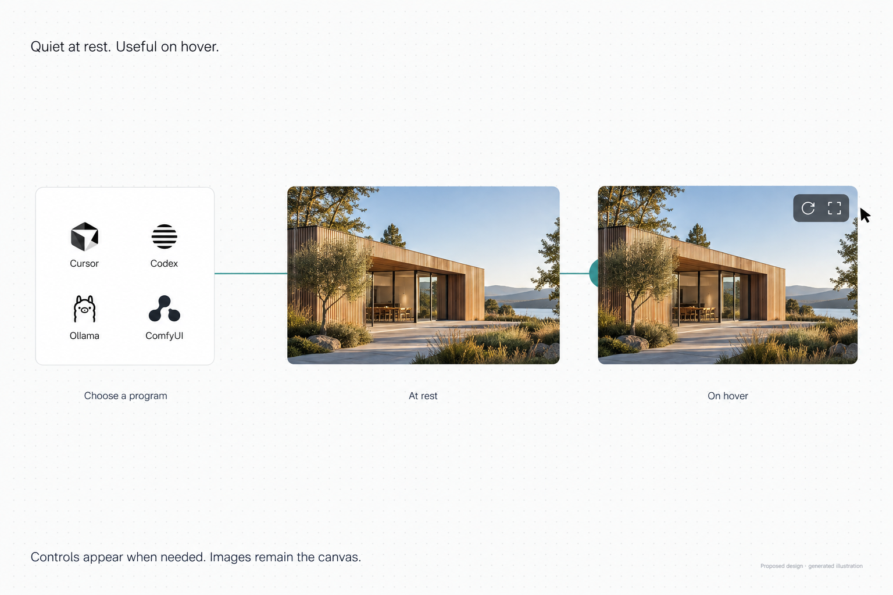
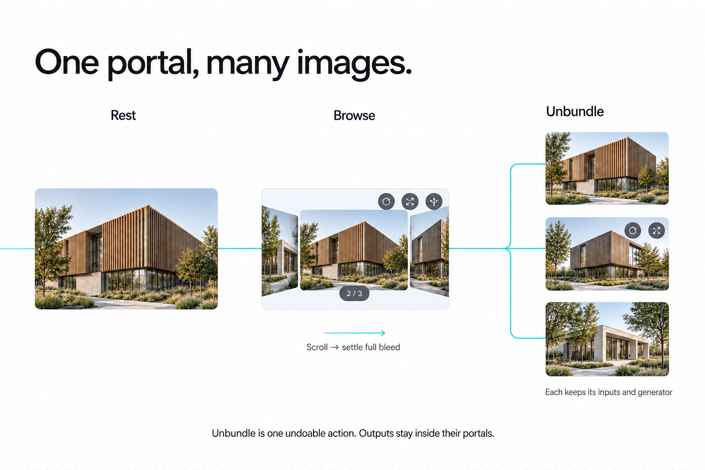

# Agent portals: small program sidecars, connected on the canvas

Status: **first native implementation complete; tests and Windows release build passed**  
Researched: **15 September 2026**  
Revised: **15 September 2026 — user's hover, full-bleed, and bundle direction**  
Scope: implement the approved minimal portal design and Codex integration; prepare the image-sidecar contract for later Ollama and ComfyUI adapters.

## Implementation pass — 15 September 2026

The first pass adds a pure `atlas-agent` contract, a renderer-free `atlas-codex`
app-server adapter, one shared portal-focus entry/leave path, and shared album
motion under `atlas-shell::home`. The picker lists discovered installed programs
plus explicitly configured file-link adapters. Connected text/image inputs are
captured on Send/Generate. Image results remain bundled inside the portal;
Unbundle preserves incoming wires and creates independent child sessions.

Codex uses the installed CLI sign-in, creates portal-owned conversations and
resumes only those conversations. It does not attach to this desktop task.
Ollama/ComfyUI-specific protocols, account UI and advanced model settings remain
later adapters. The current image interface consumes the documented sidecar
`session.json` bundle; it does not claim an unconfigured engine is available.

The first pass includes Active/pinned/All-images wire modes, immutable submissions,
saved link-folder continuity, scoped image inputs, explicit Codex Stop, and
background HTML bundle export. Authenticated adapter startup was checked against
the installed Codex without sending a model request. Native visual and full model
round-trip acceptance are still pending; concept images are design studies.

### Remaining product work

Connection setup UI, stale-input indicators, masked edit, upscale, transformer
image checkpoints, and measured native hover/album tuning remain follow-up
slices. Ollama text chat (18 September) and the ComfyUI image adapter with
Generate, Vary, Render from a wired 3D model, and Live (22 September) have
landed; see the agent portal contract for their rows and validation record.
Other image programs use an external JSON sidecar configured through
`programs.json`.
Codex uses its installed model configuration and read-only portal conversations;
structured Codex-to-stage proposal tools and attaching this desktop task are
not implemented. Existing Cursor staging remains intact.

### Using this pass

1. Place an Agent portal and choose Cursor or Codex from the icon grid. Existing
   Cursor bindings remain readable. Codex uses the installed CLI's sign-in.
2. Set the shared AI workspace if needed. Enter the portal with double-click or
   Enter; type a message, or wire a text node into it, then Send/Ctrl+Enter.
3. Image programs must already implement the JSON sidecar contract. Register
   their icon/name/view in `.atlas-ai/programs.json`, then use Choose program to
   refresh the grid. This is not an installer for a generation engine.
4. An image wire uses the displayed completed image. Its inspector offers All
   images for a whole bundle. Hover/focus reveals Generate and Maximize; scroll
   in focused contents browses the bundle. Unbundle is in the portal menu and
   inspector after multiple results exist; one Undo restores the bundle.

### Implementation validation

- `cargo check --workspace --all-targets`: passed after the shared media-tool
  changes were reconciled.
- Compiled Rust Codex probe: initialize and account/read succeeded using the
  installed sign-in. No model turn was submitted.
- Cursor sidecar: `node --check` passed.
- DRY review: approved after shared ownership and wire-policy corrections.
- Workspace unit and integration tests passed, including 351 Slate app tests,
  130 document-model tests, and 36 artifact tests. These cover immutable wired
  inputs, wire ordering/rebinding, bundle output policies, undoable unbundle,
  saved link-folder continuity, and packaged image output.
- Workspace documentation tests passed. Windows initially denied starting the
  `slate-kit` doctest executable; its unchanged retry passed, followed by the
  remaining workspace documentation checks.
- Contract checker: passed; all 35 Agent portal decisions agree with the registry
  and contract. Windows initially denied launching the newly built checker;
  running the unchanged binary subsequently succeeded.
- `cargo build --release -j 1 -p native-file-atlas -p slate`: passed. Both
  release executables are available under `target/release`; the build reported
  unused-code warnings and no errors.
- Native visual acceptance and a full Codex model round trip remain unverified.

## Recommendation

**Drop an Agent portal → choose an icon → use a minimal sidecar.** The chooser contains only a grid of program icons and their names. Cursor and Codex become simple chat portals. An image generator rests as a full-bleed image on the board, with Generate and Maximize revealed on hover. Results stay inside the generator portal.

The user's Figma-style simplicity direction is the product constraint: these are **sidecars for real programs**. The program owns execution and its richer tools. Slate owns the board, references, connections, and bundles. **The board rests clean; interaction reveals controls.** Avoid permanent headers, footers, badges, rails, and port circles on image portals. Advanced setup and Open in program live in a hover/context menu or inspector. Keyboard focus reveals the same controls as hover; touch/pen activation needs an equivalent reveal path.

**Wires and canvas context are foundational from the first working slice.** Ordinary sticky notes, text, images, frames, and other portal outputs supply inputs through real connections. Follow a left-to-right reading convention: sources on the left, program in the middle, results on the right. Moving a node never changes the meaning or direction of an existing connection.

The first implementation should connect **Cursor** and **Codex · ChatGPT sign-in**; later add **Ollama** and **ComfyUI**. The unbound icon grid lists configured connections with installed adapters, not an aspirational app catalog. Retain a configured but temporarily unreachable program with a quiet unavailable state; use Add connection for setup. The four icons shown in the concept image illustrate the intended future set and do not claim all four are connected today.

## Concept images

Generated design studies, not screenshots of implemented behavior. Image typography and icon styling are illustrative; implementation uses the shared shell and icon owners.

### Program grid and the resting/hovered image portal

Choosing a program transforms the placed portal in place. Image portals have no permanent program label or action row. A wire meets the image edge directly; its small edge blister reveals from behind the node when interaction needs it.

### A bundle browses, settles, and unbundles

Results are housed inside the generator. While browsing, multiple images briefly appear in album flow inside its bounds; at rest one image fills it again. Unbundle creates one functional generator portal per image, preserving program, parameters, and input bindings. The separate images in the right-hand storyboard are those child portals, not an automatically created result tray.

Generation method and exact prompts: [concept image prompts](images/PROMPTS.md).

## 1. Research and what to adopt

### Flora: composable steps and visible context

Flora documents connected text, image, and video nodes, ordered inputs, and compatible shared parameters. Its FAUNA assistant receives selected nodes and supports explicit node mentions. Its Techniques package reusable workflows. These support three useful patterns: reference chips, branching variants, and saved recipes. Sources: [Canvas](https://docs.flora.ai/editor/canvas), [FAUNA](https://docs.flora.ai/editor/fauna), [Techniques](https://flora.ai/updates/techniques-text-layers-router-node).

**Slate design inference, revised:** adopt meaningful connections and source-to-result iteration while keeping each portal small. Basic wires belong in the first implementation; saved multi-step recipes can come later. Keep Slate's existing placement, focus, snapping, and undo behavior.

### xFigura: architectural context and local refinement

xFigura's public product page presents a shared architectural canvas, imports from design tools including Rhino, image annotations and refinement, and agentic chat that uses canvas attachments. The useful pattern is a tight relationship between source views, marked-up intent, and alternative results. Source: [xFigura](https://xfigura.ai/).

**Slate design inference:** support a selected Rhino view or board crop as a reference, let the user indicate what to preserve or change, and compare iterations beside the original. Exact xFigura gestures and session behavior were not verified in a signed-in product session; the plan does not assume its private implementation or advertised quality claims.

### Codex: a supported integration boundary

The official App Server documents JSON-RPC over stdio, conversation start/resume/fork, streaming events, interruption, model discovery, and managed ChatGPT authentication. The installed CLI reports `0.154.0-alpha.6.2` and exposes `codex app-server`. This makes a local adapter a credible first implementation route. Sources: [App Server](https://learn.chatgpt.com/docs/app-server), [Authentication](https://learn.chatgpt.com/docs/auth).

**Slate design inference:** use an adapter-owned App Server connection, with Codex managing sign-in. Start with new portal conversations. Validate existing-conversation resume separately, including ownership while the desktop app is using the same conversation. This research does not establish that a separate process can attach to this exact running desktop conversation, inherit its connected apps, or expose every ChatGPT feature.

ChatGPT authentication and API-key authentication have different billing/access behavior; API-key usage is charged through the API account. Label an optional future connection **OpenAI API**, with its own account setup. Do not treat it as a synonym for ChatGPT sign-in. [Authentication](https://learn.chatgpt.com/docs/auth).

### Local engines: discover what the selected model can do

Ollama documents image understanding for vision models and tool calling for compatible models. Its OpenAI compatibility covers parts of that API. Use capability discovery and adapter tests; a compatible URL alone does not establish identical behavior. Sources: [Vision](https://docs.ollama.com/capabilities/vision), [Tool calling](https://docs.ollama.com/capabilities/tool-calling), [Compatibility](https://docs.ollama.com/api/openai-compatibility).

ComfyUI provides a local HTTP/WebSocket server for queued workflows, progress, history, and output retrieval. Its documented interrupt operation stops the current workflow, which needs careful ownership on a shared server. Sources: [Server overview](https://docs.comfy.org/development/comfyui-server/comms_overview), [Routes](https://docs.comfy.org/development/comfyui-server/comms_routes).

**Slate design inference:** treat ComfyUI as a generation engine behind curated task presets. Do not assume an Ollama vision model generates images. Do not expose a full ComfyUI graph editor inside Slate. A workflow using remote/paid ComfyUI nodes must not carry a “local only” badge.

## 2. Baseline inspected before implementation

This section records the pre-implementation working tree, including pre-existing edits. The implementation summary above records the changes made in this pass.

- `crates/slate-doc/src/scene.rs::AgentPortalRef` already stores provider/session/context and an optional channel without a vendor SDK type in the scene.
- `crates/atlas-ai/src/agent.rs` owns the context/request/session JSON link. The provider registry currently exposes Cursor and a generic Local agent entry.
- `apps/slate/src/app/board_agent.rs` owns the existing host body, composer, Cursor project/chat discovery, asynchronous sidecar startup, and staging integration.
- `crates/slate-doc/src/stage.rs` and `docs/agent-link-contract.md` already define proposals, target/precondition checks, attributed journal acceptance, durable decisions, and interrupted-acceptance recovery. Preserve these improvements.
- `atlas_ai::ui` is the shared AI sidebar owner. `board_portal.rs` and `board_portal_chrome.rs` own shared portal mechanics. `slate-artifact` remains the independent export interpreter.
- `slate-doc::ConnectorNode`, `WireHost`, and shared routing already own visible wires, anchors, and geometry in both interpreters. `ConnectorNode` currently has geometric endpoints, arrows, a label, and display styling; it does not define a typed prompt/image transport. Extend its semantic contract through a single owner rather than treating a drawn arrow as executable behavior.

### Gaps that should shape the first implementation

1. **Provider dispatch is Cursor-specific.** `ensure_agent_sidecar` rejects other provider IDs. Discovery, recovery actions, and status also contain Cursor assumptions. A selector alone would expose options that cannot work.
2. **Context is too thin for visual work.** `agent_context_for` sends selected IDs, viewport, and counts. Changing scope changes a label; it does not yet assemble frame contents, scene properties, or image evidence. Unsaved edits must come from the live document.
3. **Selection needs a stable capture.** Focusing a portal changes board selection. Capture relevant nodes before focus, display them as removable chips, and freeze that context for each send. Sending must not accidentally use only the portal itself.
4. **The mailbox can lose requests.** `request.json` is overwritten and IDs use seconds. The Cursor watcher remembers its last ID only in memory. Two quick sends or a restart need stronger identity, acknowledgement, and recovery semantics.
5. **Chat history is not established continuity.** The current Cursor sidecar creates a new agent and does not consume the selected channel. A history picker must say whether it opens a transcript, resumes a session, or starts from copied context.
6. **Throttled I/O still blocks.** `agent_pump` calls file-link reads/writes directly. A one-second throttle is not protection from a slow workspace share. Move I/O behind a worker with bounded results.
7. **The AI crate mixes UI and contracts.** DV-02 records renderer coupling. Extract the durable protocol types before adding SDK-specific fields or workflow state.
8. **Wires need meaning and delivery.** Add explicit input/output bindings, revision tracking, and readiness. Geometric adjacency, arrow decoration, and node titles must never be the hidden API.

## 3. Proposed experience

### Unbound: the program grid

Place one ordinary Agent portal with the current placement gesture. Its default body contains **only program icons and names in a compact grid**: no Agent header, instruction sentence, footer, or permanent setup row. It starts unbound; selecting a program journals its binding and replaces the grid in place. Reuse the host focus rule for pointer interaction, with one proposed refinement: a newly placed portal may receive contents focus immediately so the next click chooses a program. Later single-clicks still select the frame; double-click/Enter enters the contents.

Configured program order is stable. Reachability probes run off-thread. Add connection and unavailable-connection explanations are available through hover/focus or the context menu, not a permanent footer. Keep workspace/session setup progressive: use a valid existing binding; otherwise ask for only the missing folder/session or sign-in. Switch program returns to the same grid. Rebinding invalidates incompatible ports visibly instead of silently forwarding old inputs elsewhere.

### Bound: a minimal program interface

**Chat:** a simple transcript and composer; a minimal program identity where needed. Secondary controls, external-open, and input detail reveal on hover/focus. Send/Stop remains available while composing or running. No permanent model library, analytics, activity panel, or comparison dashboard.

**Image generator at rest:** one full-bleed output with no text, program header, footer, padding, or permanent controls. Preserve source pixels; cover-crop the preview without distortion or changing the file. Keep the portal bounds stable while browsing different aspect ratios. Maximize/inspect can show the complete image. Before a first output exists, use only the minimal contextual setup needed to supply inputs and generate.

**Image generator on hover/focus:** reveal small Generate and Maximize glyphs over the image. A context action provides program identity, settings, Open in program, and Unbundle when applicable. Reveal/retreat is brief and reversible; avoid always-running decorative animation. A named timing token controls it. During work show only meaningful progress/Stop; on failure keep the previous image and expose a concise failure/retry state without implying a new success.

**Results form a bundle:** every completed generated image is a linked output entry housed in that portal. One run may produce multiple images, and subsequent runs can append entries. Browsing selects an entry without creating board nodes. There is no automatic separate output card, comparison tray, or permanent thumbnail strip. A separate explicit bake/export remains available through existing commands when a static image is actually wanted.

### Progressive detail

- At overview scale: image portals are images; controls/labels stay hidden. Chat portals reduce according to P0.9.
- On hover/focus: reveal local actions and wire affordances; contents focus owns browsing and composer input.
- When maximized: give the same interface more space. Full program functionality remains in the real program.
- Reuse P2.PortalHost and P1.portal.contents-focus: click selects; double-click/Enter enters; Escape peels focus/maximize. Provide a separate **Stop** action for a running task. Escape must not unexpectedly spend or cancel work.

### An architectural workflow to design against

1. Drop an Agent portal and choose the configured image program.
2. Put a sticky note to its left: “Warm timber facade. Keep the massing and camera.”
3. Wire the note's Text output to Prompt and a Rhino view capture's Image output to Reference.
4. Hover reveals Generate. It snapshots the wired input revisions and runs the real program; completed images appear inside the portal.
5. Change the note and generate more. Browse the bundle with album flow, settling onto one full-bleed preview each time.
6. Unbundle when separate board placement helps: each image becomes its own functional generator portal with the same inputs and settings. Or wire the bundle's active image/all images into a compatible downstream program. A text agent can similarly supply a brief to a generator.

The annotations-to-mask and view-capture affordances require their own interaction decisions when implemented. A flattened view is a visual reference, not a promise of geometrically exact reconstruction.

### Connection rules: visible, typed, and stable

- **Direction:** outputs on the right, inputs on the left. At rest, draw a naked wire flush into the component, with no endpoint circle or permanent port label. On edge hover, keyboard focus, or an active wire drag, a subtle blister emerges from behind the node at a valid connection site, then retreats. Tooltips reveal the semantic input only when needed. Keep the forgiving hit target larger than the painted blister. Use existing routing/rails; port identity is independent of physical position.
- **Text → Prompt:** sticky/text nodes supply their live textual content. Edits update the bound input and mark any prior response out of date. They do not overwrite a portal's manual composer draft.
- **Image → Reference:** supply a bounded preview or explicitly chosen file locator as supported by the adapter. Accept multiple image inputs and a bundle's ordered ImageSet when supported. Honor each program's image count/size limits visibly; never silently drop excess images. Masks use a distinct supported input; no hidden image-to-text conversions.
- **Portal → Portal:** use a named output such as Reply or Image. The receiving portal consumes a completed output revision; partial streaming remains preview-only by default. A run snapshots its inputs so later edits cannot change it mid-flight.
- **One prompt, many references:** Text bindings concatenate in stable wire order; a manual composer draft is preserved. Reference accepts an ordered list or an ordered ImageSet. Preserve authored order, not geometry-derived order. A small one-off composer message is sent after the wired brief and its role is visible in the expanded context.
- **Selection and frames:** unconnected chat can capture an explicit selection on Send. Wired inputs take precedence as explicit context; ambient selection is not silently added. A connected frame supplies a bounded collection using existing geometric membership. Nearby unconnected notes do not become instructions merely because they are nearby. Whole-board context is an explicit choice.
- **Live inputs, deliberate runs:** proposed default is immediate input propagation with Send/Generate starting work. Editing, rewiring, moving a node, or reopening a workbook must not silently trigger computation. Automatic rerunning remains a separately chosen mode; its precise behavior is still a product decision.
- **Disconnection:** retain the last successful output with an out-of-date/missing-input state; pause dependent execution. Never convert a removed wire into a hidden copied prompt. A dangling wire is visible and inactive.
- **Cycles and failures:** reject executable cycles in the first version, keep decorative connectors legal, and show incompatible input types at connection time. A failed upstream run leaves the last result available but does not masquerade as a new result.

### Preserve the existing wire model

Use one authored semantic binding under `slate-doc::ConnectorNode`'s existing identity. It references the current A/B endpoints and names their output/input ports plus an optional ordinal/revision policy; do not store another independently editable source/destination node pair. Authored policy is document data; actual run revisions, readiness, and results are local runtime state. Do not maintain a separately authored execution graph; derive it from the bindings. Decorative connectors remain inert unless explicitly bound to data ports.

Keep `WireHost` geometry-only. One pure mapping resolves semantic port IDs into the existing anchors/slot/fan behavior for routing, hit testing, and export. Do not write another anchor/route engine or put program execution policy in WireHost. Connection edits and remapping participate in SceneCmd, undo, copy/paste, and export. If paste degrades an external endpoint to `Free`, its binding becomes inactive with no hidden link to the original node. The runtime reads immutable graph/context snapshots and emits results; it never becomes a second scene interpreter.

Exports preserve the authored connections and retained content. Live host sessions and their ability to run do not transfer into the HTML artifact. The artifact writer must accurately communicate this boundary without inventing a second graph model.

### Bundles, album flow, and unbundle

**Bundle model:** an ordered set of completed output asset references belongs to one program session. One pure manifest contract in the proposed `atlas-agent` owner records stable output-entry IDs, ordering, and provenance; the workbook holds a portable locator and authored display/binding policy. Image bytes remain linked assets. Session progress and animation are derived. Reopening resolves the saved manifest and restores the chosen preview without executing the program. A missing asset is not mistaken for an empty new session.

**Album flow:** scrolling/dragging while contents-focused temporarily reveals neighboring images inside the same portal footprint. Motion settles into a single full-bleed image again; no covers, pagination, or filmstrip remain on the resting board. Hover may show the current index and Unbundle, while arrow keys provide the same navigation in focus. Unfocused wheel input still belongs to the board. The current `atlas-shell::home::cover_flow_home` API couples motion to home CTA/square-cover presentation: **extract its reusable movement/layout within that owner before implementing the album**. Compose a separate minimal presentation with that same engine rather than adding home-mode flags. Do not copy its CTA, title, shadows, or folder affordances.

**Output choice:** expose Active image and All images as separate semantic outputs. Browsing is local view state and does not rewrite a connected prompt or automatically rerun a downstream task. Default wire creation pins the chosen output revision; an explicit Follow active policy can update downstream input readiness as the user browses. Actual execution still follows the Send/Generate policy. An All images connection preserves the manifest's image order.

**Unbundle:** one named, invertible command replaces the bundle portal with N image-generator portals, one per completed image. Snapshot stable output-entry IDs, program/settings, upstream bindings, and origin metadata at the action. Preserve the original NodeId on the active-image child; give the other children new NodeIds and **all children fresh independent session identities** initialized from their respective images. A later Generate never rewrites sibling history. Image files are linked, not copied or removed. Undo restores the original portal/connector structure in one validated journal group. Selection remains transient UI state, not journal data (VIII.5). Preserve the original manifest, assets, and child histories; redo uses the same identities and never reruns generation.

**Wire preservation:** clone incoming semantic bindings onto each child using existing endpoint remapping. Reconnect a single-image outgoing binding to the child for that stable output-entry ID, preserving its pinned revision. Preserve an explicit Follow active policy on the active child. Expand an All images binding into ordered child outputs only where the destination supports the resulting cardinality; otherwise surface the unresolved binding. Never duplicate downstream executions as a side effect of unbundling. Preserve shared-source fan routing through the existing rails owner.

**Scope:** Unbundle is available for two or more completed images. Proposed default: finish or stop an in-flight run before unbundling, so ownership is unambiguous. New children launch no programs until needed. HTML export packages completed images as a scroll-snap bundle with provenance and no live controls. Chat remains a host poster/pointer; the artifact never contains a running generator. This behavior fits journal-only authoring and host-portal authority without a constitutional amendment.

## 4. Ownership and data boundaries

### Preserve the owners; extract only a necessary boundary

- **Pure agent contracts and run-state reduction:** move the existing `AgentContext`, `AgentRequest`, `AgentSession`, and `AgentStatus` definitions from `atlas-ai::agent` into a small renderer-free crate, provisionally `atlas-agent`; use compatibility re-exports where necessary. It owns stable IDs, capability descriptors, requests/events, context manifests, and the run state machine. It owns no scene geometry, model SDK, or UI. Do not retain a second schema or a second run-state reducer in `board_agent.rs`. This is a governed boundary for DV-02, not a utility crate.
- **Shared integration and AI panel:** keep `atlas-ai` and the named `atlas_ai::ui` entry point. It consumes the pure contract, supervises workers/processes, and provides shared connection setup. Both apps use the same setup body.
- **Vendor adapters:** leaf processes/modules translate external protocols to the pure contract. Cursor setup and Codex authentication live here. Implement only the Codex leaf now; add Ollama/ComfyUI leaves when their milestone starts.
- **Board integration:** extend the existing `board_agent.rs` body. Shared shell painting and `board_portal::{resolve_source, source_locator}` are callable today. Focus still needs a targeted extraction: replace the duplicated prelude in `agent_focus` with the `portal_enter_interactive` / `contents_blur` owner and one authoritative host-focus state before adding interaction paths. Edge blisters belong to the shared wire affordance/chrome owner; album motion/layout extends `atlas-shell::home`. Do not add `board_codex.rs`, `board_ollama.rs`, a second chat-paint shell, another album engine, or another focus/bake helper.
- **Scene, connections, and staging:** remain in `slate-doc`; authored data-port bindings extend the existing connector identity and shared WireHost/routing contracts. A runtime dependency snapshot is derived from those bindings, never a second authored master. App command `SPECS` and dispatch remain the action surface. A future MCP adapter wraps that surface; it is not a prerequisite for the first Codex file-link adapter.
- **Export:** the live Agent portal remains a host poster and pointer. Accepted outputs use normal scene nodes and the existing artifact writer.

### Keep three kinds of state distinct

**Authored workbook state:** portal frame, portable source locator, provider-neutral program binding, connector endpoint/port bindings, their stable input ordering, and explicit task parameters. Every edit goes through SceneCmd. Prompt notes remain ordinary authored text nodes. No credentials or vendor transcript payloads enter `.slate`.

**Local connection/session state:** machine connection ID, endpoint, auth status, vendor conversation handle, drafts, transcript, queue, progress, bundle output manifest, previews, and run history. Hover and album animation are derived view state. Provider IDs already saved in AgentPortalRef remain readable; migration should resolve them to local connections without silently rebinding to another provider. Reopening on another machine can require connection resolution.

**External assets:** generated files and human-readable provenance beside the chosen output workspace. Slate links to them. A manifest records input locators/revisions, prompt, effective model/workflow identity, supported parameters, output checksum, and run ID. Seeds aid repeatability but do not guarantee identical generations. Package assets through the existing packaging contract when portability is needed.

### Capability-driven connection selector

A connection reports supported inputs/outputs and operations: text, image input, image generation/editing, masks, tools, streaming, resume, fork, cancellation scope, usage reporting, and model settings. Show only supported controls. Unknown capability means unverified, not supported.

For example, an Ollama model without vision cannot receive a hidden image attachment; the UI offers to choose a compatible model or send text alone. A ComfyUI engine offers task templates and their exposed parameters, rather than pretending to be a chat session. A text agent can request that engine through a registered generation command, subject to the same workspace permissions.

## 5. Runtime and context contract

### Request snapshot

Each run gets a unique request ID, session ID, provider/connection binding revision, workbook identity, live scene revision, connection-graph revision, and immutable input manifest. Resolve explicit wired inputs first. Include live text/properties, relative-first source references, bounded previews, and frame membership only when that frame/scope was included. Selection/frame/board are real extraction policies, not labels. Record completed upstream output revisions so a run always names the exact results it consumed.

Use the existing preview/capture owner for visual evidence, on demand. Read unsaved scene data from memory. Do not walk the whole workspace or read cloud placeholder bytes for context. Respect `atlas_core::cloud::is_dehydrated`; show which attachments were unavailable or omitted.

### Delivery and cancellation

The next file-link version should negotiate a protocol version and capabilities. Preserve v1 compatibility for existing sidecars. Start v1 connections with one acknowledged in-flight request and explicit disabled/queued sends. For v2, use per-request files or a journal of requests/events with persisted acknowledgements; retain `session.json` as a bounded snapshot.

State machine: Draft → Queued → Starting → Running → Completed / Failed / Cancelled. Waiting for a tool permission is a distinct state; proposal review is a distinct board action. A heartbeat indicates liveness; installed/running desktop-app status never substitutes for an agent acknowledgement.

Persist IDs and terminal outcomes. An interrupted/unknown run is reconciled with its provider before retry. Do not claim exactly-once remote execution; disconnections can leave an ambiguous paid generation. Late events from another binding, workbook, request, or cancellation generation cannot replace the current portal result.

Stop means “cancellation requested” until acknowledged. For shared ComfyUI, do not invoke a global interrupt on another user's job; prefer an adapter-owned instance or queue-owned cancellation with a clearly stated capability. Removing/rebinding a portal must not orphan an untracked running task.

### Permission boundary

Preserve proposal-by-default (Art. VII.6). Generation authorization and board acceptance are separate: one starts computation; the other changes the document. A human clicking Generate is the authorization for that request; repetitive confirmation is unnecessary inside an explicitly granted workspace budget/autonomy policy.

Adapters must enforce source-write restrictions and a bounded output/staging area. Prompt instructions alone are not enforcement. Prefer read-only source access plus mediated context/proposal tools. The first Codex proof must demonstrate the Windows permission boundary without access to `.slate` writes or File Atlas mutation paths. If that boundary cannot be enforced, stop short of exposing an autonomous editing connection and refine the integration.

No workbook-supplied scripts, arbitrary loops, or native in-process extensions. A user-run external ComfyUI server is an allowed extension boundary; a workbook must not silently install or execute custom nodes. Secrets stay in the provider's credential store or machine credential storage (`atlas_core::secrets`), not documents, context, logs, or exported artifacts. Web sign-in is the per-user WebView2 profile for that origin, not a field on the portal.

## 6. Small, reviewable implementation sequence

### A. Program grid, typed wires, and shared context

Extract the pure contract and needed shared focus mechanism; generalize connection status/discovery/recovery; show the configured-program icon grid in a newly placed Agent portal. Extend the existing connector contract with explicit Text→Prompt and supported Image→Reference bindings. Make connected text update the resolved context immediately. Add request identity, one-in-flight protection, and immutable wired-context snapshots; move link I/O to a worker. Preserve existing decorative wires and Cursor workbooks.

**Acceptance:** drop → choose Cursor → wire a sticky → edit sticky → send resolved text; the reply becomes an output another portal can address. Duplicate and undo remap/restore endpoint identities correctly. Two quick sends are distinguishable; restart cannot silently replay work; focusing the portal retains wired references; a blocked workspace share does not block painting; unknown programs remain identifiable and unavailable. Ordinary arrowed connectors stay inert.

### B. Add Codex with ChatGPT sign-in

Build the leaf App Server adapter; perform protocol/version checks against the installed CLI; let Codex own authentication; choose a compatible configured model; start a portal-owned conversation; stream output, stop, reconnect, and propose a board edit through the existing stage path. Codex appears in the same program grid and uses the same minimal composer/ports as Cursor. Keep a route into the real program; do not mirror its settings, task sidebar, or plugin management.

**Acceptance:** sign in → send bounded live context → receive answer/proposal → accept → undo; rejection and stale edits remain correct. Authentication failure, rate limits, denied tools, missing CLI, and process death have specific recovery actions. Existing desktop conversations are a separate capability spike, not promised parity.

### C. Pin the minimal interaction contract

Carry out the tool-contract review before affected UI work in A/B; this is a cross-cutting gate, not permission to defer basic connectivity. Record the user's stated decisions at confidence 100: icon/name grid only; configure in place; minimal program sidecars; real wires; left-to-right convention; uncluttered resting board; hover reveal; naked wire with edge blister; full-bleed generator output; multiple-image inputs; album-flow bundle; and functional unbundle. Read all D01–D35 and inherit P2.PortalHost/P1.wire. Settle only remaining details: initial contents focus, run policy, input cardinality/order, album focus/navigation, output binding policy, and unbundle during a run. Use the same control reveal on keyboard focus.

**Acceptance:** initial grid contains only icons/names and transforms in place; image portal rests as an edge-to-edge image with no persistent text/buttons; hover/focus reveals Generate/Maximize and valid wire blisters; wires meet the edge without circles at rest. Album flow returns to full bleed. Unbundle is one undoable action and every child can generate independently. Live sessions stay out of export. An explicit static bake uses the existing owner; no new portal-poster writer is introduced.

### D. Add Ollama

Discover the user-configured local service and installed models; expose supported text/vision/tools; manage conversational history in the adapter; stream status; bound context. Keep a simple local-only mode that refuses remote fallback.

**Acceptance:** service unavailable, missing model, unsupported image input, and model-load failure are explicit; a selected local model completes a task without a cloud connection. Do not download a model as an incidental send side effect.

### E. Add local image generation

Connect to ComfyUI with a user-installed workflow and declared dependencies. Begin with a wired sticky/text prompt + one or more supported image references → one or more outputs housed inside the generator bundle. Reuse/extract the shared album-flow motion to browse outputs, settling into full bleed. Generate/Maximize appear on hover/focus; richer graph editing stays in ComfyUI. Include functional unbundle in this image-portal milestone. Add masked refinement only after its contract is agreed. Capture provenance and concise queued/running status when relevant.

**Acceptance:** multi-image input order is preserved; generated outputs append to the bundle; focus-scrolling browses images while unfocused scrolling zooms the board; settling leaves a full-bleed image. Unbundle preserves every child's program/settings/inputs, remaps output wires, and undoes exactly. Input/output assets remain linked; reconnect locates an existing job; missing nodes/models are named; cancellation affects only owned work. Test on the user's actual GPU/model combination before choosing concurrency or image-size defaults.

### F. Reuse connected arrangements

The typed connections already exist from A. This later milestone lets the user duplicate or save a useful connected arrangement and explicitly run a selected chain. Store reusable arrangements as declarative registered-command data with stable step IDs and no authored conditions, loops, expressions, scripts, or cycles in v1. A core-owned scheduler orchestrates the existing commands; it is not another board-command or mutation interpreter. `.slatekit` remains the owner of gesture-result recipes. Mark only affected downstream inputs stale when a source changes. The visible wires remain the authoritative authored dependencies.

**Acceptance:** duplicate/reopen and rerun an arrangement; branch retains origin; parameter changes mark dependent results stale; cached results are never mislabeled as a new generation. Reuse existing connector mechanics and the single semantic binding owner. Additional orchestration earns its place through repeated real workflows (Art. III).

## 7. Validation and implementation gates

- **DRY review result, 15 September: approved after the required extractions and wire fixes.** The initial extraction gate required the following: Move protocol types and bundle manifest contracts to one pure owner; complete the shared-focus extraction before new interaction paths. Extract shared album motion/layout inside `atlas-shell::home` before the full-bleed album presentation. Keep semantic bindings on existing connector A/B identity, use one semantic-port-to-anchor mapping, and deactivate bindings when pasted anchors become Free. Unbundle snapshots output IDs/settings, preserves pinned wire revisions, reuses identities on redo, and never journals selection or reruns generation. Web and Atlas still have separate poster PNG writers: any future new poster bake first needs P2.PortalHost.bake extraction. Call shared locators (DV-18); keep Atlas scan/session work out of scope (DV-19); retain the targeted focus prerequisite (DV-20). No new duplicate is authorized.
- Unit/integration tests should target request delivery, context scope, stale/cancelled events, protocol migration, reconnect, permissions, and atomic staging. Use recorded adapter fixtures for routine CI; live account/model tests are opt-in.
- Reuse current staging golden tests for wrong workbook, stale edits, interrupted acceptance, durable rejection, and exact undo. Add one full golden path for each implemented backend.
- Register all new actions in Slate's command surface. For shared AI setup, keep both apps on `atlas_ai::ui`; do not rewrite File Atlas's load/paint paths.
- Measure portal work while panning and while responses/previews arrive. Proposed target: agent integration adds no blocking I/O and stays within a named bounded per-frame drain budget; choose numerical event/texture limits from measurements, not guesses. Preserve 60 fps as the product target.
- At implementation time: `cargo xtask contracts`, applicable focused tests, `cargo test --workspace`, and the Windows release build. The concept images remain generated design illustrations. See the implementation validation record for actual native checks.

## Settled direction and next adapters

The user's settled direction is **icons/names → minimal sidecar**, **real wires from the beginning**, **left-to-right flow**, and **a clean resting board with hover feedback**. Image generators are **full-bleed bundles** that browse with album flow and **unbundle into fully functional portals**. Preserve Cursor and add Codex first; local programs follow. This revision supersedes the earlier headers/footers, persistent handles, detached result cards, workbench/result-tray, and wires-later directions.

The approved interaction default is that input changes affect the next snapshot and explicit Send/Generate runs the program. Automatic rerunning is deferred. Additional implementation choices are the first local image preset, output folder, and supported access to existing Codex conversations. None requires a larger default portal interface.

The proposal conforms to the current Constitution without an amendment: one board, provider-neutral models, out-of-process runtimes, journaled authored changes, proposal acceptance, and linked assets. General scripting or direct agent write-back would require a different, explicitly ratified scope.
