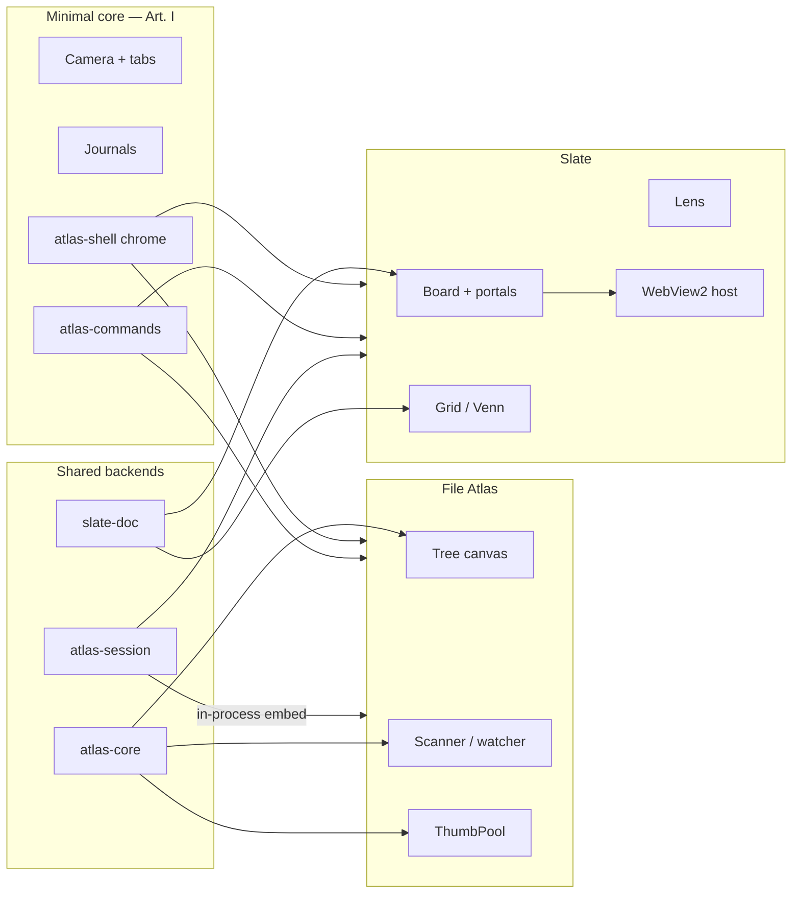

# Audit №3 — Executive summary

**For:** the human (Jeff). Agents should read
[`2026-08-15-health-marching-orders.md`](2026-08-15-health-marching-orders.md)
and the cards in [`docs/workplan/tasks/wave-perf.md`](../workplan/tasks/wave-perf.md).
**Date:** 2026-08-15. **Tree:** `1dd849c` on `main` (Web portals hardened).
**Method:** four parallel codebase combs plus direct reads of the load, cache,
zoom, and portal paths. **Not measured on Windows.** The reference-machine
benches in `docs/performance.md` are still the last numbers; this audit
explains *why* the daily driver now disagrees with those numbers.

This is Part 2. Part 1 is the marching orders. Decisions you make here become
binding the same way D1–D16 did.

---

## 1. The verdict

The architecture is still the right one. The constitution is holding: chrome
is shared, document models stay renderer-free in intent, mutations are
journaled, thumbnails are generation-tagged, and the web portal *policy*
(six live views, posters for the rest, nothing live when zoomed out) is
correct.

What is not holding is **discipline at the seams**.

Three things happened at once in the first week of August, and they explain
almost everything you are feeling:

1. **The disk thumbnail cache was thrown away twice.** `CACHE_KEY_VERSION`
   moved `3 → 4` on 3 August (necessary — icons had been cached as previews)
   and `4 → 5` on 8 August (not necessary — an SVG extractor was added).
   Version is baked into every key. Every previously warmed JPEG, PNG, PDF,
   and `.3dm` became an orphan. Those folders are not "degraded." They are
   cold. Re-extraction is the whole job again.
2. **Slate work and Atlas work shipped in the same commits.** The web-portal
   commit (`dc3178c`) is titled as a Slate feature and also rewrites
   2,733 lines of File Atlas, adds edit-mode filesystem ops, a scan skip
   list, directory metadata, and shell-drag to `atlas-core`, and bumps the
   cache epoch. That is the leak: not a Slate setting that Atlas inherited,
   but a mega-commit that changed Atlas's load path while the reviewer's
   attention was on WebView2.
3. **Web-portal zoom jitter is a contract violation, not a mystery.** The
   agreed contract (`portal-web-embed.md` D21 / D29) says poster capture is
   async and generation-tagged. The implementation captures on the UI thread
   with a D3D11 readback the moment a portal drops below 160 px during a
   zoom-out. A fast max-out → max-in gesture evicts and recreates WebView2
   instances and pays that readback on the frame loop. That is the gutter.

The rest of the report is architecture, connectivity, and a ranked list of
what is fragile. The week of work is in the marching orders.

---

## 2. Why File Atlas feels worse

You described three symptoms: thumbnails slow again, previously cached
directories cold, lag and lock-up while files load. They have different
causes that stack.

### 2.1 The cache is actually cold

Keys are `hash(rel | size | mtime | page | version)`. Version `5` does not
read version `4` files. There is no migration and no orphan prune (cover
PNGs learned this lesson; thumbs did not). `%LOCALAPPDATA%\NativeFileAtlas\thumbs\`
is full of JPEGs the app will never open again.

The 8 August bump was for `resvg`. Only SVG files needed a new recipe.
Everything else was punished for a format they do not use. `docs/performance.md`
still describes version 4 as current.

**What this is not:** a broken `has_local` check, a OneDrive hydration
regression, or a lost `.atlas-cache`. Those paths still look correct. The
epoch moved out from under them.

### 2.2 Revisit is GPU-cold even when disk is hot

Opening an indexed folder (`ingest_loaded`) resets every card to
`ThumbState::NotAsked` and rebuilds the tree. Disk hits are cheap, but the
UI still re-requests and uploads at **24 textures per frame**. A 20k folder
with a warm disk still paints like a first visit for the first ~14 seconds
of scrolling. Warm jobs write JPEGs and send **no pixels**, so the card
waits for the on-demand path anyway.

That was always the design. It was invisible when the disk was already
warmed under the current epoch. After two epoch bumps in five days it is
the whole experience.

### 2.3 The 8 August Atlas rewrite is in the load path

`dc3178c` did not only bump the epoch. It landed, in the same commit:

- File Atlas **Edit mode** (human-only FS mutations, journaled)
- `dirmeta` (owners/dates off the frame loop — this part is good)
- `skiplist` (folders never scanned)
- `fsops` + `shell_drag`
- 280 lines of `tree.rs` (still imports `eframe::egui` — Art. I leak)
- 148 lines of `scanner.rs`

Some of that is the July performance work finally merging. Some of it is
new surface area on the frame loop: watcher upserts still call
`scanner::stat_file` (a `metadata` per event, up to 32 per frame). On a
share that is the documented freeze. `ScanMsg` batches are still drained
to exhaustion in one frame. `FsChange::Rescan` is a no-op.

The July `load_jitter` win (per-batch sweep removed, p95 27 → 13 ms at
120k) is still in the code. It has not been re-measured against this
rewrite. Until the Windows benches run again, treat "jitter while loading"
as **unverified regression**, not as a known number.

### 2.4 Linked Slate can starve the same disk

The apps do **not** share a `ThumbPool`. They share
`%LOCALAPPDATA%\NativeFileAtlas\thumbs\` and, in a linked session, one
process. Atlas will spin up to 24 thumb workers on a network root; Slate
keeps 4 thumb workers plus 2 preview workers. That is 30 threads on one
SMB link. PreviewPool cannot steal Atlas's queue. It can steal the wire.

---

## 3. Why Slate zoom jitters (web portals)

The portal design is good. The implementation of the expensive edge is not.

On a fast zoom-out → zoom-in:

| Step | What the code does | What it should do (D21 / D29) |
|---|---|---|
| Cross 160 px downward | `capture_poster` → D3D11 `read_frame` **on the UI thread**, then `evict` (destroy WebView2) | Capture off-thread, generation-tagged; keep last poster |
| Cross 96 px | Strip-only paint; poster texture remains in an unbounded per-node map | Same, plus a memory cap |
| Cross 160 px upward | `host.admit` every frame; async WebView2 create; 2 texture uploads/frame | Admit with hysteresis so the boundary does not oscillate |
| Same gesture, paths | `zoom_bucket = (z * 8).round()` → ~29 buckets over `[0.05, 3.5]`; cache **clears entirely at 256 entries** | LRU; do not nuke |
| Same gesture, images | Preview ladder 256/512/1024/2048, 3 decodes/frame, **no cancel** of in-flight work | Generation-tag the worker; drop stale tiers |
| Same gesture, board paint | Clone **every** non-hidden `Node` every frame; spatial index unused | `query_rect` the viewport |

The one-frame LOD lag is real: `web_pump` admits from **last frame's**
geometry. A Schmitt trigger (live at 160, demote at 128, two-frame confirm)
would remove most create/destroy chatter.

Closed path fills still `flatten()` every frame with no cache. Stroke meshes
are cached, then cloned, and the cache key is built with `format!(Debug)` —
an allocation on every lookup.

Grid and Venn still run `grid_layout()` / `venn_layout_now()` **every
frame** over every item. Atlas already learned this lesson (`absorb_new_entries`).
Slate has not applied it to its own generated views.

---

## 4. Architecture: what is healthy, what is strained

**Healthy**

- Chrome unification (top bar, dock, tokens, home, minimap) is real. Article X
  is the strongest architectural win of the last month.
- Thumbnail extraction policy (cloud gate, icon tier, EXIF preview, generation
  tags) is still the right policy. The epoch bump is a process failure, not a
  design failure.
- Portal taxonomy (generated / document / host) is correctly encoded for web
  and agent-link. The 10% cut on web portals (no address bar, no page→app
  bridge) is holding.
- Atlas load invariants in `ARCHITECTURE.md` (7, 8, 10) are still the law
  the code is trying to obey.

**Strained**

| Seam | Symptom | Why it will get worse |
|---|---|---|
| `apps/file-atlas/src/app/mod.rs` **9,418 lines** | Every load, paint, tab, and FS edit lives in one file | Agents cannot work in parallel; a Slate commit touching "just one helper" is a 2,700-line Atlas diff |
| `apps/slate/src/app/board.rs` **5,191 lines** | Paint, hit-test, tools, and portals share one module | Viewport cull and tool work collide |
| Three journals | `SceneCmd`, `atlas_core::journal::Action`, `atlas-commands::History` | Agents already have three dialects; live collab (Wave 4) cannot speak all three |
| `ViewKind` vs portals | Grid / Venn / Lens are still tab modes | Phase 3 of the roadmap is "unify"; shipping more view-mode features deepens the hole |
| Two `Camera` types, unsynced | Slate persists `ViewState.{cam_x,cam_y,zoom}` and never reads or writes it | Workbooks do not restore the view. The field is a lie. |
| Display parameters triplicated | Zoom min/max 0.02–32 vs 0.05–3.5; three wheel formulas; separate upload budgets | Tuning one surface cannot tune the others; "unification of backend display parameters" is this table |
| `atlas-core/tree.rs` imports egui | Pure crate is renderer-bound | The substrate hedge (Art. I.1) is already leaking on the Atlas hot path |
| Word **"portal"** | Atlas: collapsed folder preview. Slate: Art. V node | Agents and docs will keep crossing the streams |

Line counts since the 25 July baseline (`docs/metrics/README.md`, commit
`4d40a33`): File Atlas 7,681 → **13,440**; Slate 22,243 → **32,706**;
`atlas-core` 4,196 → **9,485**; `atlas-shell` 7,257 → **11,256**. The
pure-ratio canary has not been re-run. It should be, this week, before any
other Wave 1/2 card claims the metrics file.

---

## 5. Connectivity to streamline

These are the relationships I would straighten **before** adding more
capability. None of them require a constitutional amendment.

### 5.1 One display-params module, two profiles

Do not invent a third camera. Extract a pure `CameraState` + `ZoomProfile`
(`ATLAS_TREE`, `SLATE_CANVAS`) with wheel policy, fit policy, and a
`TextureBudget` / `DecodeBudget`. Apps keep their product limits (Atlas
must zoom into a directory tag; Slate must not). They stop inventing a
fourth copy of `ZOOM_MIN`.

This is the unification you asked for. It is parameters and budgets, not
document models. Article I is happy: no egui in the module.

### 5.2 One thumb host, two faces

Linked sessions should share **one** `ThumbPool` (or a hard combined
worker cap). Two pools on one process and one SMB link is how a Slate
board open next to Atlas makes Atlas "mysteriously" slow. Keep the shared
disk cache — that part is working as designed.

### 5.3 One generation-epoch API

Atlas bumps `generation` on root/tab change. Slate's `THUMB_GENERATION`
is the literal `1`. Portals, web views, and minimaps each have a private
counter. A single `bump_epoch(reason)` on the pools would make stale
results a typed problem instead of a folklore problem.

### 5.4 Paint through the spatial index that already exists

DV-10 is closed: `Scene` has a spatial hash. Board paint still clones
every node. That is the cheapest large-board win available. Grid/Venn
should cache layout the same way Atlas caches filter aggregates.

### 5.5 Stop shipping Atlas inside Slate commits

AGENTS.md already says shared chrome is a dedicated task and each agent
gets its own branch. It does not say "a Slate feature commit may not
rewrite File Atlas." It should. The 8 August commit is the exhibit.

### 5.6 What not to unify

Do not merge the two canvases. Do not make Grid a portal this week
(Phase 3 is still the right time). Do not put WebView2 in `atlas-core`.
Do not give Atlas a preview ladder — 192 px plus far-zoom color is the
10%. Do not share the Atlas tree "portal" threshold with Slate board
portals; rename the Atlas one.

---

## 6. Performance and fragility hotspots

Ranked by what your hand will feel this week. P0 is "the app lies or
locks." P1 is "a large project stutters." P2 is "it will matter at the
next order of magnitude."

### File Atlas

| # | Hotspot | Sev | Why it bites |
|---|---|---|---|
| A1 | `CACHE_KEY_VERSION = "5"` orphans all v4 thumbs | **P0** | Every "I have been here" folder is a first visit |
| A2 | `apply_fs_change` → `stat_file` on the frame loop | **P0** on a share | 32 metadata calls/frame is the old freeze |
| A3 | `scan_rx` drained to exhaustion | **P1** | Batches can outrun frames again |
| A4 | Warm queue unbounded | **P1** | Post-scan enqueue of every missing key |
| A5 | `entries.clone()` on async tree rebuild | **P1** | ~42 ms hitch at 120k, still the documented p99 |
| A6 | Parked tabs keep full GPU texture maps | **P1** | Memory ≈ tabs × corpus |
| A7 | `FsChange::Rescan` is `{}` | **P1** | Watcher storms can leave a stale canvas |
| A8 | Combined workers in a linked session | **P1** | See §2.4 |

### Slate

| # | Hotspot | Sev | Why it bites |
|---|---|---|---|
| S1 | Sync `capture_poster` on pool eviction | **P0** | The zoom gutter |
| S2 | No LOD hysteresis; admit every frame | **P0** | WebView2 create/destroy chatter |
| S3 | `textures` / `thumb_pixels` never evicted | **P1** | Atlas has `TEXTURE_CAP = 1100`; Slate does not |
| S4 | `drain_thumbs` has no upload budget | **P1** | One frame can upload the whole queue |
| S5 | Path cache nuclear-clear at 256; fills uncached | **P1** | Fast zoom remesh storm |
| S6 | Board paint clones all nodes; no viewport cull | **P1** | Spatial index sits unused |
| S7 | Grid/Venn layout every frame | **P1** | Atlas's exact former bug |
| S8 | `SceneJournal` unbounded (DV-08, still open) | **P1** | Long board day, large `Patch`es |
| S9 | Preview queue unbounded, no cancel | **P1** | Zoom reversal decodes the old tier anyway |
| S10 | `ViewState` camera never wired | **P1** correctness | Saved view is fiction |
| S11 | WebView2 user-data dir is process-global | **P2** | Cookies/consent shared across workbooks |
| S12 | 3D path | OK | Linger / caps / `free()` are in place |

### Shared

| # | Hotspot | Sev |
|---|---|---|
| C1 | `atlas-core/tree.rs` depends on egui | **P2** constitution |
| C2 | Hardcoded canvas colors outside `ui-tokens.toml` | **P2** chrome |
| C3 | Metrics baseline frozen at 25 July | **P2** governance |
| C4 | Linux CI cannot see COM, WebView2, or share metadata | process | Windows must verify A2, S1, S2 |

Nothing here is a leak in the C sense (the old security-descriptor leak is
fixed). They are **unbounded growth** and **frame-loop I/O**. Those feel
identical to a leak when a 20k folder is open.

---

## 7. Future-proofing

If the next year of agents is going to keep landing features, these are
the structures that make that safe.

1. **Wave P before more capability.** Article II says a broken frame rate
   is a regression, not a cost of doing business. Web portals shipped
   (Wave 5 started early). The performance debt they and the mega-commit
   created should be paid before T1.1c grows `board.rs` again.
2. **Display-params crate (or `atlas-core::display`).** Parameters become
   data. The next portal type reads a budget instead of inventing
   `UPLOADS_PER_FRAME_2`.
3. **File-ownership rule for apps.** A Slate card may not edit
   `apps/file-atlas/**` or bump `CACHE_KEY_VERSION`. An Atlas card may not
   edit `apps/slate/**`. Shared crates stay on dedicated cards. The 8
   August commit is why.
4. **`CACHE_KEY_VERSION` is a recipe, not a feature flag.** Bump it only
   when *existing* bytes would be wrong (the icon episode). Adding an
   extractor for a new extension is not that. Put the rule in
   `thumbs.rs` next to the constant; `performance.md` is not enough.
5. **Journal unification is still the collaboration gate.** DV-01 and
   DV-08 are unchanged. Live multi-user (D11) cannot land on index-
   addressed `Patch` of whole nodes. That work is Wave 1, not Wave P —
   do not let a performance agent "notice" `scene.rs`.
6. **Portals eat view modes on purpose, later.** Keep shipping host
   portals (web, agent-link) as nodes. Do not add another `ViewKind`.
   `ViewKind::Branch` is already dead.
7. **Re-run metrics on every audit.** Decision D6: the next audit diffs
   numbers, not impressions. This audit had to count `wc -l` by hand
   because the snapshot is three weeks and ~25k lines stale.

---

## 8. Decisions I need from you

These are D17–D21 if you ratify them. Until you do, agents follow the
**default** in italics.

**D17 — Cache epoch 5.** Accept that current machines must re-warm, and
forbid format-specific version bumps. *Default: accept. Do not attempt a
dual-read of v4 keys (they are opaque hashes; a dual-read would also
resuscitate any v4 icon-as-preview leftovers).*

**D18 — This week is Wave P.** P0 cards (cache hygiene, web-zoom capture,
watcher-off-thread) preempt new Slate capability. Wave 1/2 may continue
only on files Wave P does not own. *Default: yes.*

**D19 — Linked-session worker policy.** Share one `ThumbPool` in-process,
or cap combined workers (proposed: Atlas 16 + Slate 4). *Default: cap,
do not merge pools this week — merging changes identity of in-flight
jobs.*

**D20 — Atlas "portal" rename.** The tree collapsed-folder preview stops
using the word portal in UI copy (suggested: "group preview" /
"stack threshold"). *Default: yes, labels only, no layout change.*

**D21 — Display-params module.** Approve a pure `atlas-core::display`
(or a new crate) for camera/zoom/budgets, with two profiles, no egui.
*Default: yes, as a P2 card after P0/P1 land.*

Reply with corrections. The marching orders treat the defaults as in
force so agents can start.

---

## 9. What this audit did not do

- No `load_jitter`, `thumb_bench`, `scan_bench`, or `folder_probe` on the
  reference machine. Those numbers in `docs/performance.md` predate
  `dc3178c`. Running them is the first human action that makes Wave P
  measurable.
- No WebView2 capture timing. The sync-readback claim is from the code
  and the contract, not a profiler.
- No multi-day memory curve. Unbounded maps are identified; RSS growth
  is not plotted.
- Linux `cargo test --workspace` was not used as evidence of Windows
  thumbnail or portal behavior. The stubs exist so CI stays green. They
  hide the two hottest paths.

The Windows commands are in the marching orders, §Windows verification.
