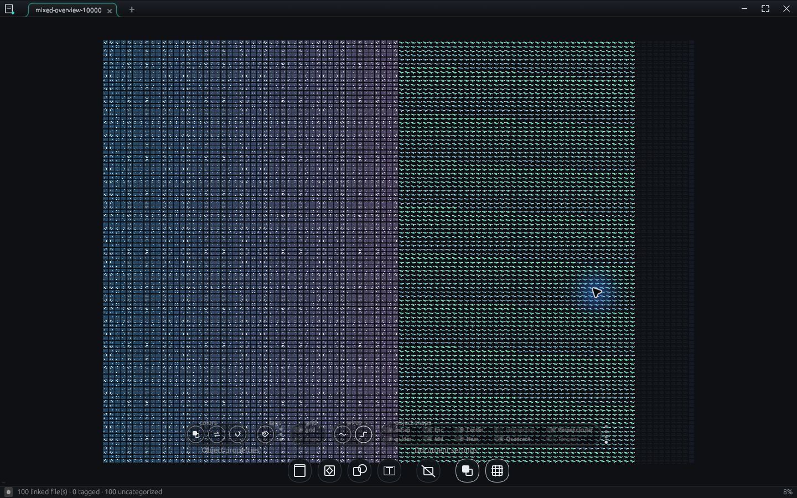

# Atlas and Slate: stabilization audit

**14 September 2026 · Current working tree based on `6338b1c` · Windows release builds**

## Decision

Keep the product thesis and the native substrate. Prioritize a stabilization phase before expanding capabilities. The shared model, journals, folder-map owner, progressive previews and portal contracts are valuable foundations. The implementation does not yet meet the 10,000 mixed-node / 60 fps ambition, and the agent interface is not ready for trusted autonomous editing.

The strongest findings are now supported by a running build or an executable reproduction:

- **Slate’s 10,000-node fitted overview is far outside the frame budget.** A final 180-frame sample recorded **124.5 ms mean application work**, **172.8 ms maximum application work**, and **222.0 ms p95 interval between updates**. All 180 intervals exceeded the logger’s 16.67 ms threshold. The frame counter reported **8,000 tessellation misses per paint**.
- **Three agent-staging defects reproduced through the current public model APIs:** wrong target accepted; an intervening human edit lost on both acceptance and undo; accepted/rejected proposals rediscovered as pending after reconstructing the watcher.
- **The local file link works in a limited, observable sense:** Slate emitted live context and displayed a controlled response written to the unique audit session. **There is no implemented Atlas/Slate MCP server to validate.**
- **Existing controls need completion:** F3 produced no inspector on the writable mixed board, consistent with the explicitly unwired Selection inspector. The Atlas flat-folder overview was a narrow horizontal ribbon even after Fit.

## What was actually inspected

Three independent source audits covered Slate scale, Atlas scale, and architecture/agent integration. The governing Constitution, app architecture documents, command contracts, performance history, roadmap, deviation ledger and recent git history were reviewed. No product source was changed by this audit.

Relevant past conversations were sampled, including:

- `01a0a062-2014-7373-9bae-781b184e636d`: toolbar/catalog refinement and canvas-based advanced tools.
- `01a0a062-2648-7d53-9a4d-7817921502ee`: agent portal, lost responses, misleading Node errors, visible recovery actions and focus ownership.
- `01a0a062-2522-7b22-bab0-95d529cfe2f2`: web clipping, tab text and shared portal fillets.
- `01a0a062-200b-7840-97b5-ea9069df3670`: integration of performance work, shared folder-map extraction and build provenance.

This was a targeted review of available history, not a claim to have read every past conversation. The history makes the intent clear: direct manipulation, embedded content that behaves like content, visible failures with a next action, and shared fixes rather than another per-portal approximation.

### Build and test evidence

- `cargo build --release -p native-file-atlas -p slate`: **succeeded**, 4m17s, with 15 Slate unused-code warnings. The previous release executables were dated August 16; debug executables were newer. This audit used the newly built releases.
- `cargo test --workspace`: compiled test targets and ran **20 atlas-ai + 19 atlas-commands tests successfully**, then Windows refused to execute the atlas-core test binary: `Access is denied (os error 5)`. The approved unsandboxed retry failed the same way. **The workspace suite is not certified green.**
- The filtered `bench_web` run was likewise denied before execution. Static inspection found that `bench_web.rs` and `probe_web.rs` are not wired into the test module tree. A zero-test result was **not** observed, because the binary never ran.
- The staging probe initially hit the same build-script restriction. Compiling its small executable directly against the exact matching current product libraries succeeded. Its assertions deliberately demonstrate defects; they are not product correctness passes.

Logs and probe source are in [the evidence directory](2026-09-14-evidence). The disposable fixtures and direct-probe runner remain under `target/audit-2026-09-14/` and can disappear during `cargo clean`.

## Native UI and performance observations

### Slate: 10,000-node run

The deterministic local fixture contains **5,000 image placements, 4,000 filled/stroked cubic paths, 900 text nodes and 100 local HTML web portals**. It has 100 linked SVG item records; the 5,000 image placements reuse 50 of those assets. It therefore stresses scene/geometry work but **does not** certify thousands of distinct raster decodes or concurrent live browsers. At overview scale web portals were mostly too small to inspect interactively. The viewport was 1440 × 900 screenshot pixels, with the board fitted at approximately 8% zoom.

The final sample was taken after fit/zoom/command checks, with compilation finished and no cargo/rustc process observed during the large-board run. Slate remained `Responding=true`; that means Windows could service it, not that manipulation was smooth. A representative final stall attributed 133.5 ms to `slate.board.paint` out of 148.2 ms application time. The final sample is [preserved as JSON](2026-09-14-evidence/slate-10000-stable-fit.json).

**Measurement limits:** these are application logger timings and intervals between UI updates, not GPU presentation timestamps. They include host scheduling; screenshots and automation perturb the desktop. The initial overview sample included startup (218.5 ms application mean over 94 frames). Idle/occluded/suspended intervals must not be interpreted as rendering FPS. The final active heavy-board CPU time alone is sufficient to reject the 16.7 ms target for this fixture.

Fit and wheel zoom visibly changed the board. The Pan tool armed, but the automated drag did not produce a clearly observable translation, so this audit does not certify pan gesture latency. F3 on the writable board produced no visible inspector. The dense lower toolbar loses contrast against busy content and overlaps the fitted scene; this deserves visual acceptance tests, not just token tuning in isolation.

### Slate: small portals and agent context

The small fixture rendered local HTML and its native accessibility document. A controlled `session.json` response appeared inside the agent transcript, and the chip changed to Live. No model provider was called. The emitted context contained session/provider, workbook, format, selection IDs, viewport, scope and node count; it did not contain the actual unsaved node properties or a visual capture.

A native web button click did not visibly change its text in this automation run. After selecting the agent portal, F3 opened the webview’s Find UI. This is an **observed keyboard-focus/routing symptom requiring reproduction**, not a proven root cause: accessibility activation also mis-targeted coordinates, and the first fixture was read-only because a separate sandbox launch had held its lease. The lease correctly prevented a second writer; it must be preserved. A fresh writable fixture was created for subsequent checks.

The native accessibility trees expose most custom chrome as unnamed `custom` elements. The web document is much more discoverable than the surrounding product. This materially limits reliable agent operation and is a product-quality issue as well as an automation issue.

A valid disposable proposal on the fresh writable fixture produced the visible **1 proposal** badge. Its context menu offered no accept/reject action; the command registry directs users to the unwired inspector. The registered command-palette path remains available in code but was not exercised through acceptance/undo here. See [the native proposal screenshot](2026-09-14-evidence/agent-proposal-ui.png). The audit writer subsequently marked this test proposal rejected to clear it; this was test cleanup, **not a successful UI rejection round trip**. No proposed content was applied. Canvas TypeScript syntax validation passed; the host-rendered interactive artifact was queued to open but not visually verified.

### File Atlas: 10,000-file flat directory

The fresh release loaded 10,000 synthetic local text files, reported the correct count, displayed cards and continued cache warming. Fit changed the camera to its 2% minimum; the map remained an extremely wide ribbon with substantial empty vertical space. Wheel zoom visibly worked. This is a glanceability/layout weakness for flat folders. Evaluate the existing packed-sheet mode as part of the solution before changing tree semantics.

The saved Atlas sample contains long background/idle intervals and is **not a valid 60 fps score**. This audit did not run a real SMB/OneDrive corpus or a 120,000-file interactive session. Existing source evidence identifies those risks; it does not replace the missing platform measurements. No user cloud files were byte-read for synthetic fixture creation.

## Ranked engineering findings

### P1 — Safe agent edits are not yet safe enough

`slate-doc/src/stage.rs:64` validates format but not workbook identity. `board_agent.rs:722` applies to the active scene. `scene.rs:1876` replaces a Patch target without comparing current state to `before`; the journal then retains the stale inverse. `StageWatcher::tick_read` (`stage.rs:154`) ignores decision files when reloading pending proposals.

The [reproduction log](2026-09-14-evidence/staging-reproduction.log) confirms all three through public APIs. Watcher restart means a newly constructed watcher, not a full native-app restart. Fix target identity, preconditions, exact pre-accept undo state, durable decisions and result-write error reporting before exposing mutations over MCP. These are the practical consequences of Articles VI.2 and VII.6.

### P1 — Slate’s culling and cache boundaries do not scale end to end

- `board.rs:500–504` queries visible IDs, then calls linear `Scene::node` (`scene.rs:1722`) and deep-clones nodes. With all 10,000 visible, this entails roughly 50 million ID comparisons per paint, before rendering. Image item lookup is also linear (`doc.rs:222`). This is an algorithmic estimate, not measured attribution of all frame cost.
- `board_path.rs:22,59–104` caps each path cache at 256 entries, evicts in insertion order, and deep-clones cached meshes. A sequential working set larger than capacity can miss every frame. Merely changing FIFO to LRU will not cure that working-set problem. The live 8,000 misses are consistent with 4,000 fill + stroke paths repeatedly missing.
- Picking/marquee/snap paths still scan the scene (`board_path.rs:721,746`; `board.rs:4632,4147`). `node_mut` bumps the global generation; later queries rebuild the whole spatial index (`scene.rs:1624,1726`).
- Stroke cache hashing omits rotation even though the built mesh includes it (`board_path.rs:454,873,903`). This is a code-backed visual-regression candidate, not yet a reproduced rotation defect.

Use model-owned identity lookup, cache keys that cover all geometry inputs, bounded retention based on the visible working set, immutable mesh sharing, and broad-phase queries before existing exact tests. Preserve ordered paint, stable IDs, stroke slop, rotated shapes, hidden/locked rules, group expansion and one undo step per gesture.

### P1 — Atlas’s duplicated portal session contains the old freeze path

`board_atlas.rs:411` calls filesystem stat on the UI loop; `:439` and `:589` build trees synchronously. Standalone Atlas already moved watcher stats off-thread (`apps/file-atlas/src/app/mod.rs:3228`). DV-19 describes this duplication; the consequences are now concrete. Portal invalidation also keys on `entries.len()` (`board_atlas.rs:449,584`), so same-count updates/dead entries can leave the visible tree stale.

Run the mandated DRY gate, then extract source-session ownership and revisioned snapshots. Keep camera/collapse/filter decisions local to each view. Do not repair the two copies independently again.

### P1/P2 — Scanner batches are not bounded for flat directories

`scanner.rs:135` enumerates an entire directory before the size/time flush at `:186`; cancellation is checked between directories. One large directory can become one oversized batch. Two batches per frame is therefore not a reliable work budget. Move flush/cancel checks inside enumeration while preserving breadth-first discovery, then defend ingest with entry/time limits.

### P2 — Existing UI and resource work needs completion

- Restore the existing Selection/Lens bodies through shared chrome: `ui/inspector.rs:8` explicitly marks Selection unwired; `dispatch.rs:196` nevertheless reports it shown. DV-12 remains valid.
- Atlas still clones whole entry snapshots and recomputes inactive packed layouts (`mod.rs:2707,4402–4409`); directory metadata application sweeps the tree (`tree.rs:309`). Narrow snapshots, delta enrichment and lazy layouts should follow trace evidence.
- Shared folder-map painting builds/sorts routes and clones entries (`folder_map/paint.rs:207,804`). Cache layout-derived routes and borrow records; retain zoom-sensitive LOD behavior.
- Slate preview completions drain without an upload time/byte budget (`preview.rs:124–166`). Thumbnail residency is 1,100, with no visible-set protection during eviction (`mod.rs:1367`). Distinct-image stress testing is still required.

## Architectural coherence

The Constitution is a useful design asset. Keep its pure models, two independent scene interpreters, journal authority, shared chrome, data-only extension boundary and provider-neutral contracts.

Real debt remains: Slate imports the File Atlas app (`apps/slate/Cargo.toml:26`, `session.rs:27`), contrary to XII.5. That import powers the intended linked second viewport; extract a reusable host capability while preserving shared-memory tagging/drag. Do not split the processes merely to improve a dependency diagram. Renderer coupling in atlas-ai and tree geometry (DV-02/DV-14), absolute item locators (DV-03), whole-node/index-based commands and unbounded history (DV-01/DV-08), and app-wide tagging outside the scene journal all remain longer-lived obligations.

Governance needs reconciliation: DV-05 still calls alignment undispatched although named align commands now dispatch. Conversely, closing spatial-index/culling rows did not certify end-to-end 10k performance. Update claims with evidence; retain the history of why they were closed.

## Proposed sequence of reviewable changes

1. **Baseline and trust surface.** Add reproducible fixture recipes, source/build identity in diagnostics, real test enumeration checks, accessible names for critical controls, and a visual checklist. Recover existing inspector/Lens entry points. Exit: every advertised entry point visibly succeeds or states an actionable reason.
2. **Staging correctness.** Add the three failing regressions, workbook/revision checks, safe patch preconditions, exact undo preservation and durable decisions. Exit: reject wrong/stale targets; accepted and rejected proposals stay decided after restart; result-write failures are visible.
3. **Slate lookup and vector-cache pass.** Derived ID indexes in the model owner; complete cache keys; visible-working-set retention with a byte budget; avoid mesh/node copies. Exit: warmed unchanged visible paths have no recurring misses, rotation updates correctly, existing ordering/export tests remain valid, rerun the same 10k fixture.
4. **Slate interaction/resource pass.** Spatial broad phase for pick/marquee/snap, bounded gesture updates, preview completion budgets, visible-image residency and portal membership caching. Exit: one-node and 1,000-node drags, zoom, select-all, undo and tab revisit stay within the agreed latency gates.
5. **Bound Atlas discovery.** Entry/time-limited flush and cancellation inside directory enumeration; bounded ingest and enrichment. Exit: flat/wide/deep 10k/40k/120k corpora populate progressively without oversized batches or delayed cancellation.
6. **Shared Atlas session/host extraction.** DRY-reviewed owner for discovery/watcher/revisions, then both standalone and portal consume it. Remove UI-thread stat and count-based invalidation. Exit: same-count updates, watcher storms and multiple portals stay fresh; cloud/tab/collapse safety tests still pass.
7. **Useful live context, then a thin MCP adapter.** Publish bounded unsaved selected/visible node snapshots, revisions and visual evidence; expose typed command descriptions from a renderer-free owner; implement the protocol as a leaf. Exit: an external client lists tools, reads live selection, proposes, previews, accepts through the authorized path, undoes, rejects and reconnects without replay. Log the actual round trip.
8. **Refinement and remaining model debt.** Fix keyboard focus handoff, busy-board toolbar contrast, flat-folder overview and empty/error recovery flows; add native/artifact visual goldens. Then stage property commands, bounded history and relative-first sources. Retire legacy views only at demonstrated portal parity.

Items 2 and 3 can proceed independently with separate owners. Item 6 requires the DRY review before implementation. This is a dependency order, not an estimate of calendar duration or permission to implement all changes in one PR.

### Acceptance contract to ratify before performance work

- Retain the constitutional **60 Hz / 16.67 ms** objective. For active interaction traces, propose p95 at or below one frame and p99 at or below two frames, with every larger stall explained. These percentile gates are proposed engineering tolerances, not an amendment to the Constitution.
- Separate cold first paint, progressive preview arrival, warmed navigation, edits, saving and live-web interaction. Record CPU work, presentation intervals, p50/p95/p99, worst stall, memory/texture bytes and cache misses.
- Cover 1k/5k/10k mixed scenes, >256 visible paths, thousands of distinct raster/SVG images, overlap/rotation, one and 1,000 selected nodes, and a bounded number of active web hosts. Ten thousand stored nodes is not ten thousand running browsers.
- Test local flat/wide/deep folders and a deliberately chosen real slow source, with hydration-safe diagnostics. The historical 120k benchmark improved p99 to 30 ms; it did not establish full 60 fps compliance. Existing `load_jitter` times CPU UI work and synthetic 512-entry batches, not the whole rendered interaction.
- Each UI change ships with observed before/after use: launch current binary, execute the gesture, inspect screenshot and log, verify recovery and undo. A compile-only claim cannot close a UX issue.

## Chesterton fences: preserve these explicitly

Cloud dehydration guards; progressive on-screen previews during discovery; capped/deferred bulk warming; off-thread owner enrichment; generation checks; parked tab state; recorded collapse; I/O-free tree construction; human-only filesystem edits/write-back; leases and atomic saves; portal content-focus authority and live-host limits; honest native/artifact interpretation; shared chrome and folder-map ownership.

The first phase should prove this existing design can meet its workload. A renderer replacement, new portal family or broad cleanup rewrite would distract from the demonstrated bottlenecks.
