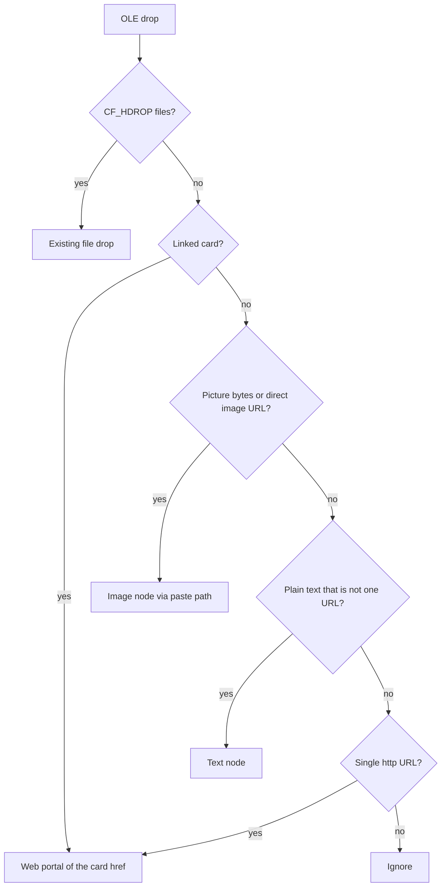

# Browser element drop — classification and placement

Status: **spec only** (ledger **BD1**, 2026-10-10). No code, contract rows, or
`decisions.json` changes until this document is implemented. Authority:
`docs/requests/2026-10-10/browser-drop-brief.md`.

Constitution: Art. III (90% cut — OLE payload only, no DOM), Art. VI
(journaled placement), Art. IX (links, not copies, except pasted bitmap bytes
under `assets/pasted/`), Art. XII (decode in `external_drop.rs`, pure classifier
module, existing placement owners).

Related contracts and research:

- `../contracts/portal-web-embed.md` — D01 (drop-in web portal), D05 (Alt
  “other object”), D15 (DOM scraping and browser chrome permanently cut).
- `../research/browser-drop.md` — Windows OLE boundary, tab-drag investigation
  (to be amended on implementation to point here).

## Today's behavior (shipped)

Windows registers Slate's root window as an OLE `IDropTarget`
(`apps/slate/src/app/external_drop.rs`). The adapter decodes a drag into
`Payload::Url(String)` or `Payload::Files(Vec<PathBuf>)` only
(`external_drop.rs:11–14`). Portal rules and journal commits stay in
`board_web.rs`; file drops continue through `ingest_dropped_paths` in
`clipboard.rs`.

**Decode order.** `read_payload` (`external_drop.rs:260–312`):

1. If `CF_HDROP` is present (`medium` at `external_drop.rs:249–258`), return
   `Payload::Files` — no further formats are considered.
2. Otherwise walk a fixed list in order: registered
   `UniformResourceLocatorW`, registered `text/uri-list` (comment lines
   starting with `#` stripped), then `CF_UNICODETEXT`
   (`external_drop.rs:281–307`).
3. For each buffer, call `board_web::web_url_text` (`board_web.rs:42–48`). The
   **first** format whose entire trimmed text is one remote `http(s)` URL
   becomes `Payload::Url` (`external_drop.rs:308–310`).
4. If nothing matches, the drop is ignored (`None` from `read_payload`).

There is **no** read of HTML Format, bitmap / PNG / file-contents formats, or
multi-field classification. A YouTube thumbnail drag, an Observable card, and a
gallery `` therefore all reduce to whichever single URL Chrome published
first — often the page URL, not the image.

**Transfer media.** `medium()` requests `TYMED_HGLOBAL` only
(`external_drop.rs:249–258`). Payloads Chrome offers as `CF_DIB`, `CF_BITMAP`,
or `IStream` “file contents” are not read today.

**Frame loop.** Each decoded drop is queued as `DropEvent { payload, at, alt }`
(`external_drop.rs:15–18`, enqueued at `external_drop.rs:227–231`). `alt` is
OLE's MK_ALT bit (`external_drop.rs:226–230`); egui modifiers are unavailable
during the drag.

In `mod.rs`, native drops are drained before winit file drops
(`mod.rs:2487–2524`):

- `Payload::Url` → `drop_web_url(&url, event.at)` (`mod.rs:2520–2521`).
- `Payload::Files` → merged into the file path and passed to
  `ingest_dropped_paths(..., alt, screen)` (`mod.rs:2523–2539`).

**Web URL placement.** `drop_web_url` (`board_web.rs:2554–2584`):

- Requires `web_drop_enabled()` (board tab, not home, not read-only, not
  presenting) and drop point inside `canvas_rect`.
- Parses with `web_url_text` (one whole URL, no whitespace).
- Hit-tests an unlocked web portal → journaled rebind via `bind_web_source`;
  locked portal refuses.
- Otherwise `place_web_url` → bound web portal at the drop point (D01).

URL drops do **not** consult `alt` today; Alt only affects file drops through
`ingest_dropped_paths` (HTML file → portal unless Alt → snippet card,
`mod.rs:2535–2537`, `clipboard.rs:793–798`, portal-web-embed D05).

**Acceptance highlight.** URL drops are accepted only when the pointer is over
the board canvas rect registered each frame via `set_url_area`
(`external_drop.rs:139–145`, `mod.rs:2671–2672`). File drops accept anywhere on
the window.

**Paste (contrast, not OLE).** Bitmap paste already places images:
`paste_os_clipboard` → `place_os_media` → `write_pasted_png` under workbook
`assets/pasted/` (or app data until saved) → `ingest_dropped_paths`
(`clipboard.rs:745–877`). That path is the model for **picture** placement from
browser drags once bytes are decoded.

## Target behavior

After implementation, Slate **reads every format the browser offered** on the
OLE `IDataObject`, builds a structured snapshot, and runs a **pure classifier**
(no I/O, no egui). Placement dispatches to existing owners; the classifier only
chooses the outcome.

`SourceURL` in HTML Format names the page the drag **started** on. It is context
for debugging and tests only — **never** the locator placed on the board.

## Classification order

Evaluate in this order; the first matching branch wins:

1. **`CF_HDROP` files** — existing file-drop path (`ingest_dropped_paths` /
   portal diversion / workbooks unchanged).
2. **Linked card** — web portal bound to the card's `http(s)` href (unchanged
   locator; no download, no `/embed/` rewrite, no repo clone).
3. **Picture** — image node via the paste writer (`write_pasted_png` /
   `ingest_dropped_paths`); prefer bytes already in the drag; optional one-shot
   fetch for a direct image URL when no bytes are present (size-capped worker).
4. **Passage** — plain text that is **not** exactly one URL → one text node;
   HTML tags stripped; no rich text.
5. **Bare URL** — today's web portal path (`drop_web_url`), including rebind
   onto an unlocked web portal.
6. **Ignore** — no recognized payload.

Image and text outcomes **always place a new node**; they do not rebind an
existing web portal. Bare URL keeps today's rebind behavior.

## Four outcomes — rules and examples

### Linked card

**Rules.**

- HTML drag payload contains an `http(s)` anchor whose `href` is the card link
  (after HTML entity decode), **or**
- The primary published URL is a YouTube watch / Shorts / `youtu.be` link
  (treat as card even when the visible drag is the thumbnail bitmap).
- Place a **bound web portal** at the drop point with that href **unchanged**.
- A thumbnail bitmap, `CF_DIB`, or secondary URL in the same drag does **not**
  downgrade a card to a picture.
- No YouTube download, no `/embed/` rewrite, no `git clone`, no navigation
  inside the gesture (D03).

**Examples.**

| User gesture | Placed locator |
|--------------|----------------|
| Drag YouTube video thumbnail | `https://www.youtube.com/watch?v=…` (or Shorts / youtu.be equivalent) |
| Drag Observable / D3 example tile | Tile's `https://observablehq.com/…` (or embedded example URL) |
| Drag GitHub repo social card | Repo `https://github.com/org/repo` |

### Picture

**Rules.**

- Not classified as a linked card, **and** any of:
  - Bitmap / PNG / DIB / “file contents” bytes in the drag (decode all offered
    tymeds — see Implementation notes).
  - A **direct** image URL (`web_url_text` passes and path/query indicates a
    raster resource, not a gallery wrapper).
- Image-search and detail wrappers are **pictures**, not cards:
  - Google `/imgres` or `tbm=isch`
  - Bing image search / detail pages
  - DuckDuckGo image detail URLs
- Place an **image item** through `write_pasted_png` (or equivalent file write)
  and `ingest_dropped_paths` — same assets folder and journaling as paste.
- Prefer in-drag bytes over fetching. When only a direct image URL is present,
  fetch once on a worker thread, enforce the same size cap as
  `png_within_limits`, then write and link.

**Examples.**

| User gesture | Outcome |
|--------------|---------|
| Drag `` from a blog (bytes + page URL in payload) | Image node from bytes |
| Google Images result drag | Image node (wrapper URL or bytes), not a portal to the search page |
| Drag `.png` URL from CDN with no bytes | Image node after capped fetch |

### Passage

**Rules.**

- Plain text remains after taking the best plain or HTML text fragment.
- The text is **not** exactly one remote URL per `web_url_text`.
- Strip HTML tags; normalize whitespace; **no** rich text, lists, or embedded
  objects.
- One journaled `TextNode` add at the drop point (same commit path as
  `commit_text_box_draft` / `board.tool.text` in `board_text_place.rs`).

**Examples.**

| Payload | Outcome |
|---------|---------|
| Selected paragraph from an article | Single text node, tag-stripped body |
| Two URLs or URL plus prose | Passage (not bare URL) |
| `CF_UNICODETEXT` with `"See https://a.com and https://b.com"` | Text node |

### Bare URL

**Rules.**

- Exactly one remote `http(s)` URL per `web_url_text`, and not overridden by a
  linked-card rule.
- Same as today: `drop_web_url` — new bound portal or rebind on unlocked web
  portal under the cursor (`board_web.rs:2554–2584`).
- Typical sources: address bar drag, selected URL text, plain link drag with no
  richer HTML payload.

**Examples.**

| User gesture | Outcome |
|--------------|---------|
| Drag URL from omnibox | Web portal |
| Drop selected `https://example.com` text | Web portal or rebind |

## Alt modifier (portal-web-embed D05)

**Today (files only).** Alt while dropping a `.html`/`.htm` file skips
`divert_web_drops` and keeps the legacy text snippet card (D05).

**After this spec (linked card + Alt).** When classification would produce a
**linked card**, holding **Alt** places the **thumbnail picture** instead (same
“other object” role Alt already has for HTML file drops). Alt does not turn a
bare URL into a picture unless bytes exist and the classifier would otherwise
choose picture over card — product rule: **Alt on a linked card = picture path
when bitmap/file-contents bytes are present; otherwise ignore Alt.**

Implementation amends D05 in `portal-web-embed.md` to state this explicitly;
D01's drop-in bullet list gains browser **element** classification (card /
picture / passage / URL).

## SourceURL handling

Browsers embed `SourceURL:` in HTML Format clipboard/drag metadata — the document
URL where the drag began. The classifier:

- Parses and records it in the decoded snapshot for tests and telemetry.
- **Never** uses it as the placement locator.
- **Never** prefers it over `href`, primary URL lists, or image bytes.

Test case: drag from page A with anchor to B — placed object follows B (or the
classified outcome from B's payload), not A's `SourceURL`.

## Out of scope

Stated explicitly so implementers do not expand scope:

- YouTube or yt-dlp **download** (portal stays a normal watch URL).
- A new portal kind or host class.
- Saving the full page as local HTML on drop.
- Reading the WebView2 DOM or executing page script (D15 — OLE payload only).
- Native browser **tab-strip** docking (unchanged; see research note).
- Rewriting locators (`/embed/`, raw GitHub → git, etc.).

## Implementation notes

### Payload and decode (`external_drop.rs`)

Grow `Payload` beyond `Url | Files` only as much as needed to hand the
classifier a normalized snapshot (for example: optional HTML fragment, plain
text, uri-list lines, byte blobs with format ids, `SourceURL`). **Decode stays in
`external_drop.rs`** — COM, `FORMATETC`, and `ReleaseStgMedium` remain here.

### Pure classifier (`external_drop_classify.rs`)

New module: `apps/slate/src/app/external_drop_classify.rs`. Inputs are the
decoded snapshot + `alt`; output is an enum (`FilePaths`, `WebPortal`,
`Picture`, `Passage`, `BareUrl`, `Ignore`). No filesystem, network, or egui.
Unit tests live beside the classifier (see below). Keeps allowlisted
`board_web.rs` and `clipboard.rs` from growing.

### `medium()` and Chrome picture bytes

Today `medium()` accepts only `TYMED_HGLOBAL` (`external_drop.rs:249–258`).
Implementation must also read:

- `CF_DIB` / `CF_BITMAP` (often `TYMED_HGLOBAL` or `TYMED_GDI`)
- FileGroupDescriptor + `IStream` file contents (`TYMED_ISTREAM`)
- PNG as registered format when present

Convert to PNG bytes for `write_pasted_png` where needed. Still release every
`STGMEDIUM` exactly once (`external_drop.rs:239–247`).

### Placement owners (no new journal semantics)

| Outcome | Owner |
|---------|--------|
| Files | `ingest_dropped_paths` (`clipboard.rs:782–834`) |
| Web portal (card or bare URL) | `drop_web_url` / `place_web_url` (`board_web.rs:2554–2584`, `2531–2542`) |
| Picture | `write_pasted_png` + `ingest_dropped_paths` (`clipboard.rs:842–877`) |
| Passage | Journaled text `Add` via `board_text_place.rs` (`commit_text_box_draft` pattern, `119–146`) |

Frame loop (`mod.rs:2515–2539`) becomes: decode → classify → dispatch; `alt`
routes linked-card → picture before dispatch when applicable.

### Network

Only the picture branch may fetch, and only for a direct image URL with no
in-drag bytes — async, capped, one attempt, same limits as paste.

## Follow-up contract and research amendments (on implementation)

Do **not** edit until code lands:

1. **`portal-web-embed.md` D01** — Replace “first http(s) URL” wording with
   browser **element** classification: linked card, picture, passage, bare URL;
   cite this spec.
2. **`portal-web-embed.md` D05** — Document Alt on linked card → thumbnail
   picture (parallel to Alt on `.html` file → snippet card).
3. **`docs/keymap/research/browser-drop.md`** — Add a short “Classification
   spec” section pointing to `../specs/browser-element-drop.md`; keep the tab-drag
   investigation as-is.

## Classifier test cases (pure unit tests)

Each row is one `external_drop_classify` test with synthetic decoded input (no
COM). Expected enum outcome:

| Case | Input summary | Expected |
|------|----------------|----------|
| YouTube card | HTML anchor to watch URL + thumbnail DIB + `UniformResourceLocatorW` watch URL | `WebPortal(watch URL)` |
| Observable card | HTML with example `href` + page URL line | `WebPortal(example href)` |
| Google Images picture | URL with `/imgres` or `tbm=isch`, or PNG bytes + wrapper URL | `Picture` |
| Paragraph | `CF_UNICODETEXT` multi-sentence, no single URL | `Passage` |
| Bare URL | Only `text/uri-list` with one `https://example.com` line | `BareUrl` / `WebPortal` |
| SourceURL ignored | HTML with `SourceURL:https://page-a/` and anchor `href` to B | `WebPortal(B)` — snapshot may assert `SourceURL` parsed but not chosen |

Add regression tests that thumbnail + watch URL never yields `Picture` without
Alt, and that Alt flips linked-card + bytes to `Picture`.

## Acceptance (after implementation)

- Drag YouTube thumbnail → portal at watch URL, not a bitmap node (without Alt).
- Alt + same drag → image node when bytes present.
- Observable / GitHub card → portal at linked href.
- Google Images drag → image node, not search-page portal.
- Paragraph selection → one plain text node.
- Address bar URL → unchanged bare URL / rebind behavior.
- `cargo test` classifier module green; existing OLE integration tests updated
  for new decode paths without live Chrome dependency.
