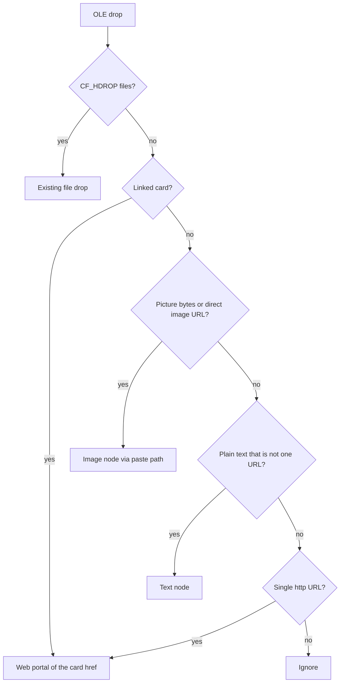

# Browser element drop — spec brief (owner, 2026-10-10)

Ledger id BD1. Write `docs/keymap/specs/browser-element-drop.md`. This task is
the spec only. Code, contract rows, and `decisions.json` stay unchanged until
that spec is implemented.

## What the spec records

Today `apps/slate/src/app/external_drop.rs` keeps the first http(s) URL it
finds (`UniformResourceLocatorW`, `text/uri-list`, or `CF_UNICODETEXT`) and
`apps/slate/src/app/mod.rs` sends it to `drop_web_url`. A picture, a YouTube
thumbnail, and a gallery icon all become the page URL Chrome happened to
publish. Paste of a bitmap already works, via `place_os_media` /
`write_pasted_png` in `apps/slate/src/app/clipboard.rs`.

The drop reads every format the browser offered, then classifies. `SourceURL`
in HTML Format is the page the drag started on and is never the thing placed.

- **Linked card.** HTML has an http(s) anchor, or the URL is a YouTube watch /
  shorts / youtu.be link. Place a web portal bound to that href, unchanged.
  Covers a YouTube thumbnail, an Observable / D3 example icon, and a GitHub
  repo card. A thumbnail bitmap riding along does not turn the card into an
  image. No download, no `/embed/` rewrite, no repo clone.
- **Picture.** Not a card, and the drag has bitmap / PNG / file-contents
  bytes, or a direct image URL. Place an image node through the existing paste
  writer (`assets/pasted/`). Prefer bytes already in the drag. A direct image
  URL with no bytes is fetched once on a worker, size-capped, then written the
  same way. Image-search wrappers (google `/imgres` or `tbm=isch`, Bing images,
  DuckDuckGo image detail) are pictures, not cards.
- **Passage.** Plain text that is not a single URL becomes one text node. Tags
  stripped. No rich text.
- **Bare URL.** Address bar, selected URL, or a link with no richer payload
  stays today's web portal, including rebind onto an unlocked web portal.
  Image and text drops place a new node and do not rebind.

Alt on a linked card places the thumbnail picture instead, the same "other
object" role Alt already has for HTML file drops in portal-web-embed D05.

Out of scope, stated in the spec: YouTube or yt-dlp download, a new portal
kind, saving the page as local HTML, and reading the webview DOM.
`docs/keymap/contracts/portal-web-embed.md` D15 already cuts DOM scraping;
this feature uses only the OLE payload.

## Implementation notes the spec will name

- Grow `Payload` beyond `Url | Files`. Decode stays in `external_drop.rs`. The
  pure classifier goes in a new module,
  `apps/slate/src/app/external_drop_classify.rs`, so neither that file nor
  allowlisted `board_web.rs` / `clipboard.rs` grows. `medium()` today accepts
  only `TYMED_HGLOBAL`; Chrome picture bytes often arrive as `CF_DIB` or
  `IStream` file contents, and the spec calls that out.
- Placement calls owners that already exist: `drop_web_url`,
  `write_pasted_png` / `ingest_dropped_paths`, and the journaled text-node add
  in `apps/slate/src/app/board/board_text_place.rs`.
- When code follows the spec, amend D01 (and D05 for Alt) in the web-portal
  contract and point `docs/keymap/research/browser-drop.md` at the spec. Tests
  are pure classifier cases: YouTube card, Observable card, Google Images
  picture, paragraph, bare URL, SourceURL ignored.
