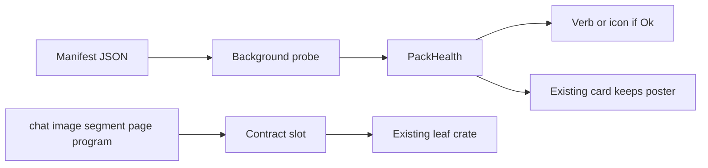

# Pack registry and out-of-process hosts (owner brief, 2026-10-10)

Ledger ids PK1 (phases 1–3) and PK2 (OpenAI "add API key"). Phase 4 is a
separate slice and out of scope for this round.

Another agent can land this beside a larger build. Do the registry first. Do
not start a Craft-app embed, and do not grow the vendor enums while the
registry is going in.

## Law the build must keep

- Article I.2: no document model depends on a vendor. Adapters stay leaf crates.
- Article III: a pack is promoted into a crate only when it is reached for
  weekly. A week-long trial stays a JSON file.
- Article V.3: a host portal owns no mutations inside the foreign app and
  exports as a poster plus a pointer.
- Article VII.8: declarative manifest, then an out-of-process program. No
  native in-process binary extension.
- Article IX / P1.portal.health: health is resolved off the UI thread and a
  failure names what was looked for.
- Article XII / P2.PortalHost: a later program portal calls the shared host
  helpers. Do not paste `board_web.rs` into `board_photocraft.rs`. Run the
  dry-review subagent before adding any portal host file.

## What is wrong today

`discover_programs` (`crates/atlas-ai/src/runtime.rs`) special-cases Cursor and
Codex, then appends `.atlas-ai/programs.json`. Ollama and ComfyUI are a second
door. Execution matches a closed set:

```rust
enum Engine { Codex, Ollama, Comfy, OpenAi }
```

`LaunchKind` (`crates/atlas-ai/src/agent.rs`) is the same shape (Cursor, Codex,
None). The agent grid probes once per session in `ensure_agent_programs`
(`apps/slate/src/app/board_agent/programs.rs`) and does not look again after an
install. The AI panel in `crates/atlas-ai/src/ui.rs` always shows Launch
Cursor, including "Cursor not detected". That is the ghost.

`runtime.rs` is on the size allowlist. Do not append to it. Extract.

## Target



Slate ships contracts. A pack manifest names one contract and a probe. The
tools rail and the program chooser show the intersection: contracts that have
at least one Ok pack this session. A missing pack is a row in Connections, not
a button. **Exception (owner decision, PK2):** a pack whose only missing piece
is a user credential (OpenAI image: no API key) still shows in its chooser,
dimmed, as "add API key", leading to key entry and a link to get a key.

Startup probes in the background and never blocks first paint. Opening the
program chooser probes again, so installing Cursor while Slate is open is
picked up without a restart. There is no Add connection step for a known pack.
The person still chooses the AI workspace folder once, and still signs in
inside Cursor.

## Records

New pure crate `crates/atlas-packs` (no egui, builds on Linux). Types:

- `PackId`, `ContractId` (chat, image, segment, page, program) plus
  `contract_version`.
- `PackManifest`: id, title, contract, probe spec, optional install note.
  Serde JSON.
- `PackHealth`: Ok, Missing, Unknown, Retired. This is not `LinkStatus`
  (`crates/slate-doc/src/link.rs`). A portal whose pack is Missing or Retired
  still uses P1.portal.health Missing or Unknown, and the caption names the
  pack.
- `ProbeSpec` closed set: known-path (file names and directory roots),
  command-on-path, http-get (loopback URL, timeout), custom (a leaf registers a
  function; the manifest only stores the custom id).

Shipped manifests live in `crates/atlas-packs/packs/*.json`. Trial manifests
are read from `%LOCALAPPDATA%/NativeFileAtlas/packs/` and
`<ai-workspace>/.atlas-ai/packs/`. A trial that fails its probe is absent from
the chooser. Deleting the JSON file abandons it.

Catalog API: `load()`, `probe_all()` on a worker, `health(id)`,
`ready(contract) -> Vec<PackId>`. Apps register custom probes at startup.
`atlas-packs` does not call Cursor, Ollama, SAM, or PDFium itself.

## Shelves

- **page** — PDFium. Connections row only. No toolbar verb. Keep today's
  fail-open thumbnail path in `crates/atlas-core/src/pdf.rs`.
- **segment** — SAM via `crates/atlas-segment`. The Highlight linger runs only
  when the pack is Ok. A miss stays "Highlight unavailable" on a card that
  already asked, and does not offer the gesture on a machine that never
  installed it.
- **chat** — Cursor, Codex, Ollama. One Chat verb. The chooser lists only Ok
  packs.
- **image** — ComfyUI, OpenAI image. Same rule for Generate (plus the PK2
  credential exception).
- **program** — later host portal. No Craft engine is linked. PhotoCraft is
  not a shipped manifest until a real install probe exists; a trial JSON may
  point at it.

## Phases

1. **Catalog, no behavior change.** Add `atlas-packs`, shipped JSON for the
   packs above, and unit tests that a missing file is Missing, a present file
   is Ok, a timeout is Unknown, and Retired never appears in `ready()`.
   Register the existing Cursor path check from `cursor_exe`
   (`crates/atlas-ai/src/launch.rs`) as the Cursor custom probe. Do not delete
   `Engine` yet.
2. **Surface.** One Connections section painted by atlas-shell and called from
   both Slate Advanced and File Atlas Advanced, so the chrome does not
   diverge. Columns: name, contract, health, install note. Forget removes a
   trial manifest from the probe list and leaves documents alone. Refresh
   re-runs probes on a worker.
   Wire the agent grid to `ready("chat")` and `ready("image")`. Call probe on
   startup and again when the chooser opens (`programs_started` must not stick
   for the whole session). Hide Launch Cursor in `ai_body`
   (`crates/atlas-ai/src/ui.rs`) unless Cursor is Ok. Register any new command
   in both apps' `ENTRIES`.
3. **Stop the graveyard.** New vendors are manifests that use an existing
   `ProbeSpec`. A new `Engine` or `LaunchKind` variant is a failed review.
   Execution still calls the current leaf (atlas-codex, atlas-ollama,
   atlas-comfy, atlas-openai) through a contract slot keyed by pack id. Shrink
   the enums only after two chat packs share that slot and tests cover both.
4. **Program host, separate slice (out of scope this round).** Only after
   phases 1–3. One `PortalKind` for external programs, inheriting
   P2.PortalHost: journaled frame, pack id, relative locator; derived poster.
   Double-click enters; Esc or click-out asks the process for a poster and
   drops back to the still. At most one live program. Export is poster plus
   pointer. Bake stays the existing helper. Do not host their WASM build in
   the web portal. Do not vendor their binaries. Their launcher updates the
   program; the `.slate` file keeps the pointer and contract version.
   Contract mismatch paints Unknown and the last poster.

## Tests that define done

- Catalog: missing, present, timeout, retired, and a trial JSON that does not
  appear in ready when its probe fails.
- A document that names a Missing pack still opens and paints its last
  poster; the caption names the pack.
- Chooser snapshot with no chat pack has no Cursor icon and no Launch Cursor
  button.
- After a simulated Cursor install (probe flips to Ok), opening the chooser
  shows Cursor without restarting the process.
- PK2: with no OpenAI key, the Generate chooser shows "OpenAI · add API key";
  after a key is stored, it shows as a normal option.
- `cargo xtask size` stays green: new modules under 500 lines, `runtime.rs`
  not grown.
- Linux `cargo test -p atlas-packs` passes. Windows-only probe details stay
  behind cfg.

## Out of scope

Linking PhotoCraft, FilmCraft, VectorCraft, LightCraft, or any Hugging Face /
world-model weights. Embedding those apps' WASM. A filesystem watcher on the
install directory. Folding pack binaries or foreign documents into the
`.slate` file. A new portal kind per application.
