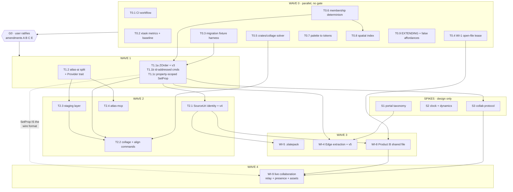

# Workplan — Audit №1 implementation

**Inputs:** `audit-2026-07-25-protocols-collaboration-agents-api.md` (`c808966`)
and the flexibility stress test (audit №2);
`docs/audit/2026-07-25-decisions.md` (D1–D6),
`docs/audit/2026-07-25-decisions-flexibility.md` (D7–D16),
`docs/audit/amendments/2026-07-25-amendments.md` (unratified).

**Where the audits and the decisions disagree, the decisions win.** Audit №2's
portal generalisation, its sealed-bundle model, its verdict on destructive
source edits, and its tiering of live collaboration were all overturned; see
D7, D10, D9, and D11.

**Shape of the work:** thirteen tasks in Waves 0–2 specified to the line, and
Waves 3–5 sketched. Later waves are deliberately under-specified — their design
depends on what Waves 0–2 teach, and over-specifying them now would be guessing
in expensive detail.

**Who executes:** one subagent per task card. Cards are written to be executable
by a capable-but-literal agent with no memory of this conversation: every card
names its files, its frozen APIs, its tests, and its forbidden moves. If a card
requires judgement the agent does not have, that is a defect in the card —
escalate rather than improvise.

---

## 1. How to run this

For each task, dispatch one agent with exactly this prompt shape:

```
Read, in order:
  1. CONSTITUTION.md
  2. AGENTS.md
  3. docs/workplan/agent-brief.md      <- standing rules, read every word
  4. docs/workplan/tasks/wave-N.md, section <TASK ID>

Execute <TASK ID> and nothing else. Follow the agent brief's
definition of done and stop conditions. Do not merge; open a PR.
```

Do not give one agent two cards. Do not let an agent "notice" adjacent work and
fix it — that is how a swarm produces conflicts (and see `AGENTS.md`: shared
chrome changes are always a dedicated task).

**Review lane.** Every PR gets a review pass before merge — either the Bugbot
subagent or a fresh agent given the card plus the diff and asked to verify each
acceptance criterion literally. Implementer and reviewer are never the same
agent.

**Integration.** The human (or the orchestrating agent) merges. Merge order
inside a wave follows the file-ownership table in §5; two PRs that touch the
same owned file mean one of them broke its card.

---

## 2. Waves and gates

| Wave | Theme | Gate to enter | Tasks | Parallelism |
|---|---|---|---|---|
| **0** | Guardrails, governance, and the first user-visible win | none — start now | T0.1 – T0.9 | 9-wide, near-fully parallel |
| **G0** | **Ratification** | user edits `CONSTITUTION.md` per the amendments file (A, B, C, E, F) | — | blocking |
| **1** | Convergent foundations | G0 + Wave 0 merged | T1.1a–c, T1.2 | 2 lanes |
| **S** | **Design spikes** — portals, clock, collaboration protocol | G0; S3 also needs T1.1c | S1, S2, S3 | runs alongside Waves 1–2 |
| **2** | Identity, and the collage shipping | Wave 1 merged | T2.1 – T2.4 | 4-wide |
| **3** | Share: package, edges, shared file | Wave 2 merged + one week of daily use | WI-5, WI-4, WI-8 | 3 lanes |
| **4** | **Live collaboration** | Wave 3 merged + S3 adopted | WI-9 | 2–3 lanes |
| **5** | Web portals, dynamics, video scrub, Mode 2, control surfaces | audit №3 | — | — |

Wave 4 is no longer a deferred maybe. Decision D11 makes simultaneous multi-user
editing a core capability, which is why S3 exists and why it runs early: the
protocol is reviewed on paper while Waves 1–2 build the pieces it needs.

**Wave 0 is constitution-neutral by design.** Nothing in it depends on an
unratified clause, so it runs while the user reads the amendments. If
ratification stalls, Wave 0 still ships the lease guard, CI, metrics, the
membership fix, and the collage solver.

### Dependency graph



---

## 3. Task index

| ID | Title | Owns (primary) | Size | Card |
|---|---|---|---|---|
| T0.1 | GitHub Actions CI: fmt, clippy, test on Linux | `.github/workflows/ci.yml` | XS | [wave-0](tasks/wave-0.md#t01) |
| T0.2 | `cargo xtask metrics` + first baseline | `xtask/`, `docs/metrics/` | M | [wave-0](tasks/wave-0.md#t02) |
| T0.3 | Migration fixture harness (v1/v2 fixtures + round-trip tests) | `crates/slate-doc/tests/` | S | [wave-0](tasks/wave-0.md#t03) |
| T0.4 | WI-1 · `.slate` lease + read-only mode | `slate-doc/src/lease.rs`, `apps/slate/src/app/mod.rs` | S | [wave-0](tasks/wave-0.md#t04) |
| T0.5 | `crates/collage` — pure layout solver | `crates/collage/` (new) | M | [wave-0](tasks/wave-0.md#t05) |
| T0.6 | Membership determinism (one frame owns a node) | `slate-doc/src/scene.rs` | S | [wave-0](tasks/wave-0.md#t06) |
| T0.7 | Palette becomes data in `ui-tokens.toml` | `atlas-shell/src/{theme,tokens}.rs` | S | [wave-0](tasks/wave-0.md#t07) |
| T0.8 | Spatial index over node bounds | `slate-doc/src/spatial.rs` | M | [wave-0](tasks/wave-0.md#t08) |
| T0.9 | `EXTENDING.md` + false-affordance register | repo root, `docs/` | S | [wave-0](tasks/wave-0.md#t09) |
| S1 | Portal taxonomy contract | `docs/portal-contract.md` | M | [spikes](tasks/spikes.md#s1) |
| S2 | Canvas clock + `crates/dynamics` prototype | `docs/`, `crates/dynamics/` | L | [spikes](tasks/spikes.md#s2) |
| S3 | Collaboration protocol + `crates/atlas-collab` prototype | `docs/`, `crates/atlas-collab/` | L | [spikes](tasks/spikes.md#s3) |
| T1.1a | `ZOrder` fractional index, sort-on-read, v3 | `slate-doc/src/scene.rs`, `order.rs` | M | [wave-1](tasks/wave-1.md#t11a) |
| T1.1b | Id-addressed commands + typed rejection | `slate-doc/src/scene.rs` | M | [wave-1](tasks/wave-1.md#t11b) |
| T1.1c | Property-scoped `SetProp` behind a frozen app API | `slate-doc/src/scene.rs`, `board.rs` | L | [wave-1](tasks/wave-1.md#t11c) |
| T1.2 | WI-6a · make `atlas-ai` renderer-free; `Provider` trait | `crates/atlas-ai/`, `atlas-shell/src/ai_panel.rs` | M | [wave-1](tasks/wave-1.md#t12) |
| T2.1 | WI-3 · `SourceUri` + `ContentId` + tri-state health, v4 | `slate-doc/src/{item,link,doc}.rs` | L | [wave-2](tasks/wave-2.md#t21) |
| T2.2 | WI-7 · collage + align/distribute commands | `apps/slate/src/app/{board,dispatch,commands}.rs` | M | [wave-2](tasks/wave-2.md#t22) |
| T2.3 | Staging layer generalised from the Lens overlay | `crates/atlas-stage/` (new) | M | [wave-2](tasks/wave-2.md#t23) |
| T2.4 | WI-6b · `atlas-mcp` exposing the command registry | `crates/atlas-mcp/` (new) | M | [wave-2](tasks/wave-2.md#t24) |
| — | Waves 3–5 | see [wave-3-plus](tasks/wave-3-plus.md) | — | sketch |

---

## 4. The `format_version` ledger

`SlateDoc::CURRENT` is a single global number and three tasks want to bump it.
**Numbers are reserved here, and a task may only claim its own.** An agent that
finds `CURRENT` already at or past its reserved number must stop and escalate —
that means another task landed out of order.

| Version | Claimed by | Adds | Migration on load |
|---|---|---|---|
| 2 | shipped | board scene | v1 loads, scene defaults empty |
| **3** | **T1.1a** | `Node.z: ZOrder` | assign z from current vec position (dense → fractional), keep vec order stable |
| **4** | **T2.1** | `SlateItem.uri: SourceUri`, `content: ContentId` | derive `SourceUri::local(path)` + `root_relative` from the workbook's folder; keep `path` readable as a deprecated field for one version |
| **5** | **WI-4** (Wave 3) | `Scene.edges: Vec<Edge>` | move every `NodeKind::Connector` node into an `Edge` record, preserving id and z |
| 6+ | unclaimed | — | — |

Migration rule, from the v1→v2 precedent in `doc.rs::load_from`: new fields get
`#[serde(default)]`, `load_from` rejects `format_version > CURRENT`, sets
`format_version = CURRENT`, and runs any imperative fix-up (the existing
`migrate_legacy_lines()` is the model). **Every bump ships with a test that
loads a verbatim JSON fixture of the previous version.**

---

## 5. File ownership (conflict prevention)

Within a wave, each file has **exactly one owning task**. If your card does not
list a file, you may read it but not edit it. Needing to edit an unowned file is
an escalation, not a judgement call.

### Wave 0

| File / dir | Owner | Everyone else |
|---|---|---|
| `.github/workflows/**` | T0.1 | read-only |
| `xtask/**`, `docs/metrics/**`, root `Cargo.toml` `[workspace] members` | T0.2 | read-only |
| `crates/slate-doc/tests/**` (new) | T0.3 | read-only |
| `crates/slate-doc/src/lease.rs` (new), `apps/slate/src/app/mod.rs`, `apps/slate/src/app/ui/readouts.rs` | T0.4 | read-only |
| `crates/collage/**` (new) | T0.5 | read-only |
| `crates/slate-doc/src/scene.rs`, `crates/slate-artifact/tests/**` | T0.6 | read-only |
| `crates/atlas-shell/src/{theme.rs, tokens.rs}`, `ui-tokens.toml`, `themes/**` | T0.7 | read-only |
| `crates/slate-doc/src/spatial.rs` (new) + the query paths in `scene.rs` | T0.8 — **starts after T0.6 merges** | read-only |
| `EXTENDING.md`, `docs/false-affordances.md` | T0.9 | read-only |

`docs/audit/deviations.md` is owned **row by row**: the card named in a row's
*Closes with* column may set that row's Status and Closed columns, and nothing
else. The counts block between the `<!-- metrics:deviations:* -->` markers is
owned by T0.2's tool, not by hand.

T0.2 and T0.5 both add a workspace member to the root `Cargo.toml`. **T0.2 lands
first**; T0.5 rebases. This is the only known Wave 0 collision.

### Wave 1

| File / dir | Owner |
|---|---|
| `crates/slate-doc/src/{scene.rs, order.rs, doc.rs}` | T1.1a → T1.1b → T1.1c, strictly in order, one PR each |
| `apps/slate/src/app/board.rs` (mutation helpers only) | T1.1c |
| `crates/atlas-ai/**`, `crates/atlas-shell/src/ai_panel.rs`, both apps' `ui/tools.rs`, `.cursor/rules/shared-chrome.mdc`, `AGENTS.md` | T1.2 |

T1.1a/b/c are **sequential**, not parallel: they are one refactor split into
reviewable steps so that a mistake is caught at 300 lines rather than 900.

### Wave 2

| File / dir | Owner |
|---|---|
| `crates/slate-doc/src/{item.rs, link.rs, doc.rs}`, `.path` call sites listed in the card | T2.1 |
| `apps/slate/src/app/{board.rs, dispatch.rs, commands.rs, ui/tools.rs}` | T2.2 |
| `crates/atlas-stage/**` (new) | T2.3 |
| `crates/atlas-mcp/**` (new) | T2.4 |

T2.1 and T2.2 both touch `board.rs`. **T2.2 owns `board.rs`**; T2.1's board-side
edits are limited to `item.path` reads and must be listed line-by-line in its
PR, or deferred to a follow-up card if the diff exceeds ~30 lines there.

---

## 6. Standing conventions

**Branches:** `feature/<task-id-lowercase>-<slug>`, e.g. `feature/t11a-zorder`.
One card, one branch, one PR. Never commit to `main`.

**Commits:** imperative subject under 72 chars, body explaining *why*. The
repo's existing style: `Line stroke-precise pick: click and marquee hit
geometry, not AABB.`

**PR body must contain,** in this order:

1. Card ID and one-sentence outcome.
2. Each acceptance criterion from the card, with `PASS` / `FAIL` and the
   evidence (test name, command output).
3. Files touched, and confirmation that every one is owned by this card.
4. Deviations opened or closed in `docs/audit/deviations.md`.
5. A handoff note: anything the next agent in the chain must know.

**Verification (PowerShell — `;` not `&&`):**

```powershell
cargo fmt --all
cargo clippy --workspace --all-targets -- -D warnings
cargo test --workspace
cargo build --release -p native-file-atlas -p slate   # Windows only, before merge
```

**Never:** edit `CONSTITUTION.md`, `ROADMAP.md`, or `docs/audit/*` unless the
card says so; add a dependency the card does not name; touch
`crates/atlas-core/src/thumbs.rs` COM code; define chrome colors or paint tabs
outside `atlas-shell`; mutate `doc.scene` outside a journaled path.

---

## 7. What "done" looks like at each wave

- **Wave 0 done:** two people can open the same workbook without losing work;
  CI blocks a broken PR; `cargo xtask metrics` prints the baseline; a collage
  can be computed (not yet invoked); one node belongs to one slide; a theme is a
  text file; a ten-thousand-node board still hit-tests; a stranger can
  self-triage their idea from `EXTENDING.md`.
- **Wave 1 done:** two independently-authored command streams replay to
  identical scenes in either order; undo/redo behaves exactly as before; the AI
  crate is renderer-free.
- **Wave 2 done:** select 30 images, press the collage command, get a justified
  arrangement in one undo step — and an MCP client can invoke the same command
  and have it appear staged, attributed to an agent.
- **Spikes done:** three contract documents adopted by the user, and two
  prototype crates that pass their convergence and determinism tests without
  being wired to anything.
- **Wave 3 done:** a board can be packaged, mailed, and opened cold; a shared
  workbook on the firm share is safe for sequential contributors.
- **Wave 4 done:** a dozen people, some in the room and some remote, edit one
  board simultaneously through a relay the firm runs, see each other's cursors
  and changes live, and every one of them can see the images.

---

## 8. Standing risks

| Risk | Signal | Response |
|---|---|---|
| The swarm outruns review | PRs merging with untested acceptance criteria | pause dispatch; one reviewer per two implementers |
| T1.1c grows unbounded | `PropKey` enum creeping past ~20 variants | it is capped in the card — the rest use `ReplaceNode` |
| Collage becomes a layout engine | requests for text flow, captions, auto-crop | Article III: it does justified rows, grid, masonry; nothing else without a named use |
| Collaboration is designed by implementation | code lands before S3 is adopted | S3 is a gate on Wave 4, not a suggestion; the protocol is reviewed on paper first |
| Remote peers join a board they cannot see | asset streaming treated as an optimisation | it is on the critical path for hybrid (D11); S3 must size it, and Wave 4 must ship it |
| The dynamics layer becomes a game engine | collision, constraints, rigid bodies, particles | S2 caps it: point bodies, three force kinds, one integrator, a body budget |
| Migration ordering breaks a real workbook | any v3/v4/v5 bump without a fixture test | fixture test is a hard acceptance criterion on every bump |
